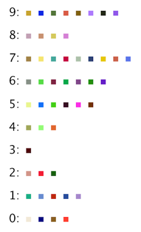

~ number: 3
~ title: Hashing

	
	

Getting the Skeleton Files
--------------------------------

As usual, run `git pull skeleton master` to get the skeleton files.

Introduction
--------------------------------
In this lightweight HW, we'll work to better our understanding of hash tables. Given that we have a midterm Thursday, we've tried to keep this homework short and to the point. Make sure you're spending your extra time going through study guides, preferably by working through problems with other students in the class!

Simple Oomage
--------------------------------

Your goal in this part of the assignment will be to write an `equals` and `hashCode` method for the `SimpleOomage` class, as well as tests for the `hashCode` method in the `TestSimpleOomage` class.

To get started on this assignment, open up the class `SimpleOomage` and take a quick look around. A `SimpleOomage` has three properties: `red`, `green`, and `blue`, and each may have any value between 0 and 255. **Try running `SimpleOomage`** and you'll see four random Oomages drawn to the screen. 

#### equals

**Start by running `TestSimpleOomage`.** You'll see that you fail the `testEquals` test. The problem is that two `SimpleOomage` objects are not considered equal, even if they have the same `red`, `green`, and `blue` values. This is because `SimpleOomage` is using the default `equals` method, which simply checks to see if the the `ooA` and `ooA2` references point to the same memory location.

Writing a proper `equals` method is a little tricker than it might sound at first blush. According to the [Java language specification](https://docs.oracle.com/javase/8/docs/api/java/lang/Object.html#equals-java.lang.Object-), your `equals` method should have the following properties to be in compliance:
 - Reflexive: `x.equals(x)` must be true for any non-null `x`.
 - Symmetric: `x.equals(y)` must be the same as `y.equals(x)` for any non-null `x` and `y`.
 - Transitive: if `x.equals(y)` and `y.equals(z)`, then `x.equals(z)` for any non-null `x`, `y`, and `z`.
 - Consistent: `x.equals(y)` must return the same result if called multiple times, so long as the object referenced by `x` and `y` do not change.
 - Not-equal-to-null: `x.equals(null)` should be false for any non-null `x`.

One particularly vexing issue is that the argument passed to the equals method is of type `Object`, not of type `SimpleOomage`, so you will need to do a cast. However, doing a cast without verifying that the Object is a `SimpleOomage` wont' work, because you don't want your code to crash if someone calls `.equals` with an argument that is not a `SimpleOomage`. Thus, we'll need to use a new method of the Object class called `getClass`. For an example of a correct implementation of `equals`, see [http://algs4.cs.princeton.edu/12oop/Date.java.html](http://algs4.cs.princeton.edu/12oop/Date.java.html).

Override the `equals` method so that it works properly. Make sure to test your `equals` method by running the test again. Your code should now pass the test. 

#### A Simple hashCode

**In Java, it is critically important that if you override `equals` that you also override `hashCode`.** Uncomment the `testHashCodeAndEqualsConsistency` method in `TestSimpleOomage`. Run it, and you'll see that it fails.

To see why this failure occurs, consider the code show below.

Two question to ponder when reading this code:
 - What *should* each print statement output?
 - What *will* each print statement output?

        public void testHashCodeAndEqualsConsistency() {
            SimpleOomage ooA = new SimpleOomage(5, 10, 20);
            SimpleOomage ooA2 = new SimpleOomage(5, 10, 20);

            System.out.println(ooa.equals(ooA2));

            HashSet<SimpleOomage> hashSet = new HashSet<SimpleOomage>();
            hashSet.add(ooA);
            System.out.println(hashSet.contains(ooA2));
        }

Answers:
 - The first print statement *should* and *will* output true, according to the definition of `equals` that we created in the previous part of the assignment.
 - The final print statement *should* output true. The HashSet does contain a `SimpleOomage` with r/g/b values of 5/10/20!
 - The final print statement *will*  print false. When the HashSet checks to see if ooA2 is there, it will first compute `ooA2.hashCode`, which for our code will be the default `hashCode()`, which is just the memory address. Since `ooA` and `ooA2` have different addresses, their hashCodes will be different, and thus the Set will be unable to find an `Oomage` with r/g/b value of 5/10/20 in that bucket.

The Java specification for `equals` mentions this danger as well: "Note that it is generally necessary to override the `hashCode`method whenever the `equals` method is overridden, so as to maintain the general contract for the `hashCode` method, which states that equal objects must have equal hash codes."

**Uncomment the given `hashCode` method in `SimpleOomage`**, which will return a hashCode equal to `red + green + blue`. Note that this `hashCode` is now consistent with equals, so you should now pass all of the `TestSimpleOomage` tests.

#### testHashCodePerfect

While the given `hashCode` method is ok, in the sense that it is consistent with equals and thus will pass `testHashCodeAndEqualsConsistency`, it is only using a tiny fraction of the possible space of hash codes, meaning it will have many unnecessary collisions.

Our final goal for the `SimpleOomage` class will be to write a *perfect* `hashCode` function. By perfect, we mean that two `SimpleOomage`s may only have the same hashCode only if they have the exact same red, green, and blue values.

**... but before we write it, fill in the `testHashCodePerfect` of `TestSimpleOomage` with code that tests to see if the `hashCode` function is perfect.** Hint: Try out every possible combination of red, green, and blue values and ensure that you never see the same value more than once.

Run this test and it should fail, since the provided `hashCode` method is not perfect.

#### A Perfect hashCode

To make the `hashCode` perfect, in the else statement of `hashCode`, **replace `return 0` with a new hash code calculation that is perfect, and set the `USE_PERFECT_HASH` variable to true**. Finally, run `TestSimpleOomage` and verify that your perfect `hashCode` method passes your test. Your `TestSimpleOomage` test might take a few seconds to complete execution.

### HashTable Visualizer

To get a better understanding of how hash tables work, we will now build a hash table visualizer. All you need to do is fill in the `visualize` method of `HashTableVisualizer`. To help you out, we've provided a class called `HashTableDrawingUtility` with the following API:

    public class HashTableDrawingUtility {
        public static void setScale(double sf)
        public static void drawLabels(int M) 
        public static double yCoord(int bucketNum, int M)
        public static double xCoord(int bucketPos)        
    }

Where the methods work as follows:
  
    setScale(sf):         Sets the scaling factor for the drawing. Set 
                          to numbers less than 1 to fit more stuff on the
                          screen. 
    drawLabels(M):        Draws numerical labels for each bucket, where M
                          is the number of buckets.
    yCoord(bucketNum, M): Returns the StdDraw Y coordinate of an item in
                          the given bucket number.
    xCoord(bucketPos):    Returns the StdDraw X coodinate of an item at 
                          the given position in a bucket.

For example, if we have a `SimpleOomage` called `someOomage`, and it is in position number 3 of bucket number 9 out of 16 buckets, then `xCoord(3)` would give us the desired x coordinate and `yCoord(9, 16)` would give us the desired y coordinate. Thus, we'd call `someOomage.draw(xCoord(3), yCoord(9, 16), scale)` to visualize the `SimpleOomage` as it appears in the hash table with the scaling factor `scale`.

Use these methods to fill in `visualize(Set<Oomage> set, int M)`. When you're done, your visualization should look something like the following:

#### Experiment With the Visualizer (Optional)

Try increasing N and M and see how the visualizer behaves. If there isn't enough room to fit everything on screen, try resetting the scaling factor to a number less than one. Compare the distribution of items for the perfect vs. imperfect vs. default hashCodes. Does what you see match what you expect? 

Complex Oomage
--------------------------------

The `ComplexOomage` class is a more sophisticated beast. Instead of three instance variables representing `red`, `green`, and `blue` values, each `ComplexOomage` has an entire a list of ints between 0 and 255. This list may be of any length.

This time, you won't change the `ComplexOomage` class at all. Instead, your job will be to write tests to find the flaw in the `hashCode` function. 

#### Visualize

The provided `hashCode` is valid, but it does a potentially bad job of distributing items in a hash table. 

Start by visualizing the spread of random `ComplexOomage` objects using the visualizer you just built. Use the `randomComplexOomage` method to generate random `ComplexOomage`s. You should find that this visual test shows no apparent problem in the distribution.

#### haveNiceHashCodeSpread

Since a visual inspection of random `ComplexOomage` objects did not show the flaw, we'll need to do a more intensive inspection. **Follow the directions in the starter file to fill in the helper method `haveNiceHashCodeSpread`.**

Then run `TestComplexOomage`. The code should pass, since the `testRandomItemsHashCodeSpread` method that uses `haveNiceHashCodeSpread` is not smart enough to expose the flaw.

#### testWithDeadlyParams and binary representations

Now finally we'll unveil the flaw. By carefully inspecting the given `hashCode` function, devise a test `testWithDeadlyParams` that this `hashCode` function fails due to poor distribution of `ComplexOomage` objects. 

Given what we've learned in 61B so far, this is a really tricky problem! Consider how Java represents integers in binary (see [lecture 23](https://docs.google.com/presentation/d/1H7253NmqEyb4rvwEQ6FQL_10tXNmAf6qBh8YTqNIvM4/edit#slide=id.g11e6c89e47_1_65) for a review). For a hint, see Hint.java. 

Your test should not fail due to an IllegalArgumentException.

Once you've written this test and `ComplexOomage` fails it, you're done with HW3!

#### Fix the hashCode (optional)

Consider how you might change the `hashCode` method of `ComplexOomage` so that `testWithDeadlyParams` passes. Are there other deadly parameters that might strike your `hashCode` method?