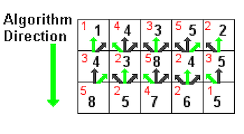
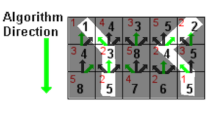

~ number: 5
~ title: Seam Carving

	
	

Getting the Skeleton Files
--------------------------------

As usual, run `git pull skeleton master` to get the skeleton files. If you're using IntelliJ, you might need to manually add the SeamRemover.jar file to your project. If you're working from the command line, you'll need to make sure SeamRemover.jar is in your classpath. The easiest way to do this is to copy it into your course-materials-sp16/javalib/ folder.

Introduction
--------------------------------

Seam-carving is a content-aware image resizing technique where the image is reduced in size by one pixel of height (or width) at a time. A vertical seam in an image is a path of pixels connected from the top to the bottom with one pixel in each row. (A horizontal seam is a path of pixels connected from the left to the right with one pixel in each column.) Below is the original 505-by-287 pixel image; further below we see the result after removing 150 vertical seams, resulting in a 30% narrower image. Unlike standard content-agnostic resizing techniques (e.g. cropping and scaling), the most interesting features (aspect ratio, set of objects present, etc.) of the image are preserved.

In this assignment, you will create a data type that resizes a W-by-H image using the seam-carving technique.

Finding and removing a seam involves three parts and a tiny bit of notation:

0. *Notation*. In image processing, pixel (x, y) refers to the pixel in column x and row y, with pixel (0, 0) at the upper left corner and pixel (W − 1, H − 1) at the bottom right corner. This is consistent with the Picture data type in stdlib.jar. Warning: this is the opposite of the standard mathematical notation used in linear algebra where (i, j) refers to row i and column j and with Cartesian coordinates where (0, 0) is at the lower left corner.

		

		<table>
			<caption><em>a 3-by-4 image</em></caption>
		
				<tbody><tr>
					<td align="center" bgcolor="#eeeeee">&nbsp; (0, 0) &nbsp;</td>
					<td align="center" bgcolor="#eeeeee">&nbsp; (1, 0) &nbsp;</td>
					<td align="center" bgcolor="#eeeeee">&nbsp; (2, 0) &nbsp;</td>
				</tr>    
				<tr>
					<td align="center" bgcolor="#eeeeee">&nbsp; (0, 1) &nbsp;</td>
					<td align="center" bgcolor="#eeeeee">&nbsp; (1, 1) &nbsp;</td>
					<td align="center" bgcolor="#eeeeee">&nbsp; (2, 1) &nbsp;</td>
				</tr>
				<tr>
					<td align="center" bgcolor="#eeeeee">&nbsp; (0, 2) &nbsp;</td>
					<td align="center" bgcolor="#eeeeee">&nbsp; (1, 2) &nbsp;</td>
					<td align="center" bgcolor="#eeeeee">&nbsp; (2, 2) &nbsp;</td>
				</tr>
				<tr>
					<td align="center" bgcolor="#eeeeee">&nbsp; (0, 3) &nbsp;</td>
					<td align="center" bgcolor="#eeeeee">&nbsp; (1, 3) &nbsp;</td>
					<td align="center" bgcolor="#eeeeee">&nbsp; (2, 3) &nbsp;</td>
				</tr>
		</tbody>
		</table>
		

		We also assume that the color of a pixel is represented in RGB space, using three integers between 0 and 255. This is consistent with the `java.awt.Color` data type.

1. *Energy calculation*. The first step is to calculate the energy of each pixel, which is a measure of the importance of each pixel—the higher the energy, the less likely that the pixel will be included as part of a seam (as we'll see in the next step). In this assignment, you will implement the dual gradient energy function, which is described below. Here is the dual gradient of the surfing image above:

		

		A high-energy pixel corresponds to a pixel where there is a sudden change in color (such as the boundary between the sea and sky or the boundary between the surfer on the left and the ocean behind him). In the image above, pixels with higher energy values have whiter values. The seam-carving technique avoids removing such high-energy pixels.

2. *Seam identification*. The next step is to find a vertical seam of minimum total energy. This is similar to the classic shortest path problem in an edge-weighted digraph except for the following:
    * The weights are on the vertices instead of the edges.
    * We want to find the shortest path from any of W pixels in the top row to any of the W pixels in the bottom row.
    * The digraph is acyclic, where there is a downward edge from pixel (x, y) to pixels (x − 1, y + 1), (x, y + 1), and (x + 1, y + 1), assuming that the coordinates are in the prescribed range.

3. *Seam Removal*. The final step is remove from the image all of the pixels along the seam. The logic for this method has been implemented for you in the supplementary SeamRemover class, provided in SeamRemover.jar. 

        public class SeamRemover {
            // These methods are NOT destructive
            public static Picture removeHorizontalSeam(Picture picture, int[] seam)  // returns a Picture with the specified horizontal seam removed
            public static Picture removeVerticalSeam(Picture picture, int[] seam)    // returns a Picture with the specified vertical seam removed
        }

SeamCarver
--------------------------------
The SeamCarver API. Your task is to implement the following mutable data type:

    public class SeamCarver {
        public SeamCarver(Picture picture)
        public Picture picture()                       // current picture
        public     int width()                         // width of current picture
        public     int height()                        // height of current picture
        public  double energy(int x, int y)            // energy of pixel at column x and row y
        public   int[] findHorizontalSeam()            // sequence of indices for horizontal seam
        public   int[] findVerticalSeam()              // sequence of indices for vertical seam
        public    void removeHorizontalSeam(int[] seam)   // remove horizontal seam from picture
        public    void removeVerticalSeam(int[] seam)     // remove vertical seam from picture
    }

### energy(): Computing the Energy of a Pixel

We will use the dual gradient energy function: The energy of pixel (x, y) is $\Delta\_x^2(x, y) + \Delta\_y^2(x, y)$, where the square of the x-gradient $\Delta\_x^2(x, y) = R\_x(x, y)^2 + G\_x(x, y)^2 + B\_x(x, y)^2$, and where the central differences $R\_x(x, y)$, $G\_x(x, y)$, and $B\_x(x, y)$ are the absolute value in differences of red, green, and blue components between pixel (x + 1, y) and pixel (x − 1, y). The square of the y-gradient $\Delta\_y^2(x, y)$ is defined in an analogous manner. We define the energy of pixels at the border of the image to use the same pixels but to replace the non-existant pixel with the pixel from the opposite edge.

	As an example, consider the 3-by-4 image with RGB values (each component is an integer between 0 and 255) as shown in the table below.

		

		<table>
				<tbody>
				<tr>
					<td align="center" bgcolor="#ff6533">&nbsp; (255, 101, 51) &nbsp;</td>
					<td align="center" bgcolor="#ff6599">&nbsp; (255, 101, 153) &nbsp;</td>
					<td align="center" bgcolor="#ff65ff">&nbsp; (255, 101, 255) &nbsp;</td>
				</tr>    
				<tr>
					<td align="center" bgcolor="#ff9933">&nbsp; (255,153,51) &nbsp;</td>
					<td align="center" bgcolor="#ff9999">&nbsp; (255,153,153) &nbsp;</td>
					<td align="center" bgcolor="#ff99ff">&nbsp; (255,153,255) &nbsp;</td>
				</tr>
				<tr>
					<td align="center" bgcolor="#ffcb33">&nbsp; (255,203,51) &nbsp;</td>
					<td align="center" bgcolor="#ffcc99">&nbsp; (255,204,153) &nbsp;</td>
					<td align="center" bgcolor="#ffcdff">&nbsp; (255,205,255) &nbsp;</td>
				</tr>
				<tr>
					<td align="center" bgcolor="#ffff33">&nbsp; (255,255,51) &nbsp;</td>
					<td align="center" bgcolor="#ffff99">&nbsp; (255,255,153) &nbsp;</td>
					<td align="center" bgcolor="#ffffff">&nbsp; (255,255,255) &nbsp;</td>
				</tr>
				</tbody>
		</table>
		

**Example 1:** We calculate the energy of pixel (1, 2) in detail:

<blockquote>
$R_x(1, 2) = 255 − 255 = 0$, 
$G_x(1, 2) = 205 − 203 = 2$, 
$B_x(1, 2) = 255 − 51 = 204$, 
</blockquote>

yielding $\Delta\_x^2(1, 2) = 2^2 + 204^2 = 41620$.

<blockquote>
$R_y(1, 2) = 255 − 255 = 0$,  
$G_y(1, 2) = 255 − 153 = 102$,  
$B_y(1, 2) = 153 − 153 = 0$,  
</blockquote>
yielding $\Delta\_y^2(1, 2) = 102^2 = 10404$.
Thus, the energy of pixel (1, 2) is $41620 + 10404 = 52024$. 

**Test your understanding:** The energy of pixel (1, 1) is $204^2 + 103^2 = 52225$.

**Example 2:** We calculate the energy of the border pixel (1, 0) in detail:

<blockquote>
$R_x(1, 0) = 255 − 255 = 0$,  
$G_x(1, 0) = 101 − 101 = 0$,  
$B_x(1, 0) = 255 − 51 = 204$,  
</blockquote>
yielding $\Delta\_x^2(1, 0) = 204^2 = 41616$.

Since there is no pixel (x, y - 1) we wrap around and use the corresponding pixel from the bottom row the image, thus performing calculations based on pixel (x, y + 1) and pixel (x, height − 1). 
<blockquote>
$R_y(1, 0) = 255 − 255 = 0$,  
$G_y(1, 0) = 255 − 153 = 102$,  
$B_y(1, 0) = 153 − 153 = 0$,  
</blockquote>

yielding $\Delta\_y^2(1, 2) = 102^2 = 10404$.

Thus, the energy of pixel (1, 2) is $41616 + 10404 = 52020$.
	
**Examples Summary:** The energies for each pixel is given in the table below:

<table>
	<tbody><tr>
		<td align="center" bgcolor="#ff6533">&nbsp;20808.0&nbsp;</td>
		<td align="center" bgcolor="#ff6599">&nbsp;52020.0&nbsp;</td>
		<td align="center" bgcolor="#ff65ff">&nbsp;20808.0&nbsp;</td>
	</tr>
	<tr>
		<td align="center" bgcolor="#ff9933">&nbsp;20808.0&nbsp;</td>
		<td align="center" bgcolor="#ff9999">&nbsp;52225.0&nbsp;</td>
		<td align="center" bgcolor="#ff99ff">&nbsp;21220.0&nbsp;</td>
	</tr>    
	<tr>
		<td align="center" bgcolor="#ffcc33">&nbsp;20809.0&nbsp;</td>
		<td align="center" bgcolor="#ffcc99">&nbsp;52024.0&nbsp;</td>
		<td align="center" bgcolor="#ffccff">&nbsp;20809.0&nbsp;</td>
	</tr>
	<tr>
		<td align="center" bgcolor="#ffff33">&nbsp;20808.0&nbsp;</td>
		<td align="center" bgcolor="#ffff99">&nbsp;52225.0&nbsp;</td>
		<td align="center" bgcolor="#ffffff">&nbsp;21220.0&nbsp;</td>
	</tr>
	</tbody>
</table>

### findVerticalSeam(): Finding a Minimum Energy Path

The `findVerticalSeam()` method should return an array of length H such that entry x is the column number of the pixel to be removed from row x of the image. For example, consider the 6-by-5 image below (supplied as 6x5.png). 

<li><b>Finding a vertical seam.</b>
The <tt>findVerticalSeam()</tt> method returns an array of length <em>H</em>
such that entry <em>i</em> is the column number of the pixel to
be removed from row <em>i</em> of the image.
For example, consider the 6-by-5 image below (supplied as 6x5.png).

		   

		   
<table CLASS = "fixedWidthTable">
		<tr>
		<td align="center" bgcolor="#4ed14f">&nbsp;( 78,209, 79)&nbsp;</td>
		<td align="center" bgcolor="#3f76f7">&nbsp;( 63,118,247)&nbsp;</td>
		<td align="center" bgcolor="#5caf5f">&nbsp;( 92,175, 95)&nbsp;</td>
		<td align="center" bgcolor="#f349b7">&nbsp;(243, 73,183)&nbsp;</td>
		<td align="center" bgcolor="#d26d68">&nbsp;(210,109,104)&nbsp;</td>
		<td align="center" bgcolor="#fc6577">&nbsp;(252,101,119)&nbsp;</td>
		</tr>
		<tr>
		<td align="center" bgcolor="#e0bfb6">&nbsp;(224,191,182)&nbsp;</td>
		<td align="center" bgcolor="#6c5952">&nbsp;(108, 89, 82)&nbsp;</td>
		<td align="center" bgcolor="#50c4e6">&nbsp;( 80,196,230)&nbsp;</td>
		<td align="center" bgcolor="#709cb4">&nbsp;(112,156,180)&nbsp;</td>
		<td align="center" bgcolor="#b0b278">&nbsp;(176,178,120)&nbsp;</td>
		<td align="center" bgcolor="#8e978e">&nbsp;(142,151,142)&nbsp;</td>
		</tr>
		<tr>
		<td align="center" bgcolor="#75bd95">&nbsp;(117,189,149)&nbsp;</td>
		<td align="center" bgcolor="#abe799">&nbsp;(171,231,153)&nbsp;</td>
		<td align="center" bgcolor="#95a4a8">&nbsp;(149,164,168)&nbsp;</td>
		<td align="center" bgcolor="#6b7747">&nbsp;(107,119, 71)&nbsp;</td>
		<td align="center" bgcolor="#78698a">&nbsp;(120,105,138)&nbsp;</td>
		<td align="center" bgcolor="#a3aec4">&nbsp;(163,174,196)&nbsp;</td>
		</tr>
		<tr>
		<td align="center" bgcolor="#a3de84">&nbsp;(163,222,132)&nbsp;</td>
		<td align="center" bgcolor="#bb75b7">&nbsp;(187,117,183)&nbsp;</td>
		<td align="center" bgcolor="#5c9145">&nbsp;( 92,145, 69)&nbsp;</td>
		<td align="center" bgcolor="#9e8f4f">&nbsp;(158,143, 79)&nbsp;</td>
		<td align="center" bgcolor="#dc4bde">&nbsp;(220, 75,222)&nbsp;</td>
		<td align="center" bgcolor="#bd49d6">&nbsp;(189, 73,214)&nbsp;</td>
		</tr>
		<tr>
		<td align="center" bgcolor="#d378ad">&nbsp;(211,120,173)&nbsp;</td>
		<td align="center" bgcolor="#bcdaf4">&nbsp;(188,218,244)&nbsp;</td>
		<td align="center" bgcolor="#d66744">&nbsp;(214,103, 68)&nbsp;</td>
		<td align="center" bgcolor="#a3a6f6">&nbsp;(163,166,246)&nbsp;</td>
		<td align="center" bgcolor="#4f7df6">&nbsp;( 79,125,246)&nbsp;</td>
		<td align="center" bgcolor="#d3c962">&nbsp;(211,201, 98)&nbsp;</td>
		</tr>

</table>

The corresponding pixel energies are shown below, with a minimum energy vertical
seam highlighted in pink.
In this case, the method <tt>findVerticalSeam()</tt> returns the array { 3, 4, 3, 2, 2 }.

		

		

		<table CLASS = "fixedWidthTable">
		<tr>
		<td align="center" bgcolor="c9c9c9">57685.0</td>
		<td align="center" bgcolor="b9b9b9">50893.0</td>
		<td align="center" bgcolor="ffffff">91370.0</td>
		<td align="center" bgcolor="7c7c7c" style="color:#FF9999">25418.0</td>
		<td align="center" bgcolor="8e8e8e">33055.0</td>
		<td align="center" bgcolor="989898">37246.0</td>
		</tr>
		<tr>
		<td align="center" bgcolor="646464">15421.0</td>
		<td align="center" bgcolor="c6c6c6">56334.0</td>
		<td align="center" bgcolor="767676">22808.0</td>
		<td align="center" bgcolor="c2c2c2">54796.0</td>
		<td align="center" bgcolor="5b5b5b" style="color:#FF9999">11641.0</td>
		<td align="center" bgcolor="7c7c7c">25496.0</td>
		</tr>
		<tr>
		<td align="center" bgcolor="5d5d5d">12344.0</td>
		<td align="center" bgcolor="6d6d6d">19236.0</td>
		<td align="center" bgcolor="bcbcbc">52030.0</td>
		<td align="center" bgcolor="6a6a6a" style="color:#FF9999">17708.0</td>
		<td align="center" bgcolor="aaaaaa">44735.0</td>
		<td align="center" bgcolor="717171">20663.0</td>
		</tr>
		<tr>
		<td align="center" bgcolor="686868">17074.0</td>
		<td align="center" bgcolor="787878">23678.0</td>
		<td align="center" bgcolor="888888" style="color:#FF9999">30279.0</td>
		<td align="center" bgcolor="ffffff">80663.0</td>
		<td align="center" bgcolor="9a9a9a">37831.0</td>
		<td align="center" bgcolor="acacac">45595.0</td>
		</tr>
		<tr>
		<td align="center" bgcolor="8d8d8d">32337.0</td>
		<td align="center" bgcolor="898989">30796.0</td>
		<td align="center" bgcolor="4b4b4b" style="color:#FF9999">4909.0</td>
		<td align="center" bgcolor="efefef">73334.0</td>
		<td align="center" bgcolor="a0a0a0">40613.0</td>
		<td align="center" bgcolor="979797">36556.0</td>
		</tr>

		</table>
		

When there are multiple vertical seams with minimal total energy, your method can return any such seam.

Your `findVerticalSeam` method should utilize dynamic programming. Recall the key idea behind any dynamic programming algorithm: the subproblem. Suppose we have the following definitions:

$M(i, j)$ - cost of minimum cost path ending at (i, j) 
$e(i, j)$ - energy cost of pixel at location (i, j)

Then each subproblem is the calculation of $M(i, j)$ for some $i$ and $j$. The top row is trivial, $M(i, 0)$ is just $e(i, 0)$ for all $i$. For lower rows, we can find $M(i, j)$ simply by adding the $e(i, j)$ to the minimum cost path ending at its top left, top middle, and top right pixels, or more formally:
$$M(i, j) = e(i, j) + min(M(i - 1, j - 1), M(i, j - 1), M(i + 1, j - 1))$$

In short, we start from one side of the 2D image array and process row-by-row or column-by-column (for vertical and horizontal seam carving respectively).

	
	

**Addendum: The Java language does not deal well with deep recursion, and thus a recursive approach will almost certainly not be able to handle images of largish size (say 500x500).** We recommend writing your code iteratively.

An equivalent (but slower approach) is to build an explicit Graph object and run the DAGSPT algorithm. You are welcome to try this approach, but be warned it is slower, and it may not be possible to sufficiently optimize your code so that it passes the autograder timing tests.

### findHorizontalSeam(): Avoiding Redundancy

The behavior of `findHorizontalSeam()` as analogous to that of `findVerticalSeam()` except that it should return an array of W such that entry y is the row number of the pixel to be removed from column y of the image. Your `findHorizontalSeam` method should NOT be a copy and paste of your `findVerticalSeam` method! Instead, considering transposing the image, running `findVerticalSeam`, and then transposing it back. The autograder will not test this, but a similar idea could easily appear on the final exam.

### Other Program Requirements

**Performance requirements.** The `width()`, `height()`, and `energy()` methods should take constant time in the worst case. All other methods should run in time at most proportional to `W H` in the worst case.

**Exceptions.** Your code should throw an exception when called with invalid arguments.
	* By convention, the indices x and y are integers between 0 and W − 1 and between 0 and H − 1 respectively. Throw a `java.lang.IndexOutOfBoundsException` if either x or y is outside its prescribed range.

	* Throw a `java.lang.IllegalArgumentException` if `removeVerticalSeam()` or `removeHorizontalSeam()` is called with an array of the wrong length or if the array is not a valid seam (i.e., two consecutive entries differ by more than 1).

Some Useful Files
--------------------------------
**PrintEnergy.java**: For printing the energy calculations per pixel for an input image.

**PrintSeams.java**: Prints the energies and computed horizontal and vertical seams for an input image.

**ShowEnergy.java**: Shows the grayscale image corresponding to the energy computed by pixel.

**ShowSeams.java**: Displays the vertical and horizontal minimum energy seams for a given image.

**SanityCheckTest.java**: Basic JUnit tests consisting of the energy and path examples given in this spec.

**SCUtility.java**: Some utilies for testing SeamCarver.

**SeamRemover.jar**: Contains a SeamRemover class file with `removeHorizontalSeam()` and `removeVerticalSeam()` methods to use in your SeamCarver.

**SeamCarverVisualizer.java**: For the purposes of visualizing the frame-by-frame actions of your SeamCarver, we've provided you with a `SeamCarverVisualizer` class which you can run using the following command:

        java SeamCarverVisualizer [filename] [numPixels to remove] [y (if horizontal carving) | N (otherwise)]

Example:

        java SeamCarverVisualizer images/HJoceanSmall.png 50 y

Extra Fun
--------------------------------

Fun #1: Try out your SeamCarver on various real world images. I recommend human faces.

Fun #2: Try to implement a version of the `SeamCarver` class that avoids the need to recompute the entire energy matrix every time a seam is removed. This will require getting fancy with your data structures. If you do this, email Josh and let him know. This should make your SeamCarver class extremely fast.

Submission
--------------------------------
Submit `SeamCarver.java` and any supporting classes that you created, if applicable. You do not need to submit `SeamRemover.jar`.

FAQ
--------------------------------

#### How do I debug this?

Make sure to try out the "Useful Files" above, especially the PrintEnergy and PrintSeams classes.

#### My code is slow (failing timing tests), what can I do to speed it up?

Some possible optimizations include (in decreasing order of likely impact):
 - **Avoiding recalculation of energies for the same pixel over and over** (e.g. through creation of an explicit energy matrix of type `double[][]`). Essentially you want to memoize energy calculations. 
 - Don't use a HashMap for looking up data by row and column. Instead, use a 2D array. They are much faster. HashMaps are constant time, but the constant factor is significant.
 - Not using `Math.pow` or `Math.abs`.
 - Not storing an explicit `edgeTo` data structure. It is possible to rebuild the seam ONLY from the values for `M(i, j)`! That is, you don't need to actually record the predecessor like you did in the 8puzzle assignment. 
 - Using a more clever approach than transposing your images (though this is not required to pass the autograder).

Credits
--------------------------------
This assignment was originally developed by Josh Hug, with supporting development work by Maia Ginsburg and Kevin Wayne at Princeton University.
