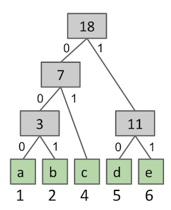

~ number: 7
~ title: Huffman Coding

Getting the Skeleton Files
--------------------------------

As usual, run `git pull skeleton master` to get the skeleton files. 

Introduction
--------------------------------

In this homework, you'll implement a Huffman encoder and decoder, as described in [lecture 38](https://docs.google.com/presentation/d/1CtOjPiNA4PQOa_kw033n88Z7INyzzG6vEB35iEda2xk/edit?usp=drive_web).

The majority of the work will be in building the Huffman decoding trie. For the purposes of this homework, the "less frequent" branch of your Huffman coding trie should always be the '0' side, and the more common side should always be the '1' side. 

For example, suppose we have the file below:

        abbccccdddddeeeeee

This file has 1 a, 2 bs, 4 cs, 5 ds, and 6 es. The unique Huffman decoding trie for this file is as shown below. For example, the letter b corresponds to the binary seqeuence `001`.

BinaryTrie
--------------------------------

Create a class BinaryTrie that obeys the API below. The vast majority of the work for this homework is in creating this class.

    public class BinaryTrie implements Serializable {
        public BinaryTrie(Map<Character, Integer> frequencyTable)
        public Match longestPrefixMatch(BitSequence querySequence)
        public Map<Character, BitSequence> buildLookupTable()
    }

**Constructor.** Given a frequency table which maps symbols of type V to their relative frequencies, the constructor should build a Huffman decoding trie according to the procedure discussed in class. You may find implementations of Huffman codes on the web useful for inspiration, e.g. [http://algs4.cs.princeton.edu/55compression/Huffman.java.html](this implementation).

**longestPrefixMatch.** The `longestPrefixMatch` method finds the longest prefix that matches the given `querySequence` and returns a Match object for that Match. The Match class is a simple container class with the following API:

    public class Match {        
        public Match(BitSequence sequence, char symbol)
        public char getSymbol()
        public BitSequence getSequence()
    }

The `longestPrefixMatch` class takes as an argument objects of type `BitSequence`, described in more detail below. 

For example, for the example Trie given in the introduction, if we call `trie.longestPrefixMatch(new BitSequence("0011010001"))`, then we will get back a Match object containing `b` as the symbol and `001` as the BitSequence. The method is called `longestPrefixMatch` because `001` is the longest prefix of `0011010001` that is a match inside our decoding binary trie.

**buildLookupTable.** The `buildLookupTable` method returns the inverse of the coding trie. For example, for the example Trie given in the introduction, this method should return the same map as:

        HashMap<Character, BitSequence> expected = new HashMap<Character, BitSequence>();
        expected.put('a', new BitSequence("000"));
        expected.put('b', new BitSequence("001"));
        expected.put('c', new BitSequence("01"));
        expected.put('d', new BitSequence("10"));
        expected.put('e', new BitSequence("11"));

This is because the character `a` corresponds to the bitSequence `000`, the character `b` corresponds to the bitSequence `001` and so forth.

**Testing.** We have provided a client side test called `TestBinaryTrie` that you should use to make sure you understand your objectives, and also to test your code.

HuffmanEncoder
--------------------------------

Once you've written AND tested your BinaryTrie, implement the class HuffmanEncoder, with the following API:

    public class HuffmanEncoder {
        public static Map<Character, Integer> buildFrequencyTable(char[] inputSymbols)
        public static void main(String[] args) 
    }

**buildFrequencyTable.** The `buildFrequencyTable` method should map characters to their counts. For example, suppose we have the character array ['a', 'b', 'b', 'c', 'c' , 'c', 'c', d', 'd', 'd', 'd', 'd', e', 'e', 'e', 'e', 'e', 'e'], then this method should return a map from 'a' to 1, 'b' to 2, and so forth. 

**The main method.** The main method should open the file given as the 0th command line argument (`args[0]`), and write a new file with the name `args[0] + ".huf"` that contains a huffman encoded version of the original file. For example `java HuffmanEncoder watermelonsugar.txt` should generate a new Huffman encoded version of `watermelonsugar.txt` that contains `watermelonsugar.txt.huf`.

Pseudocode for the Huffman encoding process is given below:

    1: Read the file as 8 bit symbols.
    2: Build frequency table.
    3: Use frequency table to construct a binary decoding trie.
    4: Write the binary decoding trie to the .huf file.
    5: (optional: write the number of symbols to the .huf file)
    6: Use binary trie to create lookup table for encoding.
    7: Create a list of bitsequences.
    8: For each 8 bit symbol:
        Lookup that symbol in the lookup table.
        Add the appropriate bit sequence to the list of bitsequences.
    9: Assemble all bit sequences into one huge bit sequence.
    10: Write the huge bit sequence to the .huf file.

Some of these tasks are tricky and require knowledge of special libraries. To save time, we have provided a number of utility methods to make this process easier for you. Using these methods is optional.

    1: char[] FileUtils.readFile(String filename)
    4/5/10: ObjectWriter's writeObject method.
    9: BitSequence BitSequence.assemble(List<BitSequence>)

See `ObjectWritingAndReadingDemo.java` for a demo of how to use the `ObjectWriter` and `ObjectReader` classes to write Java objects to files for later loading.

Important: Do not call writeObject once for each symbol! This will result in huge files, very slow performance, and a very complex decoder! For your sanity, use `BitSequence.assemble`!

Try running your file on the provided text files: `watermelongsugar.txt` and `signalalarm.txt`. You should see a modest decrease in file size for both. Your code should take no more than seconds to execute. There are no tests for `HuffmanEncoder` because the precise behavior is not specified.

HuffmanDecoder
--------------------------------

Once you've written HuffmanEncoder and verified that it is able to generate files that are smaller than the ones passed in, write a class `HuffmanDecoder` that reverses the process, with the following API:

    public class HuffmanDecoder {
        public static void main(String[] args)
    }

**The main method.** The main method should open the file given as the 0th command line argument (`args[0]`), decode it, and and write a new file with the name given as `args[1]`. For example `java HuffmanDecoder watermelonsugar.txt.huf originalwatermelon.txt` should decode the contents of `watermelonsugar.txt.huf` and write them into `originalwatermelon.txt`.

Pseudocode for the Huffman decoding process is given below:
    
    1: Read the Huffman coding trie.
    2: If applicable, read the number of symbols.
    3: Read the massive bit sequence corresponding to the original txt.
    4: Repeat until there are no more symbols:
        4a: Perform a longest prefix match on the massive sequence.
        4b: Record the symbol in some data structure.
        4c: Create a new bit sequence containing the remaining unmatched bits.
    5: Write the symbols in some data structure to the specified file.

As above, we have provided utility methods to make your life easier:

    1/2/3: ObjectReader's readObject method.
    4c: BitSequence has methods that may be useful to you.
    5: FileUtils.writeCharArray(String filename, char[] chars)

Your `HuffmanDecoder` should **perfectly** decode the output of your `HuffmanEncoder`. For example, if we run the following commands:

    java HuffmanEncoder watermelonsugar.txt
    java HuffmanDecoder watermelonsugar.txt.huf originalwatermelon.txt
    diff watermelonsugar.txt originalwatermelon.txt

Then the output of the `diff` command should be nothing. This is because `diff` is a command line tool that compares two files, and prints out any differences. If the files have no differences, nothing is output.

Your `HuffmanEncoder` and `HuffmanDecoder` should work for ANY file, not just English text, and even if the input isn't a text file at all!

### FAQ

Coming soon in response to questions.

### Submission

Submit your `HuffmanEncoder.java`, `HuffmanDecoder.java`, `BinaryTrie.java`, and any supporting files you created.