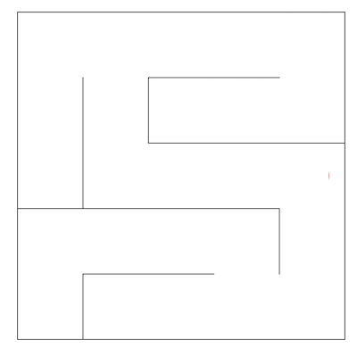
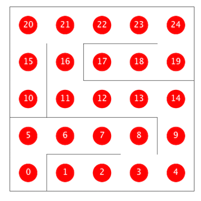
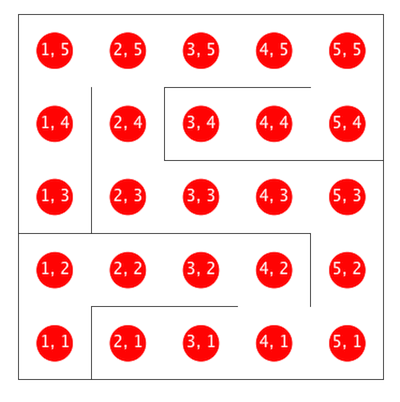

~ number: 11
~ title: Graphs

Due to late release of this lab, the magic word is given to you for free. It is "bean".

A. Compiling Project 3
----

To ensure that your computer can run Project 3, complete the section entitled ["Getting the Skeleton Files"](http://cs61b.ug/sp16/materials/proj/proj3/proj3.html#getting-the-skeleton-files). We **very strongly** recommend using IntelliJ for this project, though it is not required. Make sure you are able to open `localhost:4567` in your web browser. Once you've done this, you're done with this part of lab.

Do not start reading the project 3 spec or start work on the project during this lab. If you're having setup issues and nobody is available to help out, move on to part B of this lab until someone is available. If you can't quite get this working by the end of your lab section, that's fine. However, we strongly recommend being able to complete this section in either another lab or in Piazza by the end of Friday.

B. Introduction to our Maze Solver
----

In this lab, we'll explore how various graph algorithms behave in the context of mazes, like the one shown below.

One way to represent a maze is as an undirected graph. The vertices of such a graph are shown below, with one dimensional (vertex number) coordinates on the left version and X/Y coordinates on the right version. If there is no wall between two adjacent vertices, then the corresponding graph has an undirected edge between the vertices. For example, adj(11) would be an iterable containing the integers 12 and 16.

In this lab, you'll implement a few key graph algorithms using the provided Maze class, which has the following methods of interest:

        public int N(): Size of the maze (mazes are N x N)
        public int V(): Total number of vertices in the maze
        public Iterable<Integer> adj(int v): Returns the neighbors of v
        public int toX(int v): Returns the x coordinate of vertex v
        public int toY(int v): Returns the y coordinate of vertex v
        public int xyTo1D(int x, int y): Returns the vertex number of x, y

We've provided `MazeDepthFirstPaths`, a version of `DepthFirstPaths` adapted for use with mazes. For official lab credit, you'll need to implement at least an adaptation of `BreadthFirstPaths`, and for those of you want a deeper understanding of graph algorithms, we've also provided challenges to write a cycle detection algorithm as well as to implement the A* shortest paths algorithm. Specifically, you'll end up with:

 - `MazeDepthFirstPaths.java`: Uses DFS to find all paths from a given source, terminating as soon as the target vertex is observed. Provided for you.
 - `MazeBreadthFirstPaths.java`: Uses BFS to find all paths from a given source, terminating as soon as the target vertex is observed.
 - `MazeCycles.java`: Searches for cycles in the maze. If a cycle is detected, the algorithm terminates.
 - `AStarPath.java`: Searches for the shortest path from source to a target using A*, terminating when the target is observed.

These four maze solvers should be subclasses of the abstract `MazeExplorer` class, which has the following fields and methods:

        public boolean[] marked: Locations to mark in blue
        public int[] distTo: Distances to draw over the Maze
        public int[] edgeTo: Edges to draw on Maze
        public Maze maze: The maze being solved
        public void announce(): Call whenever you want the drawing updated
        public solve(): Solves the given Maze problem

The Maze class has special functionality built in so that it can see your MazeExplorer's public variables. Specifically, whenever you call `announce`, it will draw the contents of your MazeExplorer's `marked`, `distTo`, and `edgeTo` arrays. Make sure to call the `announce` method any time you want the drawing to be updated.

As an example, try compiling and running `TrivialMazeExplorerDemo.java`. Open up the `TrivialMazeExplorer` and `TrivialMazeExplorerDemo` files to understand what's going on.

As a more complex example, try compiling and running `DepthFirstDemo`. This code was adapted from the [DepthFirstPaths class](http://algs4.cs.princeton.edu/41undirected/DepthFirstPaths.java.html) that was discussed during lecture.

If you want to tweak the parameters of the maze, you can edit the maze.config file. There are three different types of mazes (`SINGLE_GAP`, `POPEN_SOLVABLE`, and `BLANK`) to choose from. A % sign at the beginning of a line in the config file comments it out.

C. MazeBreadthFirstPaths
----

You'll now write a class `MazeBreadthFirstPaths.java` that extends `MazeExplorer`. You should use `MazeDepthFirstPaths` as inspiration. When you compile and run `BreadthFirstDemo.java`, you should see your algorithm crawl the graph, locating the shortest path from position (1, 1) to (N, N), stopping as soon as the (N, N) position is found.

You should use [BreadthFirstPaths](http://algs4.cs.princeton.edu/41undirected/BreadthFirstPaths.java.html) as inspiration.

I've put together [a quick video showcasing the expected behavior of each class](http://youtu.be/nCg1qsqIVPY), though there's a small bug in my `MazeBreadthFirstPaths` that I point out during the video. 

D. Cycles (optional)
----

For this part of the lab, you'll write a cycle detection algorithm. When you compile and run `CylesDemo`, you should see your algorithm crawl the graph. If it identifies any cycles, it should connected the vertices of the cycle using purple lines (by setting values in the edgeTo array and calling announce()).

E. A* (optional)
----

For this part of the lab, you'll implement the A* algorithm. When you compile and run AStarDemo, you should see your algorithm crawl the graph, seeking the shortest path from (1, 1) to (N, N). Unlike BFS, the algorithm should take into account the target vertex.

For your heuristic h(v), I recommend that you use the [Manhattan distance](http://en.wikipedia.org/wiki/Taxicab_geometry), which can be simply expressed as:

        Math.abs(sourceX - targetX) + Math.abs(sourceY - targetY);

Experiment with different graph types and heuristics to see how they behave.

Submission
--------------------------------

To submit, you don't need a zip file this time, just `MazeBreadthFirstPaths.java` and `MagicWord11.java`.