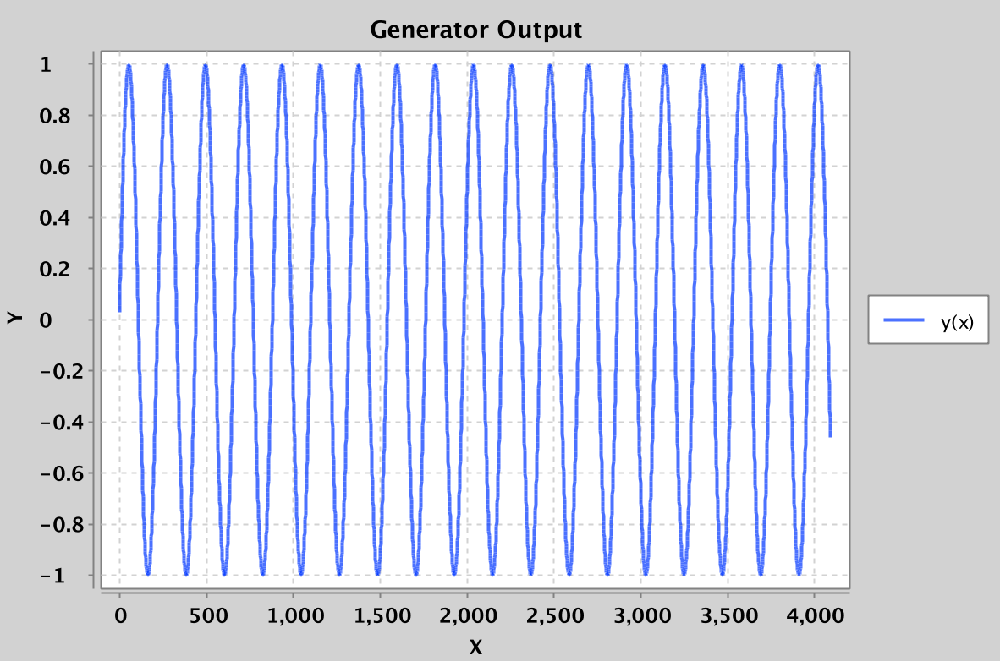
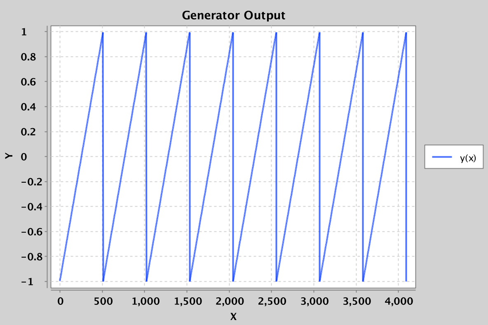
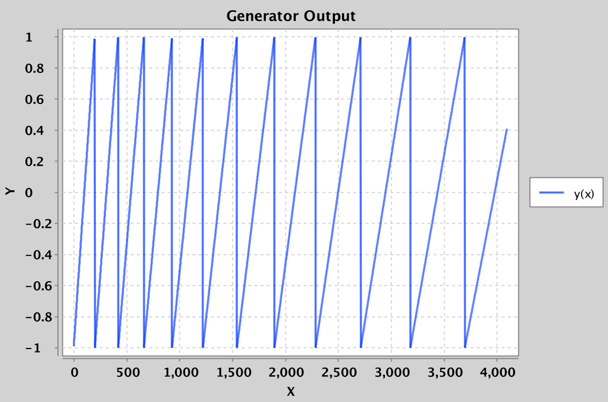
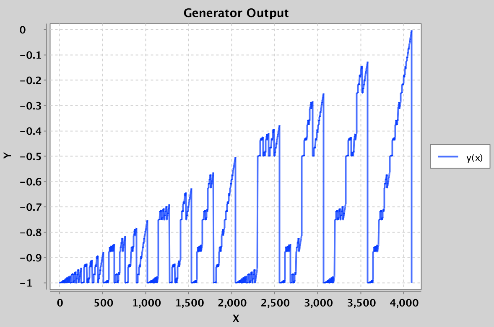

~ number: 14
~ title: Fractal Sound

Introduction
-----

In this week's lab, you'll explore the world of building audio from scratch, vaguely similar to what we did for the sound generator in HW1.

Skeleton Files
-----

After you pull from the skeleton repo, you'll have a few key files:
 - Generator.java
 - GeneratorPlayer.java
 - GeneratorDrawer.java
 - GeneratorAudioVisualizer.java
 - Soundulate.java

Generator is an interface that defines the expected behavior of any Generator class. Each Generator simply needs a method `next` that returns the next `double`. `GeneratePlayer` plays the samples returned by the generator as sound. `GeneratorDrawer` draws the samples returned by the generator as a graph. `GeneratorAudioVisualizer` both plays and draws the samples.

Playing with the Sine Wave Generator
-----

#### Creating and Using a Simple Generator

Open up `Soundulate.java`, and add the follow lines to main:

        Generator generator = new SineWaveGenerator(440);
        GeneratorPlayer gp = new GeneratorPlayer(generator);
        gp.play(1000000);

What this does is:

 - Creates a SineWaveGenerator that outputs samples corresponding to a 440 Hz sine wave.
 - Creates a GeneratorPlayer that will play the SineWaveGenerator.
 - Tells the GeneratorPlayer to play the first one million samples from the generator as sound.

Try compiling and running GeneratorPlayer, and you should hear a high pitched beep sound. If working from the command line, you can press Control-C to halt execution.

Try changing the 440 to a 200 Hz, and you should hear a lower sound. Note that if you try even lower frequencies, your laptop speakers are likely too small to generate anything lower than ~60 Hz. However, if you use headphones or real speakers, you'll be able to hear such low frequencies.

#### Using the Generator Visualizer

We can also visualize the output of a generator. Replace the main method of `Soundulate.java` with the following:

        Generator generator = new SineWaveGenerator(200);
        GeneratorDrawer gd = new GeneratorDrawer(generator);
        gd.draw(4096);

What this does is:

 - Creates a SineWaveGenerator that outputs samples corresponding to a 200 Hz sine wave.
 - Creates a GeneratorDrawer that will draw the GeneratorDrawer.
 - Tells the GeneratorDrawer to draw the first 4096 samples from the generator as a graph.

Run this and you should see something like:

#### Using the GeneratorAudioVisualizer

Finally, we can do both playing and drawing using `GeneratorAudioVisualizer.java`. Replace the main method of `Soundulate.java` with the following:

        Generator generator = new SineWaveGenerator(200);
        GeneratorAudioVisualizer gav = new GeneratorAudioVisualizer(generator);
        gav.drawAndPlay(4096, 1000000);

Try this out, and you should see the first 4096 samples being drawn and the first 1,000,000 samples being played. The reason that we make these parameters different is that if we draw 1,000,000 samples, we won't be able to see anything useful.

#### Using the MultiGenerator

As a last exercise in using the existing Generators, try the following out in `Soundulate.java`:

        Generator g1 = new SineWaveGenerator(200);
        Generator g2 = new SineWaveGenerator(201);

        ArrayList<Generator> generators = new ArrayList<Generator>();
        generators.add(g1);
        generators.add(g2);
        MultiGenerator mg = new MultiGenerator(generators);

        GeneratorAudioVisualizer gav = new GeneratorAudioVisualizer(mg);
        gav.drawAndPlay(500000, 1000000);

You should hear a neat sound -- if you have better speakers, I recommend trying out 60 and 61 hz tones instead. This phenomenon of pulsing volume is known as a [beat](https://en.wikipedia.org/wiki/Beat_(acoustics).

Task 1: Generating a SawTooth
---

Your first major goal is to generate a `SawToothGenerator` class. Given the method below:

        Generator generator = new SawToothGenerator(512);
        GeneratorAudioVisualizer gav = new GeneratorAudioVisualizer(generator);
        gav.drawAndPlay(4096, 1000000);

It should draw the waveform below:

Specifically, this waveform should start at -1.0 and linearly increase towards 1.0, before resetting back to -1.0. The argument to SawToothGenerator describes the period of the waveform, i.e. the number of samples before it resets back down to -1.0. 

For this task, you should create `SawToothGenerator` so that it behave as above. 

Hints: 
 - This should be relatively straightforward. Don't overthink it.
 - You should use the % operator, with the period as the argument to the right of the %. 
 - Your `SawToothGenerator` should have two instance variables of type int: period and state.
 - The argument for the `SawToothGenerator` should be an integer, not a double.
 - The argument for the `SawToothGenerator` constructor is the period, not the frequency.
 - There should not be any usage of `Math.PI` or `Math.sin` in your code.
 - The state of your generator should still be an integer that increments by 1 each time.
 - Create a state variable that varies between 0 and period - 1, and write a helper function called `normalize` that converts values between 0 and period - 1 to values between -1.0 and 1.0.

For extra fun, use the MultiGenerator to play multiple sawtooth or sine waves in combination with each other.

Task 2: Generating an AcceleratingSawTooth
---

Next, we'll generate an `AcceleratingSawToothGenerator`. Given the method below:

        Generator generator = new AcceleratingSawToothGenerator(200, 1.1);
        GeneratorAudioVisualizer gav = new GeneratorAudioVisualizer(generator);
        gav.drawAndPlay(4096, 1000000);

This code should draw the waveform below:

Specifically, this waveform should start at -1.0 and linearly increase towards 1.0, before resetting back to -1.0. The first argument to SawToothGenerator describes the period of the waveform, i.e. the number of samples before it resets back down to -1.0. After resetting, the period should change by a factor of the second argument, rounded down. So, in the example above, the period of the second sawtooth should be 220 samples, the 3rd should be 242 samples, the 4th should 266 (which is 266.2 with the 0.2 truncated off). 

Experiment with different period factors to see how the sound changes. Anything outside the range 0.9 to 1.1 isn't going to sound particularly interesting since the period will change too quickly.

Task 3: Generating a Fractal Sound
---
One feature of Java that we haven't discussed in 61B this semester are bitwise operations. These include `&`, `|`, `>>`, `>>>`, and `<<`. These operations take two integers and perform operations on those integers in a bitwise manner.

#### The & Operation

As an example of a bitwise operation, consider the following expression:

        int x = 231 & 62;

After this expression executes, the integer x will be 38. The reason is that the `&` operation generates a new integer where the ith bit is 1 if the ith bit of 231 is 1 AND the ith bit of 62 is 1, and 0 otherwise. Or written out:

        231: 11100111
        62:  00111110

        x:   00100110

Note that x has a 1 only in positions where 231 and 62 have a 1. If we convert `00100110` from binary into decimal, we get 38, since 32 + 4 + 2 = 38.

#### The >> Operation

As another example, consider the expression:

        int x = 231 >>> 3;

After this expression executes, the integer x will be 28. The reason is that the `>>>` operation moves all bits in the number 3 bits to the right, filling in any top digits with zeros. Or written out:

        231:       11100111
        231 >>> 1: 01110011
        231 >>> 2: 00111001
        231 >>> 3: 00011100

If we convert `00011100` from binary into decimal, we get 16 + 8 + 4 = 28.

#### Generating a Fractal Sound Using Bitwise Operations

Make a copy of your `SawToothGenerator.java` called `StrangeBitwiseGenerator.java`. This time, create a temporary variable that is the modulus of the state `&` a copy of the the state right shifted by 3 places.

For example (your instance variables may be differently named, and the order of your lines may be different):

        state = state + 1;
        int weirdState = state & (state >>> 3) % period;

Important: Make sure you aren't assigning the result of your bitwise operations back to state! Try playing/drawing weirdState (but normalized so that it fits in the range -1.0 to 1.0, as you did in `SawToothGenerator`), and you should see something like the following:

Now try bitwise-ANDing the current time with a copy of the time right shifted by 3 places AND a copy of the time right shifted by 8 places.

        weirdState = state & (state >> 3) & (state >> 8) % period;

Try playing a normalized version of `weirdState`. You should hear something pretty amazing. Try experimenting by adding more shifted versions of the time, other bitwise operations, or even multigenerators. Feel free to post your favorite Generators on Piazza.

Note that the period of this new audio signal is no longer given by the period variable. Instead, the period is somehow much longer. We will not explore the features of these strange fractal sounds, but you're welcome to explore on your own if you'd like.

Submission
---

Submit a zip file containing `SawToothGenerator.java`, `AcceleratingSawToothGenerator.java`, `StrangeBitwiseGenerator.java`, and `MagicWord14.java` to Gradescope. The specifics of your `StrangeBitwiseGenerator` are not important (its output will not be tested), since its behavior is ill-defined. 

P.S.
---

P.S. For an Illuminati time, try running:

        Generator generator = new StrangeBitwiseGenerator(1024);
        GeneratorAudioVisualizer gav = new GeneratorAudioVisualizer(generator);
        gav.drawAndPlay(128000, 1000000);

with 

        weirdState = state & (state >> 7) % period;