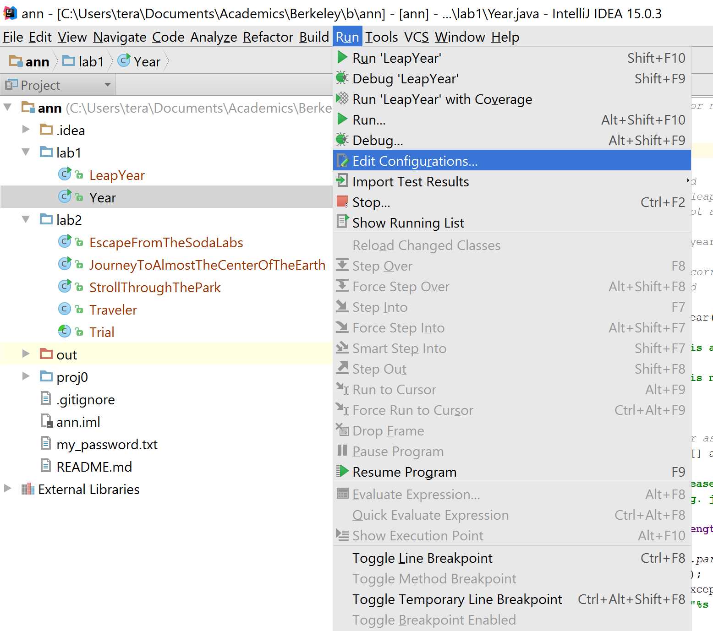
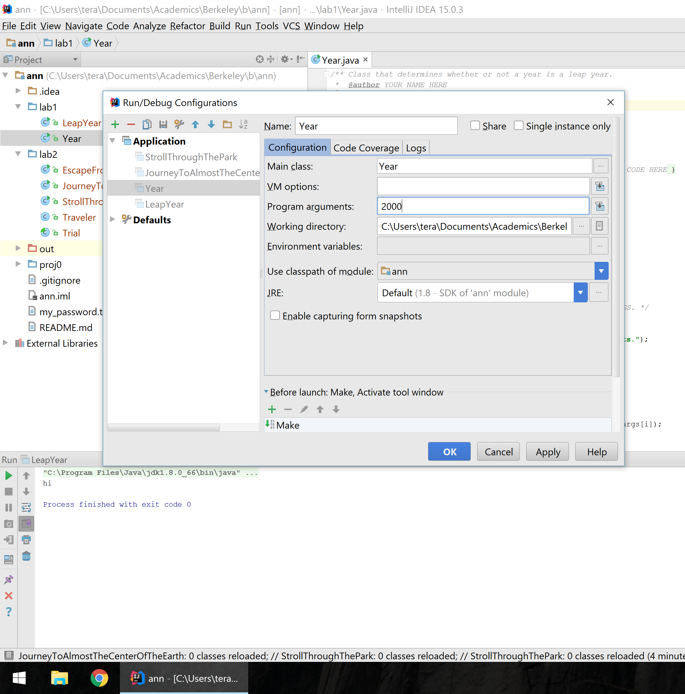
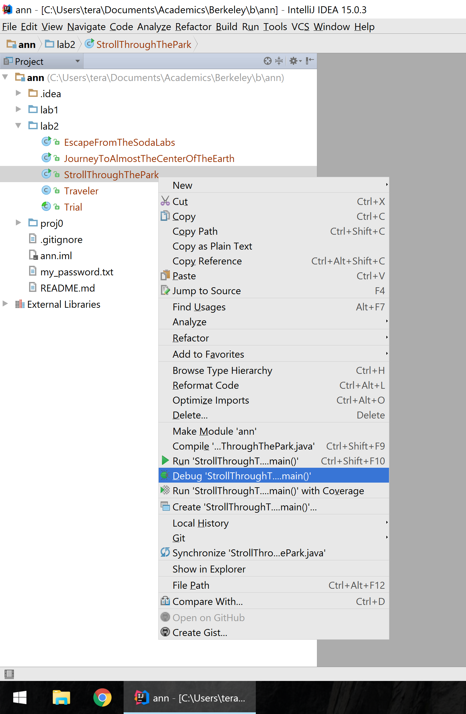
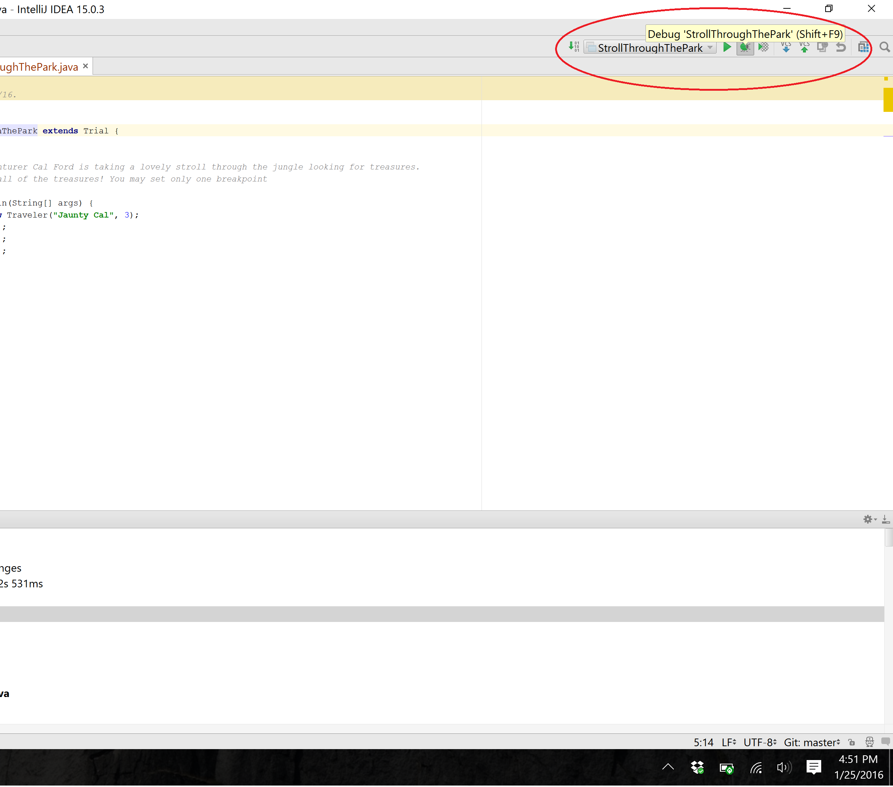
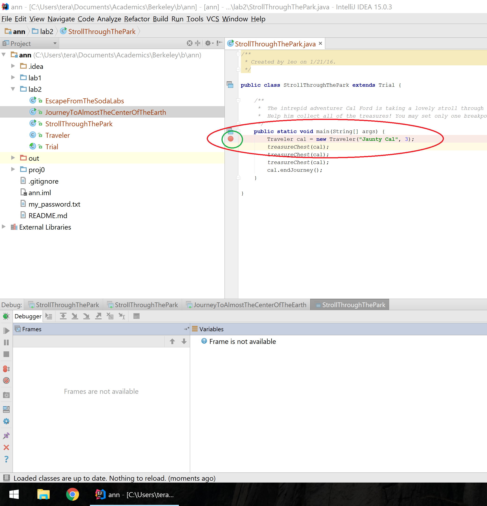
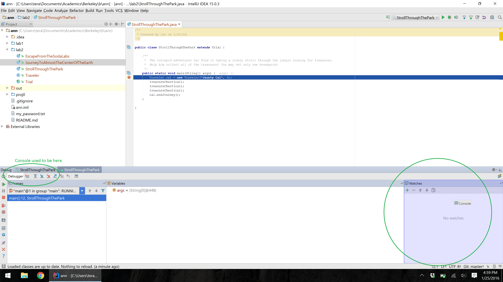
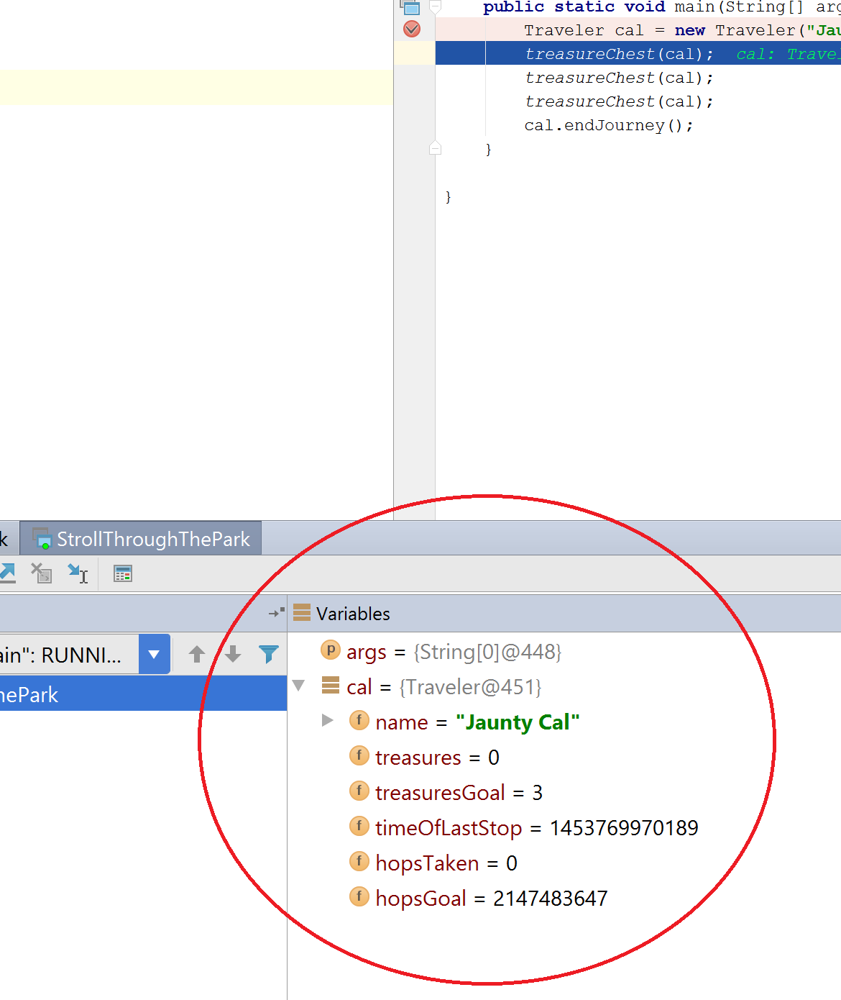
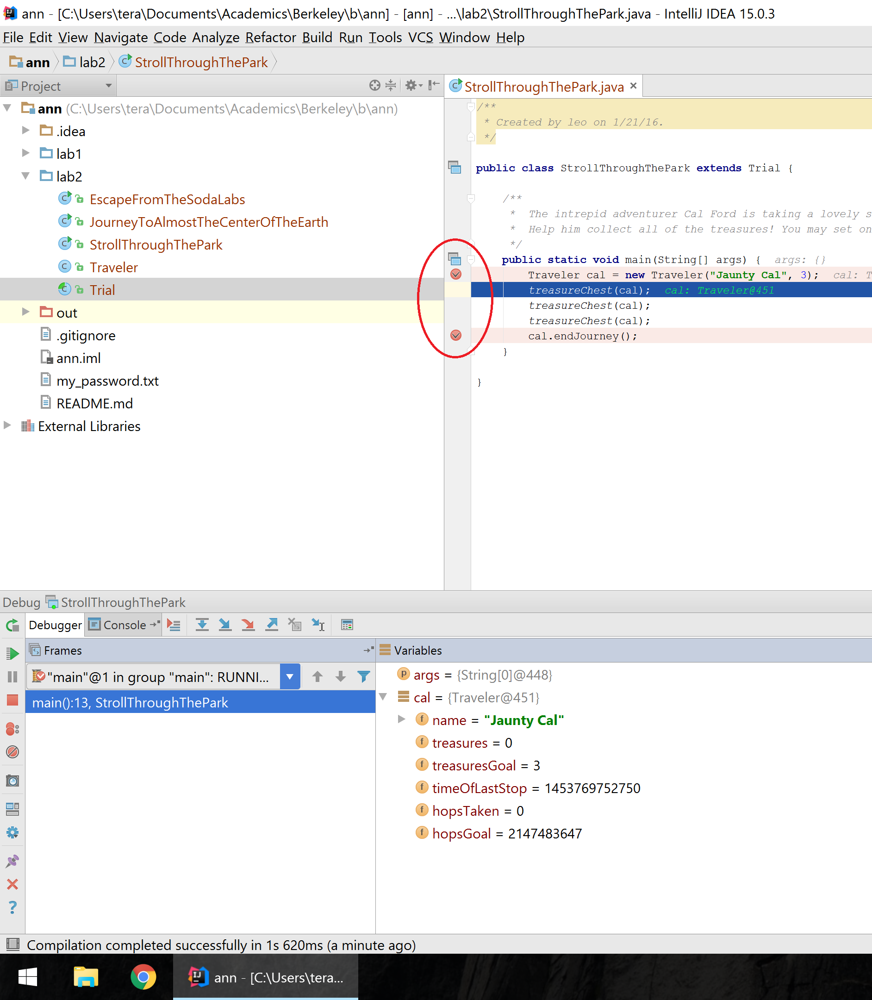
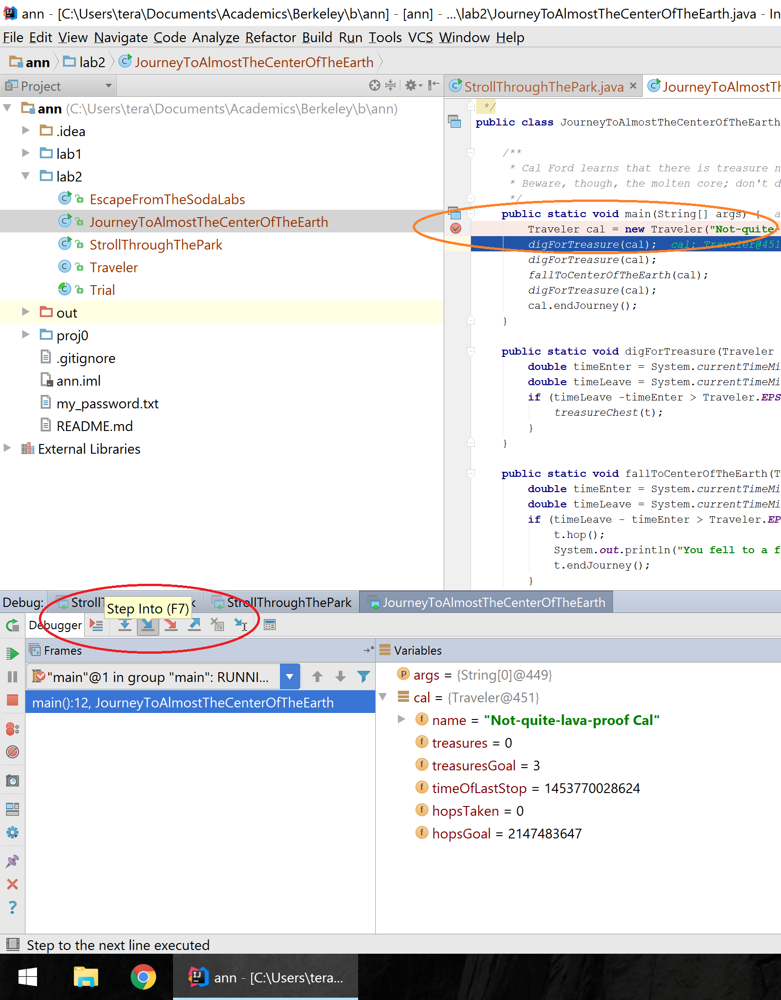

~ number: 2
~ title: Unit Testing with JUnit and IntLists

Pre-lab
-------------------------------

- Run `git pull skeleton master` in your repo. You should get a `lab2/` folder.
- If you already did lab2b before today, make sure to repeat steps 1-8 to reimport your project after pulling from the skeleton.
- [Lab 2b](http://cs61b.ug/sp16/materials/lab/lab2b/lab2b.html)

Introduction
--------------------------------
In this lab, you will learn about basic IntelliJ features, Destructive vs NonDestructive methods, and IntLists.

Your job for this assignment is to run through the debugging exercises and to create methods for `IntList.java`.

Command Line Arguments
--------------------------------
In lab 1, to run Year.java you ran `java Year 2000`. In lab 2b, you saw how to run a program but not how to input 2000 as an argument. To do so, we simply need to edit the run configuration. From the run menu, click on edit configurations.

From the following menu, Make sure that your main class is Year. Put in 2000  into the program arguments field. Click ok then run the program.

Debugger Basics
--------------------------------
`cd` into the the DebugPractice directory located in the lab2 directory. You'll notice a few colorfully named classes. You won't have to modify any of the code here; your purpose is to successfully finish each debugging exercise by collecting all the "treasures" by performing increasingly complex debugging gymnastics.

### Stroll Through the Park

Our first exercise introduces us to our core tools, the `breakpoint` and the `step over` button. In the left-hand Project view, right click on the `StrollThroughThePark` file (like you did to Years.java in lab 2b) and this time select the `Debug` option. If the Debug option doesn't appear, it's because you didn't re-import your project (see steps 1-8 of lab2b).

(note that after this, the green bug button will be visible next to the green play/triangle at the top-right; you can click this bug from here on out to run the debugger).

You'll notice that the program just ran through all the lines of the program and we failed to collect any treasures; however, we want to be able to step through the code line by line. Part of this is motivated because we can only collect a treasure if we stop right on top of a `treasureChest()` method call. In order to stop our code at some point during the execution of the program, we can set a breakpoint by clicking on the margin to the left of the line. Try setting a breakpoint at the first line of the program then start the debugger either by right clicking the file or clicking the bug button. (<a href="https://gfycat.com/FickleForthrightCoot">Animated gif demonstration</a>)

After running the debugger and stopping on your breakpoint on the first line, you'll notice that the first line is now highlighted. Also pay attention to the area down below. You should see at least two tabs, the `Console` tab (for seeing printed output) and the `Debugger` tab (which shows your variables at each paused moment). I recommend dragging the `Console` tab to the right so it's side-by-side with the watches tab, then drag the margin such that the `Debugger` and the `Console` tab have about the same space. Pay attention to the circled area in the bottom right of the image below and note that the Console tab is hovering there; dragging that tab there is how you put the Console in that space. (<a href="https://gfycat.com/GoodnaturedDisguisedAdmiralbutterfly">Animated gif version demo</a>)

<!-- TODO Leo make sure that you're happy with this Console vs. Debugger tab prose ^^. Idk how to make them show up side by side, and I'm also not sure if now is the right time to mention how. The blocks of words are already pretty big. -->

Inside the `Debugger` tab at the bottom, hit the `step over` button (or hit F8); this has us move over to the next line in the code. You should notice that the variables field now has an entry for the `cal` variable; the variables field keeps track of all local variables that exist within the scope of the current method we're in, in this case `main`. 

This `cal` variable represents YOU, the student, as you travel on your journey through the source code using IntelliJ. You can hit the arrow next to it to see a drop-down menu of all the instance variables of `cal`. Hit step over to go to the next treasure chest and you'll notice the variables of `cal` change as the first treasureChest line is executed. Of particular note, observe that when you use the debugger to run these lines of code, your treasures count increases! 

Now that you know what the `step over` button does, step over each line of code, collecting a treasure as you go.

Before we move on, we'd also like to point out the `Resume` button. Set a breakpoint at the first and last line of the main function.

Hit debug. But now instead of stepping into or over, hit `Resume`, which is the green triangle in the bottom left (hover your mouse over the button to see its name). This should let you skip to your next breakpoint. Resume will continue your program like normal until either the program finishes or it hits another breakpoint. 

After clicking resume, show the instance variables of `cal`, and you'll see that even though you're at the end of the program, you didn't get any treasures. In our debugging game, you do not earn a treasure if you run past a treasureChest.

### Journey to Almost the Center of the Earth
Taking a look at this program, you'll notice that the treasures are nested within methods; you'll have to "dig" for them. How do we "dig" into a method? Well technically, we could set a breakpoint at every `treasureChest()` call and press resume after you hit every breakpoint; however, this isn't enough of a challenge for Cal Ford so we'll impose one restriction: you can only set one breakpoint at the start of the program. Set a breakpoint at line 8 (the first line of the `main()`), and no other breakpoints. The current line number is shown in the bottom right of the IntelliJ code editing window. With cautious steps, you have nothing to fear (except molten magma)! 

How can we get to those nested `treasureChests()` now? If we simply `step over` the `digForTreasure()` methods, we'll never stop over the `treasureChests()`. Introducing our next tool; the `step into` button (F7). If you `step into` while paused over a variable, it functions like `step over` and goes to the next line (nothing interesting). However, if you hit `step into` while paused over a method, you'll go into the body of that method.

Note: If you're a fast clicker, you might find that you're moving too quickly when you dig, and thus missing the buried treasures. Slow down!

Set a single breakpoint at line 8, the first line of the `main()` method, and gather all the treasures using only `step into` (F7) and `step over` (F8).

### Escape from Soda Labs
For this exercise we add a constraint; you can only register a certain number of "hops". Hops are recorded whenever you stop on one of the methods defined in `Trial.java`. There is also a bug where you may record more than one hop for every Travel method you stop on. It's extra for you to figure out why this happens. However, to finish this exercise, the bare minimum is to stop over only the `treasureChest()` methods and to never step on the `nothingHere()` methods. Those methods are only there to distract you from your righteous path!

We'll introduce you to one final debugging operation, `step out`. This is the opposite of `step into`; rather than going deeper into a method, it runs through the remaining lines of code in the current method, and returns you to the parent method that called your current method. Because of this return, this button is sometimes called `step return`, such as in Eclipse, another popular Java IDE.

Step out is useful because sometimes you only need to see how part of a program executes; once you're done walking through the juicy parts and want to go back to the context of the method that called the function you're currently in, you can hit `step out`.

Using only one breakpoint and all three step functions we've taught, thwart Leorge Gucas by collecting the treasures and elegantly escaping his nasty traps!

Bonus for Bosses #1: Do you see why the program registers 8 hops with the bare minimum constraints? Do this while only registering 5 hops with all of the same constraints! (Hint: you can use only 1 breakpoint but feel free to be creative as to where you place it)

Bonus for Bosses #2: Fix the code such that stopping over a method is the only way to increase the number of stops.

Bonus for Bosses #3: Try making your own little puzzle! If you come up with something particularly devious, feel free to post on Piazza and challenge the class!

### Recap: Debugging
By this point you should understand the following tools

- Breakpoints
- Stepping over
- Stepping into
- Stepping out
- Resuming

However, this is simply scratching the surface of the features of the debugger! Feel free to experiment. Remember that watches tab? Why not read into what that does? Or the evaluate expressions button (the last button on the row of step into/over/out buttons)? There might be a cheeky way to cheat my games if you use that. Or perhaps look deeper into breakpoints. I personally find conditional breakpoints useful from time to time. In lab3, we will try out a couple of these features.

Application: IntLists
--------------------------------

### Introduction/Review of IntLists

As discussed in Monday's lecture, an `IntList` is our CS61B implementation for a linked list of integers. It has a `head` and `tail` property. The `head` is the `int` element contained by the node, and the `tail` is the next chain in the list (another `IntList`!).

See `IntList.java` in the IntList directory for a refresher. We've added a method called `list` that makes it easier to create IntLists. For example, to create an `IntList` containing the numbers 0, 1, 2, and 3, we could use the method as follows:

        IntList myList = IntList.list(0, 1, 2, 3);
        // Creates the IntList 0 -> 1 -> 2 -> 3 -> null

- `myList.head` returns 0
- `myList.tail` returns 1 -> 2 -> 3 -> null
- `myList.tail.tail.tail` returns 3 -> null
- `myList.tail.tail.tail.tail` returns null
- Pop quiz: what happens for `myList.tail.tail.tail.tail.tail`? (Hint: it doesn't successfully return something)

Observe that the `IntList.list()` method makes it much easier to create IntLists compared to the naive approach we used in class:

        IntList myList = new IntList(0, null);
        myList.tail = new IntList(1, null);
        myList.tail.tail = new IntList(2, null);
        myList.tail.tail.tail = new IntList(3, null);
        // One line of using IntList.list() can do the job of four lines!

Some of the following methods might be a little hard to digest at first. If you find yourself confused as to how a particular method runs, I recommend looking at the tests in IntListTest.java or adding a main method to IntList.java where you call the method in question and set a breakpoint at a line calling the method so you can walk through the code line by line, observing the state of variables as the method progresses.

### Destructive vs. Nondestructive

Let's consider a method `dSquareList` that will destuctively square every item in a list (similar to what we saw in discussion):

        IntList origL = Intlist.list(1, 2, 3)
        dSquareList(origL);
        // origL is now (1, 4, 9)

Here is one implementation of `dSquareList()`:

        public static void dSquareList(IntList L) {
            while (L != null) {
                L.head = L.head * L.head;
                L = L.tail;
            }
        }

This is a classic example of a destructive method. It iterates through the list and squares each item, causing the values linked by `L` to change. In other words, after calling this method once on `L`, every element in `L` will be squared.

NOTE: The choice to return void rather than the original pointer to `L` was an arbitrary decision. Different languages and libraries use different conventions (and people get quite grumpy about which is the "right" one).

Examining the code above, we see that the `origL` variable contains a reference to the created `IntList`. This `origL` variable never changes. Although the `L` variable in `dSquareList()` gets reassigned all day long, because all parameter passing in method calls are pass-by-copy (remember pass-by-bits from lecture?), the `origL` variable is still safe and properly points to the first element. In other words, even as we continually call `L = L.tail`, `origL` always points to the beginning of the `IntList`.

The reason that `dSquareList` is destructive is because we change the values of the **original input `IntList`**.  As we go along, we square each value, and the action of changing the internal data persists (unlike the reassignment of `L`, which doesn't effectively last after the method finishes).

By the end of the method, `L` is null, and `origL` is still pointing at the beginning of the `IntList`, but every value in the `IntList` that `origL` points to is now squared.

If these ideas don't yet make total sense, ask a TA or lab assistant to draw a diagram of the code execution or run through it slowly with the debugger. They are here to help you! Pointers and IntLists might seem confusing at first, but it's important that you understand these concepts!

Now, look at `squareListIterative()` and `squareListRecursive()`. These methods are both *non-destructive*. That is, the underlying `IntList` passed into the methods does **not** get modified, and instead a fresh new copy is modified and returned.

Look at the recursive version - try to reason why this is non-destructive. If you don't understand this yet, you should make sure you do before proceeding.

Now look at `squarelistIterative()`. The iterative version of a non-destructive method is often quite a bit messier than the recursive version, since it takes some careful pointer action to create a new `IntList`, build it up, and return it. Try to understand what this code is doing, but don't stress if it doesn't all make sense right away.

Finally, look at the test method `testDSquareList` in `IntListTest.java`.  Notice that this test checks whether or not `dSquareList` is destructive. Note: You should run these tests using IntelliJ, not the terminal.

### Implementing Destructive vs NonDestructive Methods

Finally, let's dig in by writing our own methods: `dcatenate` and `catenate`.

Both methods take in two IntLists, and concatenates them together. So `catenate(IntList A, IntList B)` and `dcatenate(IntList A, IntList B)` both result in an `IntList` which contains the elements of `A` followed by the elements of `B`.

The only difference between these two methods is that `dcatenate` modifies the original `IntList A` (so it's destructive) and `catenate` does not.

To complete the lab:

 - Now fill in one of `dcatenate()` or `catenate()`, and run them against our tests. Revise your code until it passes our tests. Note: You should run these tests using IntelliJ, not the terminal.
 - Repeat for the method you haven't yet completed. (We recommend you do one first and finish it before you start the next, because then you'll be able to take advantage of the similar logic)

`IntList` problems can be tricky to think about, and there are always several approaches which can work. Don't be afraid to pull out pen and paper or go to the whiteboard and work out some examples! If you get stuck, drawing out the pointers can probably stimulate you back onto the path of progress. And, as always, the debugger is a great option!

Feel free to use either recursion or iteration. For extra practice, try both!

It's also often useful to first think about base cases (when `A` is `null`, for example) - this works especially well for building up a recursive solution. In other words, write up a solution that would work for the base case, then stop and think about how to expand this solution into something that works for other bigger cases.

### Complete and Submit Lab 2
You will submit IntList.java

 Full Recap
-------------------------------
In this lab, we went over:

- Inputting command line arguments with IntelliJ
- Stepping into, over, and out inside the IntelliJ debugger (this will be handy for projects!)
- Non-destructive vs. destructive methods
- IntLists and pointers
- Writing `IntList` methods destrutively, non-destructively, recursively, and iteratively
