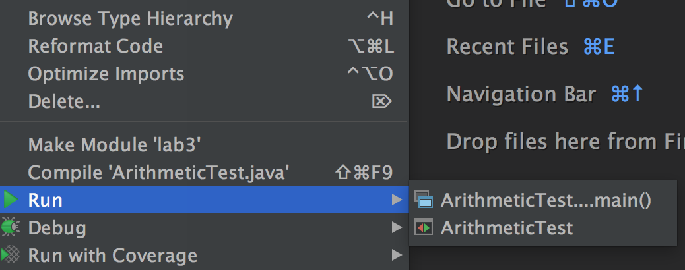

~ number: 3
~ title: Unit Testing with JUnit, Debugging

Due to the late release, attendance for this lab is not required. Please report any errors directly to Josh: hug@cs.berkeley.edu

Pre-lab
-------------------------------

- [Lab 3B: Installing JUnit](http://cs61b.ug/sp16/materials/lab/lab3b/lab3b.html): Classpath setup.
 
- After pulling skeleton, copy your IntList.java from lab2 into the lab3/IntList folder.

Introduction
--------------------------------
In this lab, you will learn about Unit Testing, JUnit, the 61B style checker, and we'll also get a bit more debugging experience.

####What is JUnit?
[JUnit](http://junit.org/) is a Unit Testing Framework for Java.

####What is Unit Testing?
Unit Testing is a great way to rigorously test each method of your code and ultimately ensure that you have a working project.
The “Unit” part of Unit Testing comes from the idea that you can break your program down into units, or the smallest testable part of an application.
Therefore, Unit Testing enforces good code structure (each method should only do “One Thing”), and allows you to consider all of the edge cases for each method and test for them individually.  In this class, you will be using JUnit to create and run tests on your code to ensure its correctness.  And when JUnit tests fail, you will have an excellent starting point for debugging.

####JUnit Syntax
JUnit provides some special functionality on top of what you can normally do in java.

Ultimately, JUnit provides a testing framework, so you can test your code without stressing about details (formatting and printing of error messages, counting failures and succsses, etc.).

So what is different about a JUnit java file?  Go ahead and navigate to the Arithmetic directory and open `ArithmeticTest.java` in your favorite text editor (don't open IntelliJ just yet).

The first thing you'll notice are the imports at the top.  These imports are what give you easy access to the JUnit methods and functionality that you'll need to run JUnit tests.

Next, you'll see that there are two methods in `ArithmeticTest.java`: `testProduct` and `testSum`
These methods follow this format:

    @Test
    public void testMethod() {
        assertEquals(<expected>, <actual>);
    }

`assertEquals` is a common method used in JUnit tests. It tests whether a variable's actual value is equivalent to its expected value.

When you create JUnit test files, you should precede each test method with a `@Test` annotation, and can have one or more `assertEquals` or `assertTrue` methods (provided by the JUnit library). ** All tests must be non-static. ** This may seem weird since your tests don't use instance variables and you probably won't instantiate the class. However, this is how the designers of JUnit decided tests should be written, so we'll go with it.

From here, you have two choices of how to proceed. If you're planning on working in IntelliJ, read on. If you're planning on running your code from a terminal, skip to [this section](#running-junit-tests-from-a-terminal).

Running JUnit Tests in IntelliJ (or another IDE)
--------------------------------

Open up IntelliJ. You'll need to reimport your project before the Run/Debug buttons will appear for
lab 3 code. Repeat the steps from [lab 2b](http://cs61b.ug/sp16/materials/lab/lab2b/lab2b.html) and
you should be good to go.

Open up lab3/arithmetic/ArithmeticTest.java in IntelliJ, and right click (a.k.a. two finger click on
Macs) and under the run menu you should see two options, as shown below:

We recommend the option that simply says "ArithmeticTest" instead of the one that says
"ArithmeticTest....main". Effectively the option is between whether you want "ArithmeticTest....main" or IntelliJ to be in charge of displaying the test results.

If you pick "ArithmeticTest" (without main) and run the tests, you should see something like:

    java.lang.AssertionErrror:
    Expected :11
    Actual :30
     <Click to see the difference>

        at org.junit.Assert.failNotEquals(Assert.java.834)
        at ArithmeticTest.testSum(AritmeticTest.java:25)

This is saying that the test on line 25 of ArithmeticTest.java failed. You'll see that even though `testSum` included many `assert` statements, you only saw the first failure (even though all of the later asserts would have failed as well!)

This is because JUnit tests are short-circuiting – as soon as one of the asserts in a method fails, it will output the failure and move on to the next test.

Try clicking on the `ArithmeticTest.java:25` and IntelliJ will take you straight to the failed test.

Now fix the bug, either by inspecting Arithmetic.java and finding the bug, or using the IntelliJ
debugger to step through the code until you reach the bug.

After fixing the bug, rerun the test, and you should get a nice glorious green bar. Enjoy the rush.

 Running JUnit Tests from a Terminal
--------------------------------

*Whether you're on your own computer or a lab machine, you will need to complete [lab 3b](../lab3b/lab3b.html) before JUnit test compilation will work.*

Rather than write your own main method that manually invokes every test (e.g. `testSum` and `testProduct`), we'll use the trick from Lecture 7 where our main method simply calls a `runTests` method that is able to automatically identify and execute all test methods annotated with the `"@Test` symbol.

In 61B, all JUnit tests files should have a main method that calls `jh61b.junit.TestRunner.runTests`, with an argument equal to the name of the class. For example, if your JUnit test file is called ArithmeticTest.java, your main should simply be:

    jh61b.junit.TestRunner.runTests(ArithmeticTest.class);

This line is invoking the `runTests(Class c)`method of a class called `TestRunner` in a library called `jh61b.junit`.

You don't need to know how this mysterious TestRunner class works (but see the [lecture 7 lectureCode](https://github.com/Berkeley-CS61B/lectureCode-sp16/tree/master/lec7/extra) if you're curious). Just know that this function will run all of the methods which are preceded by `@Test` in the specified file, and will output everything in a nice format.

Let's try it out. Go to the lab3/arithmetic folder, and try running the small test provided:

    javac *.java
    java ArithmeticTest

This will run all of the tests in ArithmeticTest.java and give you back a JUnit report. Notice it includes a failure! This tells you which test failed (`testSum` in `ArithmeticTest`), what the expected and actual values were, and on what line the failure occured. The output on your console should be something like this:

    Running JUnit tests using jh61b.junit.TestRunner in "all" mode.

    Running testSum:
    ====================================
    expected:<11> but was:<30>
        at ArithmeticTest.testSum:25 (ArithmeticTest.java)
    =====> FAILED!

    Running testProduct:
    ====================================
    =====> Passed

    Passed: 1/2 tests.

As you can see above the `testProduct` test passed with flying colors. However, the `testSum` class failed miserably, apparently calculating 30 when it should have computed 11.

Open up `ArithmeticTest.java` and take a look around. Comparing against the output above, you'll see that even though `testSum` included many `assert` statements, you only saw the first failure (even though all of the later asserts would have failed as well!)

This is because JUnit tests are short-circuiting – as soon as one of the asserts in a method fails, it will output the failure and move on to the next test.

Try modifying `ArithmeticTest` so that it shows only failed test results (by changing the mode argument from "all" to "failed"). Re-run and you'll see only failed tests. We recommend that you run your test files in "failed" mode, as this will allow you to focus on what needs doing, rather than celebrating what has already been done. Debugging is a hard life.

Now it's time to look to see why `testSum` failed. Look at `testSum` to understand what its testing for, and then make the appropriate change in `Arithmetic.java`.

After fixing the bug, execute the compilation and execution commands again:

    $ javac *.java
    $ java ArithmeticTest

If you've fixed the bug, it should look like this:

    $ java ArithmeticTest

    Running JUnit tests using jh61b.junit.TestRunner in "failure" mode.

    Passed: 2/2 tests.

Since you're running your code from the command line, you're going to need to use print statement debugging (as opposed to the cool debugger you hopefully saw in lab 2). Any code that is printed during a test will be output as part of the results message for a given test. Try adding print statements and see how the output changes.

Extra for Experts: If you're interested in learning to use a command line debugger for Java, you can try out Paul Hilfinger's gjdb tool. See this [video from Spring 2015](https://www.youtube.com/watch?v=ihMUS-MhNwA) for a demo of this tool. Due to very low adoption rates in previous semesters, we will not provide official support for this tool, but lab1d and lab3 from Spring 2015 explain how to use it. The directions from Spring 2015 should still work (but let Josh know if they don't). 

Intlists
--------------------------------

Now a real-CS61B application of JUnit tests: IntLists.

As with last week's lab, we're going to take advantage of the list method of the IntList class, which makes creating IntLists (and writing IntList tests) much easier. For example, consider:

    IntList myList = IntList.list(0, 1, 2, 3);

Which will create the IntList `0 -> 1 -> 2 -> 3 -> null`

###Test a Reverse Method

Copy your IntList.java that you created for lab2 into the lab3/IntList folder. In this section, our goal will be to write the reverse method from this week's discussion worksheet.

We'll showcase the idea of "test-driven development" for this exercise, where we write a unit test even before we write the new method.

Add a new test to IntListTest.java that tests the `.reverse()` method, which you can assume has the following definition:

    /**
     * Returns the reverse of the given IntList.
     * This method is destructive. If given null
     * as an input, returns null.
     */
    public static IntList reverse(IntList A)

Your test should test at least the following:
 - That the method handles null lists properly.
 - That the function returns a reversed list.
 - That the function is destructive. (This is a bit of a silly test, but I have a good reason!)

###Writing a Reverse Method

When you feel like your test is probably in good shape, try compiling IntListTest.java. You should get a compiler error along the lines of:

    IntListTest.java:72: error: cannot find symbol

      symbol:   method reverse

This error is a great thing! It means that the compiler is actually finding our test.

Now copy and paste a dummy version of the reverse method into IntList.java. Your dummy version might simply return null. Your only goal here is to get IntList.java to compile.

If you're running IntListTest from the command line, you'll need to add a main method before proceeding. See ArithmeticTest.java for an example.

Try compiling `IntListTest.java` again, and this time your test should compile. Run the test using `java IntListTest` or IntelliJ, and the test should fail. This is great! We've now reached the "red" phase of the TDD cycle.

Write a reverse method, and rerun the tests until it passes. If you're stuck (this is a tricky problem with a very clever solution), see the week 3 discussion solutions. Note that a correct reverse is not required for full credit on this week's lab (it's an ungraded test in the AG), so if you're really stuck and need to work on project 1, do that first, and then come back and complete this exercise.

Protip: If you want to have your tests timeout after a certain amount of time (to prevent infinite loops), you can declare your test like this:

    @Test(timeout = 1000)

The given parameter specifies the maximum time in milliseconds.

Some people find the rush of TDD addictive. You basically set up a little game for yourself to solve. Some people hate it. Your mileage may vary. Whether you personally enjoy the TDD flow or not, writing tests will be one of the most important skills you learn here at Berkeley, and getting "[test-infected](http://c2.com/cgi/wiki?TestInfected)" will save you and your future colleagues an enormous amount of time and misery.

A Debugging Mystery
--------------------------------

Another important skill to learn is how to exhaustively debug. When done properly, debugging should allow you to rapidly narrow down where a bug might be located, even when you are debugging code you don't fully understand.

Your company, Flik Enterprises, has released a fine software library called Flik.java that is able to determine whether two Integers are the same or not.

You receive an email from someone named "Horrible Steve" who describes a problem they're having with your library:

    "Dear Flik Enterprises,

    Your library is very bad. See the attached code. It should print out 500 but actually it's printing out 128.

    (attachment: HorribleSteve.java)"

Using any combination of the following techniques, figure out whether the bug is in Horrible Steve's code or in Flik enterprise's library:
 - Writing JUnit tests for the Flik library.
 - Using the IntelliJ debugger.
 - Using print statements.
 - Refactoring Horrible Steve's code. Refactoring means changing the syntax without changing the functionality. This may be hard to do since HS's code uses lots of weird stuff.

HorribleSteve.java and Flik.java both use syntax we haven't covered in class. We do not expect you to fix the bug or even understand it once you have found it. Instead, your job is simply to find the bug.

Tip: JUnit provides methods `assertTrue(boolean)` and `assertTrue(String, boolean)` that you might find helpful.

Running the 61B Style Checker
--------------------------------

Starting after the midterm, your code will be required to obey the [CS61B style guidelines](http://cs61b.ug/sp16/materials/guides/style-guide.html). As noted, you should probably not try to read these rules, though they may be a useful reference. Instead, it will be much easier to simply run the style checker. You can do this by running the style61b.py script provided in the lib folder (you may need to pull from skeleton again if you don't see it). For example, on my machine, I can run it as follows.

    $ python3 /Users/jug/work/bqd/javalib/style61b.py *.java

Try it out on the files in your IntList folder. You should see that there are at least two style errors (the two we put in, plus whatever you may have introduced yourself). You are not required to pass these checks until after the midterm (though from now on, we will be running the style checker for your reference in the autograder, for no credit).

When you pass the style check, the output should look like:

    Starting audit...
    Audit done.

Deque Unit Tests
--------------------------------

In project 1B (to be released 2/5), you'll be required to write JUnit tests for your Deque classes. If you have extra time in lab, start writing some tests for `LinkedListDeque` and `ArrayDeque` as a warmup.

 Submission
--------------------------------

Submit your Arithmetic.java, IntListTest.java, and IntList.java method to gradescope. 

Recap
-------------------------------
In this lab, we went over:

- Unit Testing (big picture)
- JUnit syntax and details
- Writing JUnit tests
- Debugging Using JUnit
- Running the Style checker
