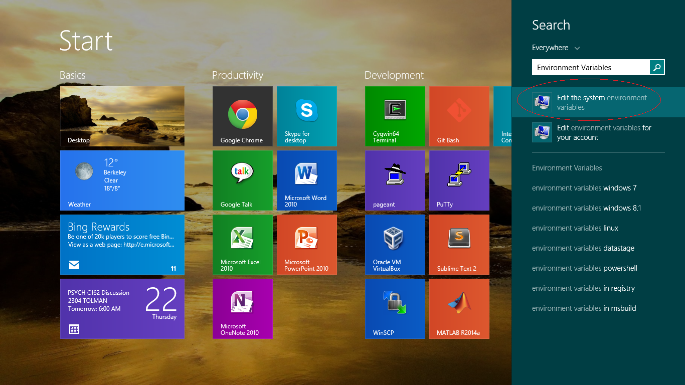
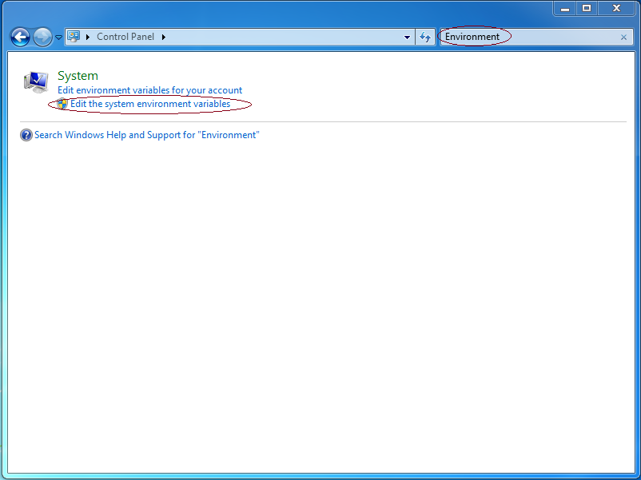
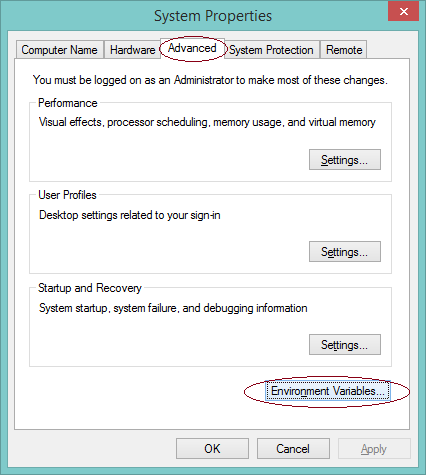
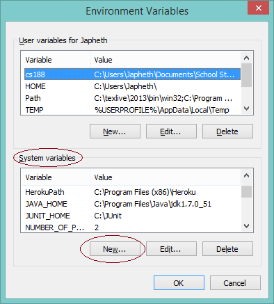
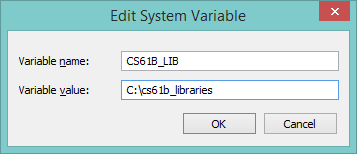
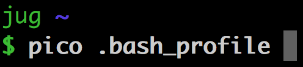

~ number: 3b
~ title: Installing the 61B Libraries

Navigation
----

- [Introduction](#introduction)
- [Windows](#a-windows-setup)
- [OS X, Unix/Linux](#b-os-x-and-unix-setup)

Introduction
----

Starting with lab3, you'll need to have your computer setup to use the Spring 2016 Java libraries.

To download the files, all you need to do is pull from the skeleton repository using `git pull skeleton master`. At the time of this writing (2/3/16), your javalib directory should contain the following files:

 - 61b_checks.xml
 - algs4.jar
 - checkstyle-5.9-all.jar
 - hamcrest-core-1.3.jar
 - jh61b.jar
 - junit-4.12.jar
 - reflections-0.9.9-RC1-uberjar.jar
 - stdlib-package.jar
 - stdlib.jar
 - style61b.py

A. Windows Setup
----

1. Pull from the skeleton repo and verify that you've received a lib folder containing the files listed above.

2.  Create a CLASSPATH environment variable pointing to the lib folder.  As we did in Lab 1b, we will do this by updating our environment variables.

    1. **Windows 10/8/8.1:** Launch the Start Screen by pressing Windows, and type 'Environment Variables'.  Select "Edit the system environment variables".

        

        **Windows 7 and earlier:** Open the Start Menu and launch the "Control Panel".  Search for "Environment Variables", and select "Edit the system environment variables".

        

    2. Navigate to the "Advanced" tab, and click "Environment Variables...".

        

    3. Under "System variables", click "New..."

        

    4. Define the following variables -- if the variable already exists, select the variable and click "Edit...", then add the value specified below to the front of the value, followed by a semicolon; otherwise, click "New..." and use the values specified below as the value of the variable:

        - **CS61B_LIB:** Set this to the location which contains your library JAR files (e.g. stdlib-package.jar).  This is the location you specified in step 1.  In my case, I have specified the location `C:\cs61b_libraries`. Since you downloaded the libraries using git, your directory will probably be something more like `C:\users\potato\61b\bxz\lib`.

            **Warning:** If the path to the above directory contains space(s), you will need to surround the Variable value with double quotes, i.e. `"C:\Some Path With Spaces".

            

        - **CLASSPATH:** Set this to `%CLASSPATH%;%CS61B_LIB%\*;.;`

2. Press OK to save these settings, and OK again to close the dialog for System Properties.  Restart any open Git Bash/Command Prompt/Cygwin windows that you have open and you should be good to go. To verify that your setup works, try compiling the ArithmeticTest.java file from lab2. If this file compiles, everything is working as expected.

B. OS X and Unix Setup
----

[Video Instructions](https://youtu.be/17-okNrio1U) (Spring 2016)

1. Navigate to your repository in the command line, pull from the skeleton repo with `git pull skeleton master`, and verify that you have a javalib folder containing the jar files listed above.

2. Navigate to the javalib folder in your repository and enter in the command `pwd`. You should get something that looks like `/Users/Dennis/school/cs61b/sp2016/aaa/javalib`. Copy this to somewhere!

3. Set up a CLASSPATH environment variable that points to the javalib folder. To do this:

    1. Open the file .bash\_profile in your home directory. Since the filename starts with a period, it counts as a "hidden file", and will not appear in your Finder window. Annoyingly, there is no "show hidden files" option in Mac OS X, so I recommend opening this file by creating a terminal window and entering the command `pico ~/.bash_profile`. This will open the pico editor, which is fairly easy to use (compared to vim or emacs). Or you can use sublime or whatever else you'd like to use.

           

    2. Copy the result you got from step 2 above.

    3. Scroll to the bottom of your .bash\_profile file. **If it is empty, this is fine. It just means that you didn't have one yet.** At the bottom of your .bash\_profile file, add: `export CS61B_LIB_DIR="[paste result from step 2 above]/*"` (*note the /\* at the end*), but with the directory name adjusted to match the location of your javalib folder. So, if I use the result that I got above, I would add `export CS61B_LIB_DIR="/Users/Dennis/school/cs61b/sp2016/repo/javalib/*"` to my .bash\_profile file. This creates an environment variable called `CS61B_LIB_DIR`.

    4. Now add a line to the bottom of your .bash\_profile file that says `export CLASSPATH="$CLASSPATH:$CS61B_LIB_DIR:./"`. This creates an environment variable called CLASSPATH. Everytime you use javac, it will look in the directories given by the CLASSPATH for library files (you do not need to manually import libraries in Java code).

    5. Check to make sure your .bash\_profile is correct. Starting from an empty .bash\_profile, I would end up with this at the bottom of my file:

            export CS61B_LIB_DIR="/Users/Dennis/school/cs61b/sp2016/aaa/javalib/*"
            export CLASSPATH="$CLASSPATH:$CS61B_LIB_DIR:./

    6. Press Ctrl-O to save. Then press Ctrl-X to exit pico.

    7. If you're using Linux (or maybe even an older version of Mac OS), you may need to repeat steps 1-6 above, but now also putting everything in a file called .bashrc. So, you'll want to edit your .bashrc file instead, with `pico .bashrc`, then copy and paste the same contents as above. 

4. Restart any terminal windows you have open.

5. Open a new terminal window and verify that your code is working by compiling ArithmeticTest.java from lab3 with `javac ArithmeticTest.java`. If this works without errors, then your computer is properly configured.

Note: For Unix users, you might need to tweak these steps slightly if you're using a different shell than Bash. If you don't know what that means, then these directions should almost certainly work (but have not been tested).

