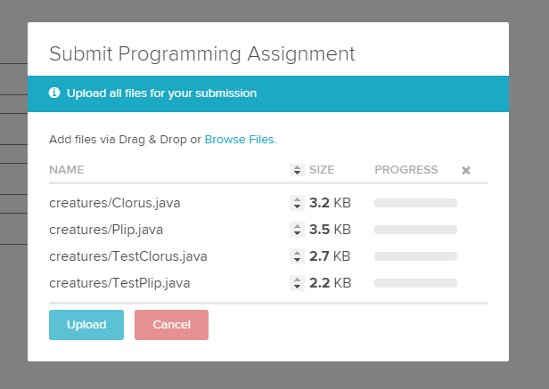

~ number: 6
~ title: HugLife

Pre-lab: Generic Collections
-------------------------------

This week in lecture, we learned how to work with generic collections. Let's review.

#### Java before generics (pre-2004)

To date, we've seen collections that hold values of a particular type. For example, an `AList` is pre-defined to hold ints:

    public class AList {
    
        private int[] items; // items are ints
        private int size; 

        public int get(int i) { // Returns an int
            // ...
        }

        public void insertBack(int x) { // Takes an int
            // ...
        }

        // ...
    }

We could imagine a class called `ObjectList`, which is like `AList` except that it can hold values of *any* type. It would look something like this:

    public class ObjectList {
    
        private Object[] items; // items are Objects
        private int size;

        public Object get(int i) { // Returns an Object
            // ...
        }

        public void insertBack(Object x) { // Takes an Object
            // ...
        }

        // ...
    }

Let's look at an example. Suppose we run the following:

    ObjectList dogs = new ObjectList();
    Dog fifi = new Dog("Fifi");

    dogs.insertBack((Object) fifi); // The (Object) cast here is optional (why?)

Can you see why `ObjectList` would be hard to use? The `get()` method in `ObjectList` returns objects of type `Object`. In order to get a member `ObjectList` as a `Dog`, you would need to downcast back to the actual type:

    Dog dog1 = dogs.get(0);       // Won't compile since dogs.get(0) returns an Object
    Dog dog2 = (Dog) dogs.get(0); // Okay, but annoying

In fact, this introduces a type safety problem: since we can put any `Object` into our `ObjectList`, there's no guarantee that the downcast will work!

    ObjectList dogs = new ObjectList();
    Cat toby = new Cat("Toby");

    dogs.insertBack((Object) toby); // Okay
    fifi = (Dog) dogs.get(0);       // Compiles, but throws ClassCastException at runtime

#### Java with generics

We need a way to tell Java that our list type is **generic**&mdash;that it can hold values of <i>any</i> type, but only a single type at a time, chosen when the list is instantiated. Here's how we do that:

    public class GenericList<T> {
    
        private T[] items; // items are of type T
        private int size;

        public T get(int i) { // Returns an object of type T
            // ...
        }

        public void insertBack(T x) { // Takes an object of type T
            // ...
        }

        // ...
    }

What's going on here? We've defined a list type called `GenericList` that has a **type parameter** (`T`). Wherever you see a `T` is where the **actual type argument** will go, once it's known.

Since `GenericList` is generic, we must provide a type argument whenever we instantiating a `GenericList`. For example, let's make a `GenericList` that can hold `Dog` objects:

    GenericList<Dog> dogs = new GenericList<Dog>();

Now this particular `GenericList`, which we've named `dogs`, will behave as though every `T` were replaced by `Dog`. So `items` will be of type `Dog[]`, `get()` will return a `Dog`, and so on. And now no casting is required when we use `get()`:

    dogs.insertBack(fifi);
    fifi = dogs.get(0); // No downcast from Object to Dog

And those pesky cats can't get into our `dogs` list!

    dogs.insertBack(toby); // Won't work

In fact, the code above won't even compile&mdash;since we declared `dogs` to be of type `GenericList<Dog>`, the Java compiler knows that the `insertBack()` method should only accept `Dog` objects and not `Cat` objects.

#### Four more things about generics

First, `GenericList<Dog>` is usually read as "`GenericList` of `Dog`s". Makes sense, right?

Second, `T` is a common name for type parameters, but there's nothing special about it. You could use `U` or `V` or even `TypeArgumentGoesHere`. But `T` is the typical name by convention.

Third, a generic class can have multiple type parameters:

    public class Cons<U, V> {

        private U car;
        private V cdr;

    }

Finally, when instantiating a generic class, the type argument can usually be replaced with `<>`. So the instantiation of `dogs`

    GenericList<Dog> dogs = new GenericList<Dog>(); // From above

can be written as:

    GenericList<Dog> dogs = new GenericList<>(); // Easier on the eyes

This makes your code easier to read, especially when you have something like

    HashMap<Integer, HashMap<Integer, HashMap<String, Float>>> trans = new HashMap<>();

which is a `HashMap` mapping ints to `HashMap`s mapping ints to `HashMap`s mapping strings to floats.

Introduction
--------------------------------
In this lab, you'll create a package named `creature` that will implement two creatures (or more, if you'd like) that will inhabit a world simulated by the `huglife` package. Along the way we'll learn how to debug small pieces of a much larger system, even if those small pieces happen to live inside another package.

####HugLife

Start the lab by booting up the HugLife simulator. To do this, use the following commands (make sure you're in the `lab6` directory):

    $ javac -g huglife/*.java creatures/*.java
    $ java huglife.HugLife samplesolo

This starts up a world called `samplesolo`. You should see a little red square wandering around randomly.

The creatures you'll create in this assignment will go in the `creatures/` directory, in these two files:
* `Plip.java` (skeleton provided)
* `Clorus.java` (you'll need to create this)

Eventually these two types of creatures will also inhabit the world, and unlike this red guy, they actually do <a href="http://i.imgur.com/E2Kdowq.gifv" target="_blank">something interesting</a>.

These classes will extend the <tt>huglife.Creature</tt> class, which provides a template that all creatures should follow.

####How the simulator works

Creatures live on an NxN grid, with no wraparound. Each square may be empty, impassible, or contain exactly one creature. At each tic (timestep), exactly one creature takes a single action. Creatures choose actions in a round-robin fashion.

There is a global queue of all creatures in the world, waiting their turn to take an action. When a creature is at the front of the queue, the world simulator tells that creature who its four neighbors are and requests a choice of action from the creature. More specifically, the world simulator calls the creature's `chooseAction()` method, which takes as an argument a collection of all four neighbors. Based on the identity of the four neighbors, the creature then chooses one of exactly five actions: MOVE, REPLICATE, ATTACK, STAY, or DIE.

MOVE, REPLICATE, and ATTACK are directional actions, and STAY and DIE are stationary actions. If a creature takes a directional action, it must specify either a direction or a location. For example, if the acting creature sees a creature to its LEFT that it can eat, it might choose to ATTACK LEFT. 

One of your main tasks for this lab is to write the code that makes Creature decisions. Actions are returned as objects of type `Action`, which are fully described in `huglife/Action.java`.

After a creature chooses an `Action`, the simulator enacts the changes to the world grid. You'll be responsible for writing the code that tracks the state of each creature. For example, after the acting creature eats another creature, the acting Creature might become stronger, die, change colors, etc. 

This will be accomplished by a *callback* to the creature, which is required to provide `move()`, `replicate()`, `attack()`, and `stay()` methods that describe how the state of the acting creature will evolve after each of these respective actions.

For example, if your creature chooses to replicate upwards by returning `new Action(Action.ActionType.REPLICATE, Direction.TOP)`, then the game simulator is guaranteed to later call the `replicate()` method of the creature that made this choice. 

Experimenting with the Sample Creature
--------------------------------

Open up `Occupant.java`, `Creature.java`, and `SampleCreature.java`, which you'll find in the `huglife/` directory. 

- `Occupant` is a general class for all possible things that can inhabit the grid of the HugLife universe. You'll see that every `Occupant` inherits a name, shared by all instances of that `Occupant` subtype. Furthermore, every `Occupant` must provide a method that returns a color (more on this later). There are two special `Occupant` types, with names "empty" and "impassible". These represent unoccupied and unoccupiable squares, respectively.
- `Creature` is a general class for all living things that can inhabit the grid of the HugLife universe. Every `Creature` has an energy level, and if that energy level ever falls below zero, the universe will choose the DIE action for them. 

    * Every creature must implement four callback methods: `move()`, `replicate()`, `attack()`, and `stay()`. These describe what the creature should do when each of these actions occurs. There is no `die()` method since the creature is simply removed from the world entirely.

    * Creatures must also implement a `chooseAction()` method, and any reasonable creature will probably find the built-in `getNeighborsOfType()` method useful for doing so.
- `SampleCreature` is a sample `Creature`; in fact, it's the lonely red square we saw earlier. The two creatures you implement for this lab will look somewhat similar to the `SampleCreature`, so you'll want to consult this class later.

Make some changes to the sample creature and observe how they affect the HugLife simulation. As one of your experiments, you might have the `SampleCreature` react in some observable way when it sees a wall. You can do this by requesting a list of all neighbors of type "impassible" from the `getNeighborsOfType()` method.

The commands to run the simulator are the same as above:

    $ javac -g huglife/*.java creatures/*.java
    $ java huglife.HugLife samplesolo

Hint: After you're done experimenting, you can use `git checkout` to revert your lab directory to its original state. Consult the documentation for Git if you don't know how.

Creating a Plip
--------------------------------

Now it's time to add a new type of creature to the world. Go into the `creatures/` directory, and you'll see a file named `Plip.java` there, waiting to be filled out. 

####Basic Plip functionality

Plips will be lazy (but motile) photosynthesizing creatures. They mostly just stand around and grow and replicate, but they'll flee if they happen to see their mortal enemy, the Clorus.

Let's start with just a few of the properties that we'll eventually need for our Plip class.

- The `name()` method (inherited from `Occupant`) should return exactly "plip" with no spaces or capitalization. This is important, since creatures only know how to react to each other based on this name string. (Do you actually have to change anything to ensure this?)
- Plips should lose 0.15 units of energy on a MOVE action, and gain 0.2 units of energy on a STAY action.
- Plips should never have energy greater than 2. If an action would cause the Plip to have energy greater than 2, then it should be set to 2 instead.
- The color method for Plips should return a color with red = 99, blue = 76, and green that varies linearly based on the energy of the Plip. If the plip has zero energy, it should have a green value of 63. If it has max energy, it should have a green value of 255. The green value should vary with energy linearly in between these two extremes.

We could test our `Plip` class by sticking a bunch of Plips on a HugLife world grid and watching what they do as they run amok. However, it would be hard to determine whether everything was working correctly. Instead, let's perform testing on the `Plip` class directly.

> Note on testing: It's not necessarily desirable to test everything! Use 
> tests only when you think they might reveal something useful, i.e. there is 
> some chance you'll get something wrong. Figuring out what to test is a bit 
> of an art!

Open `TestPlip.java`, which is also in the `creatures/` directory. You'll see that a skeleton containing a few simple tests is provided. You can run these tests from the command-line like this:

    $ javac huglife/*.java creatures/*.java
    $ java creatures.TestPlip

Try it out and you'll see that the `testBasics` test fails.

Now modify the `Plip` class according to the specifications above until all tests pass. When you're done, you'll be well on your way to having a fully functional Plip!

####The Plip replicate method

Now we'll work on adding the correct replication property to our Plips, namely:

- When a Plip replicates, it keeps 50% of its energy. The other 50% goes to its offspring. No energy is lost in the replication process.

You'll be filling out the `replicate()` method in `Plip.java`. Take a look at that now.

Before your start, write an appropriate test in the `testReplicate()` method. Be sure to check that the returned `Plip` is not the same `Plip` as the `Plip` whose `replicate()` method was called. You can use the JUnit `assertNotSame()` method for this purpose. (Do not confuse `assertNotEquals()` with `assertNotSame()`. See the JUnit documentation if the distinction is unclear!)

####The Plip `chooseAction()` method

All that's left is giving the Plip a brain. To do this, you'll be filling out the `chooseAction()` method.

The Plip should obey the following behavioral rules, in order of preference:
1. If there are no empty spaces, the Plip should STAY.
2. Otherwise, if the Plip has energy greater than 1.0, it should replicate to an available space.
3. Otherwise, if it sees a neighbor with `name()` equal to "clorus", it will move to any available empty square with probability 50%. It should choose the empty square randomly. As an example, if it sees a Clorus to the LEFT and to the BOTTOM, and "empty" to the TOP and RIGHT, there is a 50% chance it will move (due to fear of Cloruses), and if it does move, it will pick randomly between RIGHT and TOP.
4. Otherwise, it will stay.

These rules must be obeyed in this strict order! Example: If it has energy greater than 1, it will always replicate, even if there are neighboring Cloruses.

#### Writing tests for `chooseAction()`
Before you start on `chooseAction()`, uncomment the `@Test` annotation tag for the `testChoose()` method in `TestPlip.java`. This will allow the `testChoose` test to run. The existing test checks the first rule, namely that if there are no empty spaces next to the Plip, then it should stay.

Add some more tests to `testChoose()`. You might find it useful to look at the code for the `Action` class to see the various constructors for `Action`s.

Don't worry (yet) about testing the 50% rule if a Clorus is nearby. This isn't possible since you haven't created a `Clorus` class yet, and thus you won't be able to create a `HashMap` that involves Cloruses.

Later, once you write the `Clorus` class, you might find it interesting to come back and try to write a randomness test. One possibility is to simply test that both choices are possible by making many calls and ensuring that each happens at least once. Performing a statistical test is probably a bit too much for lab today (though you're welcome to try).

####Writing `chooseAction()`

After you're happy with the tests you've written, edit the `Plip` class so that it makes the right choices. You'll want to look carefully at the `SampleCreature` class as a guide. 

Simulating Plips
--------------------------------

Assuming your tests worked, you can now see how your Plips fare in the real HugLife world. Use the commands:

    $ javac huglife/*.java creatures/*.java
    $ java huglife.HugLife sampleplip

You should see your Plips happily growing along. If something goes wrong, it's probably because your tests are not thorough enough. If this is the case, using the error messages, add new tests to `TestPlip.java` until something finally breaks. If you're still stuck, let a TA or a lab assistant know!

Introducing the Clorus
--------------------------------

Now we'll implement the Clorus, a fierce blue-colored predator that enjoys nothing more than snacking on hapless Plips. 

To begin, create `TestClorus.java` and `Clorus.java` in the `creatures` package. Unlike before, you'll be writing these classes from scratch.

The Clorus should obey the following rules exactly:

- All Cloruses must have a name equal to exactly "clorus" (no capitalization or spaces).
- Cloruses should lose 0.03 units of energy on a MOVE action.
- Cloruses should lose 0.01 units of energy on a STAY action.
- Cloruses have no restrictions on their maximum energy.
- The `color()` method for Cloruses should always return the color red = 34, green = 0, blue = 231.
- If a Clorus attacks another creature, it should gain that creature's energy. This should happen in the `attack()` method, not in `chooseAction()`. You do not need to worry about making sure the attacked creature dies&mdash;the simulator does that for you.
- When a Clorus replicates, it keeps 50% of its energy. The other 50% goes to its offspring. No energy is lost in the replication process.
- Cloruses should obey exactly the following behavioral rules:
    1. If there are no empty squares, the Clorus will STAY (even if there are Plips nearby they could attack).
    2. Otherwise, if any Plips are seen, the Clorus will ATTACK one of them randomly.
    3. Otherwise, if the Clorus has energy greater than or equal to one, it will REPLICATE to a random empty square.
    4. Otherwise, the Clorus will MOVE to a random empty square.

As before, write a `TestClorus` class first. You probably don't need to test the `move()`, `stay()`, or `color()` methods, but you're welcome to. You should include at least one test for each type of action.

Once you're done writing tests, write the `Clorus` class itself.

After you've written and tested the class <i>thoroughly</i>, go into `HugLife.java` and uncomment the lines in `readWorld()`.

Showtime
---------

We did it.

Now it's time to watch Cloruses and Plips battling it out. Use the following command to kick off a Manichaean struggle that will end either in eternal oscillations or in lonely immortals wandering the wastes forever.

    $ javac huglife/*.java creatures/*.java
    $ java huglife.HugLife strugggz

If you did everything right, it should hopefully look cool. You might consider tweaking the HugLife simulator parameters, including the world size and the pause time between simulation steps. Be warned that world sizes above 50x50 are probably going to run fairly slowly.

Magic Word
--------------------

In case you missed it: be sure to set `TestPlip.MAGIC_WORD` to this week's magic word&mdash;you'll find the variable defined on line 20 of `TestPlip.java`.

If you're submitting early, use "early" as the magic word.

Submission
--------------------
Create a ZIP archive containing your `creatures` directory and upload it to Gradescope. If you don't know how to create a ZIP archive, try to find instructions on Google before asking others for help.

The upload dialog should look something like this:

Make sure the "Name" column is completely correct, or else the autograder won't run correctly.

The autograder for this lab is very basic. If your HugLife simulation looks mostly right&mdash;that is, if it resembles the [animation](http://i.imgur.com/E2Kdowq.gifv) from the introduction&mdash;you probably did everything correctly.
