~ number: 0
~ title: NBody Simulation, version 1.0

A heads up before you even read the introduction: We are the beta testers for Gradescope's new grading system. There may be glitches at the beginning of the semester. Please be friendly.

Please report any errors using [this autograder thread on Piazza](https://piazza.com/class/iiklg7j9ggf2vl?cid=234).

Introduction
------------

The goal of this project is to give you a crash course in Java. CS61B is not a course about Java, so we're going to race through the language in just 4 weeks. You've already taken CS61A, E7, or some equivalent course, so it's time to get used to learning languages quickly.

Before starting this project, we are assuming that you either have prior Java experience, or have watched lecture 2 and (ideally) have also completed HW0. If you have not watched [lecture 2](https://youtu.be/sZulrKitwf8), do so now. The code that I built during that lecture can be found at [this link](https://github.com/Berkeley-CS61B/lectureCode-sp16/tree/master/lec2/webvid). You do not need to fully understand the contents of lecture 2 to begin this assignment. Indeed, the main purpose of this project is to help you build some comfort with the material in that lecture.

Unlike later projects, this assignment has a great deal of scaffolding. Future assignments will require significantly more independence. For this project, you may work in pairs. To work in a pair, you must read the collaboration guide and fill out the partner request form linked in the [partnership guide](http://cs61b.ug/sp16/materials/guides/partnerships.html). You do not need to wait for our approval to begin as long as you meet the requirements for partnerships. If you work with someone who is more experienced, you are likely to miss lots of important subtleties, which will be painful later when you start working on your own (i.e. the entire second half of the course).

All that said, your goal for this project is to write a program simulating the motion of `N` objects in a plane, accounting for the gravitational forces mutually affecting each object as demonstrated by Sir Issac Newton's [Law of Universal Gravitation](http://en.wikipedia.org/wiki/Newton%27s_law_of_universal_gravitation).

Ultimately, you will be creating a program `NBody.java` that draws an animation of bodies floating around in space tugging on each other with the power of gravity.

If you run into problems, be sure to check out the [FAQ](#frequently-asked-questions) section before posting to Piazza.  We'll keep this section updated as questions arise during the assignment.

Getting the Skeleton Files
----------------

Before proceeding, make sure you have completed [lab1](http://cs61b.ug/sp16/materials/lab/lab1/lab1.html), and if you are working on your own computer, that you have completed [lab1b](http://cs61b.ug/sp16/materials/lab/lab1b/lab1b.html) to set up your computer.

To do this, head to the folder containing your copy of your repository. For example, if your login is 'agz', then head to the 'agz' folder (or any subdirectory). If you're working with a partner, you should instead clone your partner repository, e.g. `git clone https://github.com/Berkeley-CS61B/proj0-bqd-aba`

If you're working solo, you should now be in your personal repo folder, e.g. `agz`. If you're working with a partner, your computers should both be in the `bqd-aba` folder that was created when you cloned the repo.

Now we'll make sure you have the latest copy of the skeleton files with by using `git pull skeleton master`. If you're using your partner repo, you'll also need to set the remote just like we did in lab1 using the `git remote add skeleton https://github.com/Berkeley-CS61B/skeleton-sp16.git` command.

If the folder you're pulling into already has an older copy of the skeleton repo (from lab 1, for example), this will cause a so-called `merge` (see git guide for more details if you want). A text editor will automatically open asking you to provide a message on why you are merging.

Depending on what computer you're using, you will possibly find yourself in one of two obtuse text editors:
  - vim
  - emacs

Both of these editors are designed with the power user in mind, with no regard for those stumbling into them by accident. Unfortunately, git will likely default to one of these text editors, meaning that the simple act of providing a merge message may cause you considerable consternation. Don't worry, this is normal! One of the goals of 61B is to teach you to handle these sorts of humps. Indeed, one of the reasons we're making you use a powerful real-world version control system like git this semester is to have you hit these common hurdles now in a friendly pedagogical environment instead of the terrifying real world. However, this also means we're going to suffer sometimes, particularly at this early point in the semester. **Don't panic!**

For reference, this is what vim looks like:

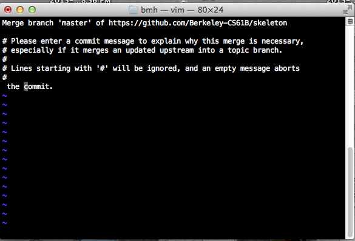

See [this link](http://stackoverflow.com/questions/11828270/how-to-exit-the-vim-editor) if you are stuck in vim. If you are in emacs, type something and then press ctrl-x then ctrl-s to save, then ctrl-x then ctrl-c to exit.

Once you've successfully merged, you should see a proj0 directory appear with files that match [the skeleton repostiory](https://github.com/Berkeley-CS61B/skeleton-sp16/tree/master/proj0).

Note that if you did not already have a copy of the skeleton repo in your current folder, you will not be asked for a merge message.

If you somehow end up having a merge conflict, consult the [git weird technical failures guide](http://cs61b.ug/sp16/materials/guides/git-wtfs.html).

If you get some sort of error, STOP and either figure it out by carefully reading the the git guide or seek help at OH or Piazza. You'll potentially save yourself a lot of trouble vs. guess-and-check with git commands. If you find yourself trying to use commands you Google like `force push`, don't.

The Planet Class and Its Constructor
----------------

You'll start by creating a Planet class. In your favorite text editor, create a file called `Planet.java`. If you haven't picked a text editor, I recommend [Sublime Text](http://www.sublimetext.com/). Remember that your .java files should have the same name as the class it contains.

Begin by creating a basic version of the Planet class with the following 6 instance variables:
- `double xxPos`: Its current x position
- `double yyPos`: Its current y position
- `double xxVel`: Its current velocity in the x direction
- `double yyVel`: Its current velocity in the y direction
- `double mass`: Its mass
- `String imgFileName`: The name of an image in the `images` directory that depicts the planet

Your instance varaibles must be named exactly as above. Start by adding in two Planet constructors that can initialize an instance of the Planet class. The signature of the first constructor should be:

    public Planet(double xP, double yP, double xV,
                  double yV, double m, String img)

Note: We have given parameter names which are different than the corresponding instance variable name. If you insist on making the parameter names the same as the instance variable names for aesthetic reasons, make sure to use the "this" keyword appropriately (mentioned only briefly in lecture and not at all in HFJ).

The second constructor should take in a Planet object and initialize an identical Planet object (i.e. a copy). The signature of the second constructor should be:

    public Planet(Planet p)

Your Planet class should NOT have a main method, because we'll never run the Planet class directly (i.e. we will never do `java Planet`). Also, the word "static" should not appear anywhere in your Planet class.

All of the numbers for this project will be doubles. We'll go over what exactly a double is later in the course, but for now, think of it is a real number, e.g. `double x = 3.5`. In addition, all instance variables and methods will be declared using the public keyword.

Once you have filled in the constructors, you can test it out by compiling your `Planet.java` file and the `TestPlanetConstructor.java` file we have provided.

You can compile with the command:

    javac Planet.java TestPlanetConstructor.java

You can run our provided test with the command

    java TestPlanetConstructor

If you pass this test, you're ready to move on to the next step. **Do not proceed until you have passed this test.**

Understanding the Physics
-------------------------

Let's take a step back now and look at the physics behind our simulations. Our `Planet` objects will obey the laws of Newtonian physics. In particular, they will be subject to:

- Pairwise Force: *Newton's law of universal gravitation* asserts that the strength of the gravitational force between two particles is given by the product of their masses divided by the square of the distance between them, scaled by the gravitational constant *G* (6.67 * 10-11 N-m2 / kg2). The gravitational force exerted on a particle is along the straight line between them (we are ignoring here strange effects like the [curvature of space](https://en.wikipedia.org/wiki/Curved_space)). Since we are using Cartesian coordinates to represent the position of a particle, it is convenient to break up the force into its x- and y-components (Fx, Fy). The relevant equations are shown below. We have not derived these equations, and you should just trust us.

    + F = G * m1 * m2 / r2
    + r2 = dx2 + dy2
    + Fy = F * dy / r
    + Fx = F * dx / r

Note that force is a vector (i.e., it has direction). In particular, be aware that dx and dy are signed (positive or negative).

- Net Force: The *principle of superposition* says that the net force acting on a particle in the x- or y-direction is the sum of the pairwise forces acting on the particle in that direction.

In addition, all planets have:

- Acceleration: Newton's *second law of motion* says that the accelerations in the x- and y-directions are given by:

    + ax = Fx / m
    + ay = Fy / m

#### Check your understanding!

Consider a small example consisting of two celestial objects: Saturn and the Sun. Suppose the Sun is at coordinates (1.0 * 1012, 2.0 * 1011) and Saturn is at coordinates (2.3 * 1012, 9.5 * 1011). Assume that the Sun's mass is 2.0 * 1030 Kg and Saturn's mass is 6.0 * 1026 Kg. Here's a diagram of this simple solar system:

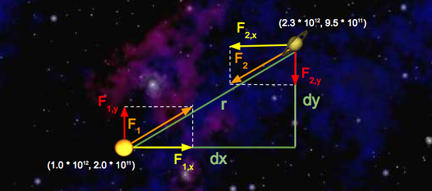

Let's run through some sample calculations.  First let's compute _F1_, the force that Saturn exerts on the Sun.  We'll begin by calculating r, which we've already expressed above in terms of _dx_ and _dy_. Since we're calculating the force exerted by Saturn, _dx_ is Saturn's x-position minus Sun's x-position, which is 1.3 * 1012 meters.  Similarly, _dy_ is 7.5 * 1011 meters.

So, r2 = _dx_2 + _dy_2 = (1.3 * 1012 m)2 + (7.5 * 1011 m)2. Solving for r gives us 1.5 * 1012 meters. Now that we have r, computation of F is straightforward:

+ F = G * (2.0 * 1030 Kg) * (6.0 * 1026 Kg) / (1.5 * 1012 m)2 = 3.6 * 1022 N

Note that the magnitudes of the forces that Saturn and the Sun exert on one another are equal; that is, |F| = |F1| = |F2|. Now that we've computed the pairwise force on the Sun, let's compute the x and y-components of this force, denoted with F1,x and F1,y, respectively. Recall that _dx_ is 1.3 * 1012 meters and _dy_ is 7.5 * 1011 meters. So,

+ F1,x = F1 * (1.3 * 1012 m) / (1.5 * 1012 m) = 3.1 * 1022 N

+ F1,y = F1 * (7.5 * 1011 m) / (1.5 * 1012 m) = 1.8 * 1022 N

Note that the sign of _dx_ and _dy_ is important! Here, _dx_ and _dy_ were both positive, resulting in positive values for _F1,x_ and _F1,y_.  This makes sense if you look at the diagram: Saturn will exert a force that pulls the Sun to the right (positive _F1,x_ ) and up (positive _F1,y_).

Next, let's compute the x and y-components of the force that the Sun exerts on Saturn. The values of _dx_ and _dy_ are negated here, because we're now measuring the displacement of the Sun relative to Saturn.  Again, you can verify that the signs should be negative by looking at the diagram: the Sun will pull Saturn to the left (negative _dx_) and down (negative _dy_).

+ F2,x = F2 * (-1.3 * 1012 m) / (1.5 * 1012 m) = -3.1 * 1022 N

+ F2,y = F2 * (-7.5 * 1011 m) / (1.5 * 1012 m) = -1.8 * 1022 N

Below, you'll write the methods <code>calcForceExertedByX</code> and <code>calcForceExertedByY</code> in the <code>Planet</code> class.  When you're done with those methods, <code>sun.calcForceExertedByX(saturn)</code> and <code>sun.calcForceExertedByY(saturn)</code> should return F1,x and F1,y, respectively; similarly,
<code>saturn.calcForceExertedByX(sun)</code> and <code>saturn.calcForceExertedByY(sun)</code> should return  F2,x and F2,y, respectively.

Let's add Neptune to the mix and calculate the net force on Saturn. Here's a diagram illustrating the forces being exerted on Saturn in this new system:

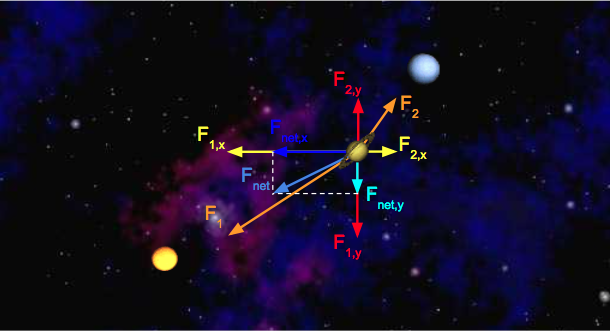

We can calculate the x-component of the net force on Saturn by summing the x-components of all pairwise forces. Likewise, Fnet,y can be calculated by summing the y-components of all pairwise forces. Assume the forces exerted on Saturn by the Sun are the same as above, and that F2,x = 1.1 * 1022 N and F2,y = 9.0 * 1021 N.

+ Fnet,x = F1,x + F2,x = -3.1 * 1022 N + 1.1 * 1022 N = -2.0 * 1022 N

+ Fnet,y = F1,y + F2,y = -1.8 * 1022 N + 9.0 * 1021 N = -9.0 * 1021 N

#### Double check your understanding!

Suppose there are three bodies in space as follows:

* Samh: x = 1, y = 0, mass = 10
* AEgir: x = 3, y = 3, mass = 5
* Rocinante: x = 5, y = -3, mass = 50

Calculate Fnet,x and Fnet,y exerted on Samh. To check your answer, click [here](http://www.wolframalpha.com/input/?i=%286.67+*+10%5E-11+*+10+*+5%29+%2F+13+*+2+%2F+sqrt%2813%29+%2B+%286.67+*+10%5E-11+*+10+*+50%29+%2F25+*+4+%2F+sqrt%2825%29) for the net x force and [here](http://www.wolframalpha.com/input/?i=%2810+*+5+*+6.67+*+10%5E-11%29+%2F13+*+3+%2F+sqrt%2813%29+-+%2850+*+10+*+6.67+*+10%5E-11%29+%2F+25+*+3+%2F+sqrt%2825%29) for the net y force.

Writing the Planet Class
--------

In our program, we'll have instances of Planet class do the job of calculating all the numbers we learned about in the previous example. We'll write helper methods, one by one, until our Planet class is complete.

#### calcDistance

Start by adding a method called `calcDistance` that calculates the distance between two Planets. This method will take in a single Planet and should return a double equal to the distance between the supplied planet and the planet that is doing the calculation, e.g.

    samh.calcDistance(rocinante);

It is up to you this time to figure out the signature of the method. Once you have completed this method, go ahead and recompile and run the next unit test to see if your code is correct.

Compile with:

    javac Planet.java TestCalcDistance.java

and run with

    java TestCalcDistance

Hint: In Java, there is no built in operator that does squaring or exponentiation. We recommend simply multiplying a symbol by itself instead of using `Math.pow`, which will result in slower code.

Hint 2: Always try googling before asking questions on Piazza. Knowing how to find what you want on Google is a valuable skill. However, know when to give up! If you start getting frustrated with your search attempts, turn to Piazza.

#### calcForceExertedBy

The next method that you will implement is `calcForceExertedBy`. The `calcForceExertedBy` method takes in a planet, and returns a double describing the force exerted on this planet by the given planet.  You should be calling the `calcDistance` method in this method. For example `samh.calcForceExertedBy(rocinante)` for the numbers in "Double Check Your Understanding" return 1.334 * 10-9.

NOTE: Do not use Math.abs to fix sign issues with these methods. This will
cause issues later when drawing planets.

Once you've finished `calcForceExertedBy`, re-compile and run the next unit test.

    javac Planet.java TestCalcForceExertedBy.java
    java TestCalcForceExertedBy

#### calcForceExertedByX and calcForceExertedByY

The next two methods that you should write are `calcForceExertedByX` and `calcForceExertedByY`. Unlike the `calcForceExertedBy` method, which returns the total force, these two methods describe the force exerted in the X and Y directions, respectively. Once you've finished, you can recompile and run the next unit test. For example `samh.calcForceExertedByX(rocinante)` in "Double Check Your Understanding" should return 1.0672 * 10-9.

    javac Planet.java TestCalcForceExertedByXY.java
    java TestCalcForceExertedByXY

#### calcNetForceExertedByX and calcNetForceExertedByY

Write methods `calcNetForceExertedByX` and `calcNetForceExertedByY` that each take in an array of Planets and calculate the net X and net Y force exerted by all planets in that array upon the current Planet. For example, consider the code snippet below:

    Planet[] allPlanets = {samh, rocinante, aegir};
    samh.calcNetForceExertedByX(allPlanets);
    samh.calcNetForceExertedByY(allPlanets);

The two calls here would return the values given in "Double Check Your Understanding."

<!--Write a setNetForce method that takes in an array of Planet objects and calculates the total amount of force exerted by those planets on the current planet. Add new instance variables variables, xNetForce and yNetForce, to the Planet class, and save the force that you calculated to this instance variable. These methods should not return anything (i.e. should have return type void). -->

As you implement these methods, remember that Planets cannot exert gravitational forces on themselves! Can you think of why that is the case (hint: the universe will possibly collapse in on itself, destroying everything including you)? To avoid this problem, ignore any planet in the array that is equal to the current planet. To compare two planets, use the .equals method: `samh.equals(samh)` (which would return true).

When you are done go ahead and run:

    javac Planet.java TestCalcNetForceExertedByXY.java
    java TestCalcNetForceExertedByXY

If you're tired of the verbosity of for loops, you might consider reading about less verbose looping constructs (for and the 'enhanced for') given on page 114-116 of HFJ, or online at [this link](https://blogs.oracle.com/CoreJavaTechTips/entry/using_enhanced_for_loops_with). This is not necessary to complete the project.

#### update

Next, you'll add a method that determines how much the forces exerted on the planet will cause that planet to accelerate, and the resulting change in the planet's velocity and position in a small period of time _dt_. For example, `samh.update(0.005, 10, 3)` would adjust the velocity and position if an x-force of 10 Newtons and a y-force of 3 Newtons were applied for 0.005 seconds.

You must compute the movement of the Planet using the following steps:

1. Calculate the acceleration using the provided x and y forces.
2. Calculate the new velocity by using the acceleration and current velocity. Recall that accleration describes the change in velocity per unit time, so the new velocity is (vx + _dt_ * ax, vy + _dt_ * ay).
3. Calculate the new position by using the velocity computed in step 2 and the current position. The new position is (px + _dt_ * vx, py + _dt_ * vy).

Let's try an example! Consider a squirrel initially at position (0, 0) with a vx of 3 m/s and a vy of 5 m/s. Fnet,x is -5 N and Fnet,y is -2 N. Here's a diagram of this system:

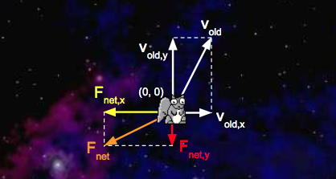

We'd like to update with a time step of 1 second. First, we'll calculate the squirrel's net acceleration:

+ anet,x = Fnet,x / m = -5 N / 1 Kg = -5 m/s2

+ anet,y = Fnet,y / m = -2 N / 1 Kg = -2 m/s2

With the addition of the acceleration vectors we just calculated, our system now looks like this:

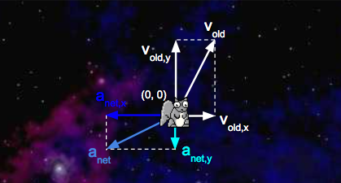

Second, we'll calculate the squirrel's new velocity:

+ vnew,x = vold,x + _dt_ * anet,x = 3 m/s + 1 s * -5 m/s2 = -2 m/s

+ vnew,y = vold,y + _dt_ * anet,y = 5 m/s + 1 s * -2 m/s2 = 3 m/s

Third, we'll calculate the new position of the squirrel:

+ pnew,x = pold,x + _dt_ * vnew,x = 0 m + 1 s * -2 m/s = -2 m

+ pnew,y = pold,y + _dt_ * vnew,y = 0 m + 1 s * 3 m/s = 3 m

Here's a diagram of the updated system:

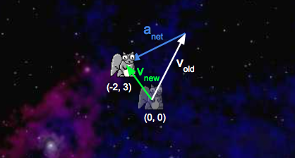

For math/physics experts: You may be tempted to write a more accurate simulation where the force gradually increases over the specified time window. Don't! Your simulation must follow exactly the rules above.

Write a method `update(dt, fX, fY)` that uses the steps above to update the planet's position and velocity instance variables (this method does not need to return anything).

Once you're done, recompile and test your method with:

    javac Planet.java TestUpdate.java
    java TestUpdate

Once you've done this, you've finished implementing the physics. Hoorah! You're halfway there.

(Optional) Testing Your Planet
------------------

As the semester progresses, we'll be giving you fewer and fewer tests, and it will be your responsibility to write your own tests. Writing tests is a good way to improve your workflow and be more efficient.

Go ahead and try writing your own test for the Planet class. Make a `TestPlanet.java` file and write a test that creates two planets and prints out the pairwise force between them. We will not be grading this part of the assignment.

Getting Started with the Simulator (NBody.java)
-----

NBody is a class that will actually run your simulation. This class will have NO constructor. The goal of this class is to simulate a universe specified in one of the data files. For example, if we look inside data/planets.txt (using the command line `more` command), we see the following:

    $ more planets.txt
    5
    2.50e+11
     1.4960e+11  0.0000e+00  0.0000e+00  2.9800e+04  5.9740e+24    earth.gif
     2.2790e+11  0.0000e+00  0.0000e+00  2.4100e+04  6.4190e+23     mars.gif
     5.7900e+10  0.0000e+00  0.0000e+00  4.7900e+04  3.3020e+23  mercury.gif
     0.0000e+00  0.0000e+00  0.0000e+00  0.0000e+00  1.9890e+30      sun.gif
     1.0820e+11  0.0000e+00  0.0000e+00  3.5000e+04  4.8690e+24    venus.gif

The input format is a text file that contains the information for a particular universe (in SI units). The first value is an integer `N` which represents the number of planets. The second value is a real number `R` which represents the radius of the universe, used to determine the scaling of the drawing window. Finally, there are `N` rows, and each row contains 6 values. The first two values are the x- and y-coordinates of the initial position; the next pair of values are the x- and y-components of the initial velocity; the fifth value is the mass; the last value is a String that is the name of an image file used to display the planets. Image files can be found in the `images` directory. The file above contains data for our own solar system (up to Mars).

#### ReadRadius

Your first method is readRadius. Given a file name, it should return a double corresponding to the radius of the universe in that file, e.g. `readRadius("./data/planets.txt")` should return 2.50e+11.

To help you understand the `In` class, we've provided an example called `InDemo.java`, which you can find in the examples folder that came with the skeleton. This demo does not perfectly match what you'll be doing in this project! However, every method that you need is used somewhere in this file. You're also welcome to search the web for other examples (though it might be tricky to find since the class name `In` is such a common english word).

Alternately, you can consult the [full documentation for the In class](http://introcs.cs.princeton.edu/java/stdlib/javadoc/In.html), though you might find it a bit intimidating.

We encourage you (and your partner, if applicable) to do your best to figure out this part of the assignment on your own. In the long run, you'll need to gain the skills to independently figure out this sort of thing. However, if you start getting frustrated, don't hestitate to ask for help!

You can test this method using the supplied TestReadRadius.
#### ReadPlanets

Your next method is readPlanets. Given a file name, it should return an array of Planets corresponding to the planets in the file, e.g. `readPlanets("./data/planets.txt")` should return an array of five planets. You will find the `readInt()`, `readDouble()`, and `readString()` methods in the In class to be useful.

You can test this method using the supplied TestReadPlanets.

Drawing the Initial Universe State (main)
------

Next, build the functionality to draw the universe in its starting position. You'll do this in four steps. Because all code for this part of the assignment is in main, this part of the assignment will NOT have automated tests to check each little piece.

#### Collecting All Needed Input

Create a `main` method in the NBody class. Write code so that your NBody class performs the following steps:

 - Store the 0th and 1st command line arguments as doubles named `T` and `dt`.
 - Store the 2nd command line argument as a String named `filename`.
 - Read in the planets and the universe radius from the file described by `filename` using your methods from earlier in this assignment.

#### Drawing the Background

After your main method has read everything from the files, it's time to get drawing. First, set the scale so that it matches the radius of the universe. Then draw the image `starfield.jpg` as the background. To do these, you'll need to figure out how to use the StdDraw library.

See StdDrawDemo.java in the examples folder for a demonstration of StdDraw. This example, like InDemo, does not perfectly match what you're doing.

In addition, make sure to check out [the StdDraw section of this mini-tutorial](http://introcs.cs.princeton.edu/java/15inout/), and if you're feeling bold, the [full StdDraw documentation](http://introcs.cs.princeton.edu/java/stdlib/javadoc/). This will probably take some trial and error. This may seem slightly frustrating, but it's good practice!

#### Drawing One Planet

Next, we'll want a planet to be able to draw itself at its appropriate position. To do this, take a brief detour back to the Planet.java file.  Add one last method to the Planet class, `draw`, that uses the StdDraw API mentioned above to draw the Planet's `img` at the Planet's position.  The `draw` method should return nothing and take in no parameters.

#### Drawing All of the Planets

Return to the main method in NBody.java and use the `draw` method you just wrote to draw each one of the planets in the planets array you created.  Be sure to do this after drawing the `starfield.jpg` file so that the planets don't get covered up by the background.

Test that your main method works by compiling:

    javac NBody.java

And running the following command:

    java NBody 157788000.0 25000.0 data/planets.txt

You should see the sun and four planets sitting motionless. You are almost done.

Creating an Animation
------

Everything you've done so far is leading up to this moment. With only a bit more code, we'll get something very cool.

To create our simulation, we will discretize time (please do not mention this to Stephen Hawking). The idea is that at every discrete interval, we will be doing our calculations and once we have done our calculations for that time step, we will then update the values of our Planets and then redraw the universe.

Finish your main method by adding the following:

  - Create a time variable and set it to 0. Set up a loop to loop until this time variable is T.
  - For each time through the loop, do the following:
    - Create an `xForces` array and `yForces` array.
    - Calculate the net x and y forces for each planet, storing these in the `xForces` and `yForces` arrays respectively.
    - Call update on each of the planets. This will update each planet's position, velocity, and acceleration.
    - Draw the background image.
    - Draw all of the planets.
    - Pause the animation for 10 milliseconds (see the `show` method of StdDraw). You may need to tweak this on your computer.
    - Increase your time variable by dt.

Important: For each time through the main loop, do not make any calls to `update` until all forces have been calculated and safely stored in `xForces` and `yForces`. For example, don't call `planets[0].update()` until after the entire `xForces` and `yForces` arrays are done! The difference is subtle, but the autograder will be upset if you call `planets[0].update` before you calculate `xForces[1]` and `yForces[1]`.

Compile and test your program:

    javac NBody.java
    java NBody 15778800.0 25000.0 data/planets.txt

Make sure to also try out some of the other simulations, which can all be found in the `data` directory. Some of them are very cool.

#### Adding Audio

(Optional) For a finishing touch, play the theme to *2001: A Space Odyssey* using `StdAudio` and the file `2001.mid`. Feel free to add your own audio files and create your own soundtracks!

Printing the Universe
-------

When the simulation is over, i.e. when you've reached time `T`, you should print out the final state of the universe in the same format as the input, e.g.:

    5
    2.50e11
     1.4925e+11 -1.0467e+10  2.0872e+03  2.9723e+04  5.9740e+24    earth.gif
    -1.1055e+11 -1.9868e+11  2.1060e+04 -1.1827e+04  6.4190e+23     mars.gif
    -1.1708e+10 -5.7384e+10  4.6276e+04 -9.9541e+03  3.3020e+23  mercury.gif
     2.1709e+05  3.0029e+07  4.5087e-02  5.1823e-02  1.9890e+30      sun.gif
     6.9283e+10  8.2658e+10 -2.6894e+04  2.2585e+04  4.8690e+24    venus.gif

You are welcome to try to figure this out on your own, but if you'd prefer not to, you can find a solution in the [hw hints](hints.txt).

This isn't all that exciting (which is why we've provided a solution), but we'll need this method to work correctly to autograde your assignment.

Submission
----------

Submit NBody.java and Planet.java to gradescope. If you pass all the tests, you get all the points. Hoorah! You may submit as many times as you'd like. We'll start restricting the autograder on future projects. The grader will be running by 1/24. Update: Sorry, due to some tecnical issues it'll actually be late 1/25.

Feel free to share your own custom universes on Piazza. Make sure to try out the other examples in the data folder!

Extra for Experts
----------

There are a number of interesting possiblities:
  - Creating your own universe files.
  - Support elastic (or inelastic) collisions.
  - Add the ability to programatically generate planet images (rather than relying on input image files).
  - Add the ability to control a spacecraft that is subject to the gravitational forces of the objects in the solar system. Try flying from one planet to another.

If you decide to implement anything extra, you should make another copy of your project in a subdirectory of your project called 'extra'. Don't add new methods to the files that you submit, otherwise the autograder will get perturbed. After the deadline, feel free to share your creations on Piazza or elsewhere.

**Acknowledgements**: This assignment is a major revision by Josh Hug, Matthew Chow, and Daniel Nguyen of an assignment created by Robert Sedgewick and Kevin Wayne from Princeton University.

Frequently Asked Questions
----------------

#### I'm passing all the local tests, but failing even easy tests like testReadRadius in the autograder.

Make sure you're actaully using the string argument that testReadRadius takes as input. Your code should work for ANY valid data file, not just planets.txt.

#### The test demands 133.5, and I'm giving 133.49, but it still fails!
Sorry, our sanity check tests have flaws. But you should ensure that your value for `G` is 6.67 * 10-11 N-m2 / kg2 exactly, and not anything else (don't make it more accurate).

#### When I run the simulation, my planets start rotating, but then quickly accelerate and disappear off of the bottom left of the screen.

- Look at the way you're calculating the force exerted on a particular planet in one time step.  Make sure that the force doesn't include forces that were exerted in past time steps.

- Make sure you did not use <code>Math.abs(...)</code> when calculating <code>calcForceExertedByX(...)</code> and
<code>calcForceExertedByY(...)</code>. Also ensure that you are using a `double` to keep track of summed forces (not `int`)!

#### Why'd you name the class Planet? The sun isn't a Planet.

You got us. We could have used Body, but we didn't. Maybe next time?

#### What is a constructor? How do I write one?

A constructor is a block of code that runs when a class is instantiated with the <code>new</code> keyword. Constructors serve the purpose of initializing a new object's fields. Consider an example below:

    public class Dog {

        String _name;
        String _breed;
        int _age;

        public Dog(String name, String breed, int age) {
            _name = name;
            _breed = breed;
            _age = age;
        }
    }

The <code>Dog</code> class has three non-static fields. Each instance of the <code>Dog</code> class can have a name, a breed, and an age. Our simple constructor, which takes three arguments, initializes these fields for all new <code>Dog</code> objects.

#### I'm having trouble with the second Planet constructor, the one that takes in another Planet as its only argument.

Let's walk through an example of how a constructor works.  Suppose you use the `Dog` constructor above to create a new `Dog`:

    Dog fido = new Dog("Fido", "Poodle", 1);

When this line of code gets executed, the JVM first creates a new `Dog` object that's empty.  In essence, the JVM is creating a "box" for the `Dog`, and that box is big enough to hold a box for each of the `Dog`'s declared instance variables.  This all happens before the constructor is executed.  At this point, here's how you can think about what our new fluffy friend `fido` looks like (note that this is a simplification! We'll learn about a more correct view of this when we learn about Objects and pointers later this semester):

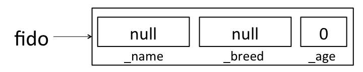

Java will put some default values in each instance variable.  We'll learn more about where these defaults come from (and what `null` means) later this semester.  For now, just remember that there's space for all of the instance variables, but those instance variables haven't been assigned meaningful values yet.  If you ever want to see this in action, you can add some print statements to your constructor:

    public Dog(String name, String breed, int age) {
        System.out.println("_name: " + _name + ", _breed: " + _breed + ", _age: " + _age);
        _name = name;
        _breed = breed;
        _age = age;
    }

If this constructor had been used to create `fido` above, it would have printed:

    _name: null, _breed: null, _age: 0

OK, back to making `fido`.  Now that the JVM has made some "boxes" for `fido`, it calls the `Dog` constructor function that we wrote.  At this point, the constructor executes just like any other function would.  In the first line of the constructor, `_name` is assigned the value `name`, so that `fido` looks like:

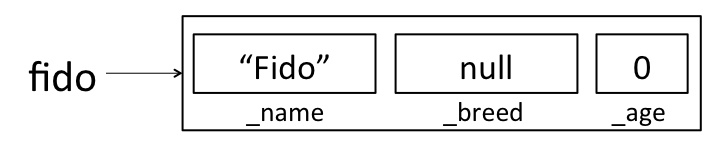

When the constructor completes, `fido` looks like:

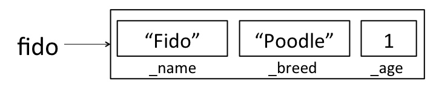

Now, suppose you want to create a new `Dog` constructor that handles cross-breeding.  You want the new constructor to accept a name, an age, and two breeds, and create a new `Dog` that is a mixture of the two breeds.  Your first guess for how to make this constructor might look something like this:

    public Dog(String name, String breed1, String breed2, int age) {
        Dog dog = new Dog(name, breed1 + breed2, age);
    }

However, if you try to create a new `Dog` using this constructor:

    Dog tommy = new Dog("Tommy", "Poodle", "Golden Retriever", 1);

This won't do what you want!  As above, the first thing that happens is that the JVM creates empty "boxes" for each of `tommy`'s instance variables:

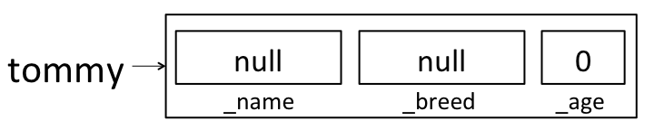

But then when the 4-argument constructor got called, it created a second `Dog` and assigned it to the variable `dog`.  It didn't change any of `tommy`'s instance variables.  Here's how the world looks after the line in our new constructor finishes:

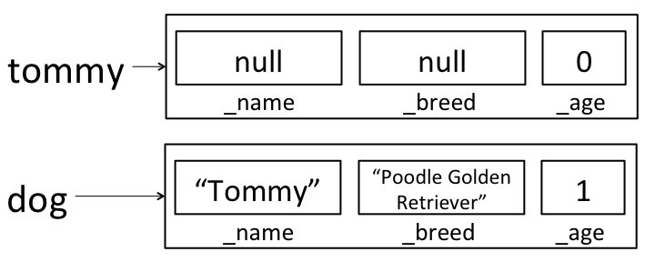

`dog` isn't visible outside of the constructor method, so when the constructor completes, `dog` will be destroyed by the garbage collector (more on this later!) and all we'll have is the still un-initialized `tommy` variable.

Here's a cross-breed constructor that works in the way we'd like:

    public Dog(String name, String breed1, String breed2, int age) {
        Dog(name, breed1 + breed2, age);
    }

Here, we're calling the old 3-argument constructor on `this`; rather than creating a new `Dog`, we're using the 3-argument constructor to fill in all of the instance variables on this dog.  After calling this new constructor to create `tommy`, `tommy` will correctly be initialized to:

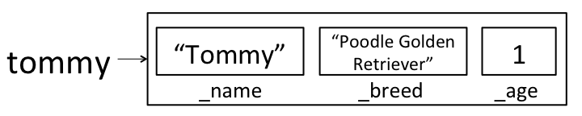

We could have also written a new constructor that assigned each instance variable directly, rather than calling the existing constructor:

        public Dog(String name, String breed1, String breed2, int age) {
            _name = name;
            _breed = breed1 + breed2;
            _age = age;
        }

<!--
(ABANDONED TEXT)

1.  Reads in three command line arguments, where the first two provide information on the timing of the simulation, and the third is a file name for a file containing data about the objects to be simulated. More details below.
2.  Reads in the universe from the specified text file, using the `In` class, storing each object read in as an instance of a `Planet` class.
3.  Simulates the universe according to the command line arguments, animating the results using `StdDraw`.
5.  Prints the state of the universe at the end of the simulation (in the same format as the input file) using `StdOut` or `System.out`.
-->
