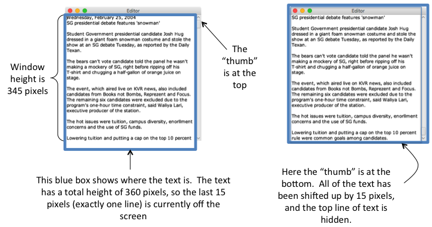

~ number: 2
~ title: Additional Tips on the Scroll Bar

Having trouble with JavaFX's `ScrollBar` class? Here are some tips on how it works.

The `ScrollBar` class has a few attributes you'll likely need to set in your editor.  The most important attributes to understand are the `min`, the `max`, and the `value`:

* `value`: The value of the scroll bar describes the current position.
* `min`: The `value` of the scroll bar when the thumb is at the top.
* `max`: The `value` of the scroll bar when the thumb is at the bottom.

The scroll bar should always satisfy the invariant that `min <= value <= max`.

Let's say we have a scroll bar where we set the `min` equal to 0, the `max` equal to 10, and the `value` equal to 5:

    ScrollBar scrollBar = new ScrollBar();
    scrollBar.setMin(0);
    scrollBar.setMax(10);
    scrollBar.setValue(5);

In this case, since the current position is halfway between `min` and `max`, the thumb will be shown in the middle.  Note that for all of the images below, we rotated the scroll bar sideways to make these easier to look at. The TOP (so the `min` position) is always shown on the LEFT side.

To move the thumb up a bit, you could change the value:

    scrollBar.setValue(3);
    
This would result in the scroll bar looking like this:

If you wanted to move the thumb all the way to the top, you could set `value` equal to `min`:

    scrollBar.setValue(0);
    
Which would result in:

The `value` of the scroll bar is only meaningful in the context of the `min` and `max` values.  For example, above, we set the `value` equal to 5 when the `min` was 0 and `max` was 10.  What if we had the `value` still equal to 5, the `min` still equal to 0, but the `max` 100? The scroll bar would look very different (the thumb will be very close to the top, because 5 is much closer to 0 than to 100):

Try some "hello worlding" at first where you make a scroll bar, set different `min`, `max`, and `value` values, and see what happens!

For this project, one good way to set the value of the scroll bar is based on the total height (in pixels) of text in your text editor.  Let's walk through an example of how this might work.  Here's our solution editor, displaying the example file we gave you at two different scroll bar positions (and with a smaller width than the default width of 500 pixels):

Using Verdana, size 12 font, each line is 15 pixels high, and with this window size, the file has 24 lines of text.  The total height of text in the file is 24 lines * 15 pixels per line = 360 pixels.  The window height is only 345 pixels, so one line of text will always be hidden.  When the thumb of the scroll bar is at the top, the last line of text is below the bottom of the window.  When the thumb of the scroll bar is at the bottom, the all of the text has been moved up 15 pixels, so the last line of text is visible and the first line is hidden.  If the thumb of the scroll bar were in the middle position, half of one line would be hidden above the top of the window, and half of one line would be hidden below the bottom of the window.

Make sure to read the tip in the [scroll bar section of the main project spec](proj2.html#scroll-bar) about how to easily update the position of all of your text objects, without iterating through every single text object (by creating a `Group`)!

One last gotcha for the scroll bar: you'll need to create a listener that "listens" for when the user moves the scroll bar, and moves the y-position of your text objects (and your cursor) accordingly.  Beware that this listener gets called anytime the value of the scroll bar changes -- even if that change was one you initiated by calling `scrollBar.setValue(x)`.  So, you'll need to check the new value passed into the `changed` function to see if anything has actually changed.