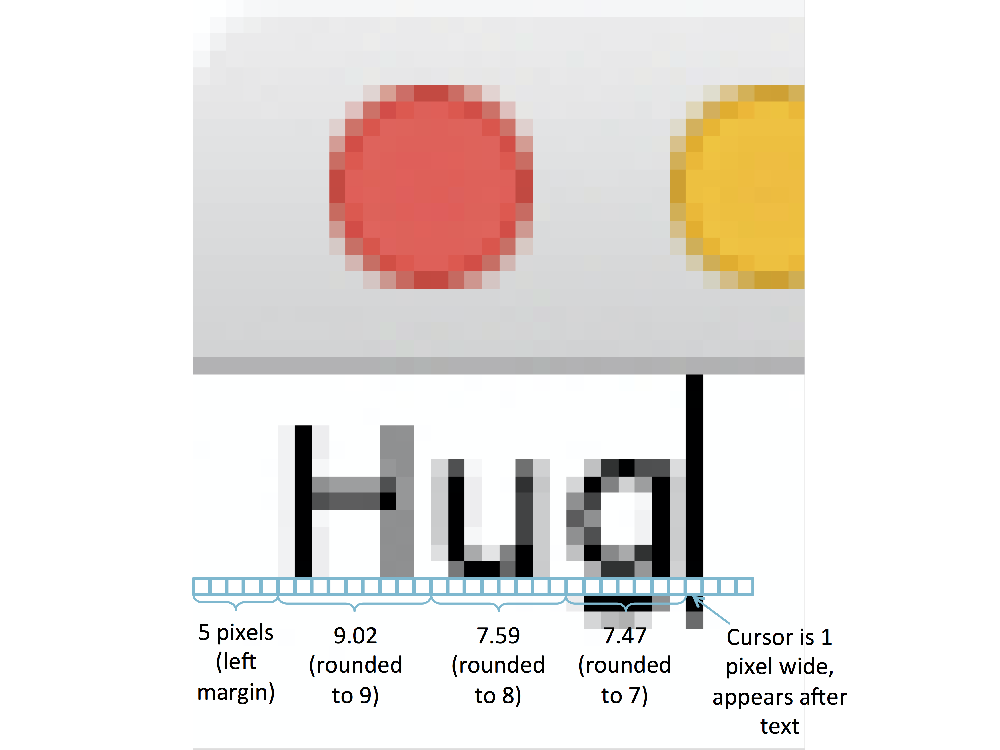
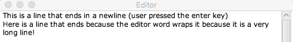
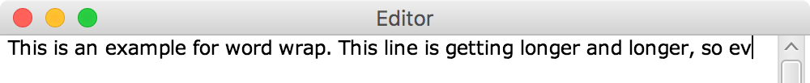
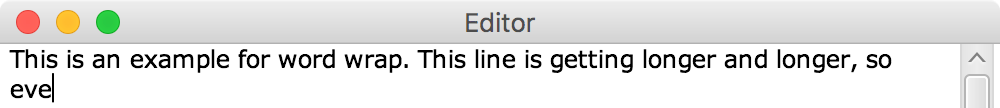
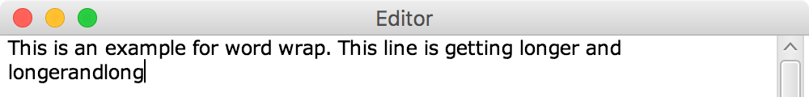
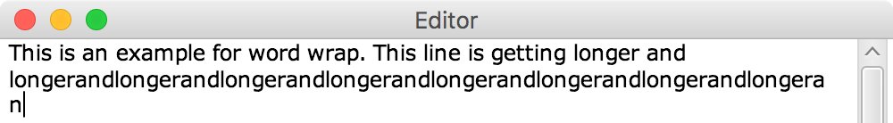
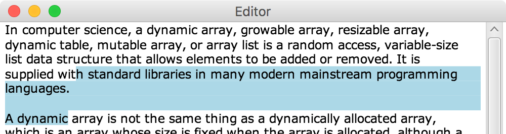

~ number: 2
~ title: Editor, version 1.0

Change Log
-----------------------------

This section describes major changes that have been made to the spec since it was released.

##### March 6

* Updated information about grading (to link to Piazza).

##### March 3

* Added an extra page with some tips about how to use JavaFX's `ScrollBar` class, linked from the [scroll bar section](#scroll-bar).

##### March 1

* Added another video on data structure selection and analysis.
* Added basics autograder.

##### February 29

* Added FAQ about removing nodes
* Added a note that the scroll bar should never result in non-integral window positions (these positions should be rounded, like text positions).

##### February 27

Added more FAQs to address common questions about the mysterious JavaFX Nodes, Groups, and special root Group.

##### February 25

* Added a clarification to the runtimes: Using arrow keys or clicking should be resolved in constant time: but the length of each line is a constant, since the window can only be so wide.
* Added links to Project 2 slide and video.

##### February 23

* Added a requirement that shortcut+p prints the current cursor position, and removed the "cursor" option for the 2nd command line argument.
* Updated `CopyFile.java` example to show how to check if a file exists before attempting to read from it.
* Added a hint for how to display the cursor.

##### February 21

Clarified description of time requirements to explicitly separate the timing requirements for storing document data from the timing requirements for rendering.

Table of Contents
-------------------

* [Introduction](#introduction)
* [Overview](#overview)
* [Getting the Skeleton Files](#getting-the-skeleton-files)
* [Detailed Spec](#detailed-spec)
  * [JavaFX and KeyEvents](#javafx-and-keyevents)
  * [Window size and margins](#window-size-and-margins)
  * [Command line arguments](#command-line-arguments)
  * [Data structures and time requirements](#data-structures-and-time-requirements)
  * [Shortcut keys](#shortcut-keys)
  * [Font and spacing](#font-and-spacing)
  * [Newlines](#newlines)
  * [Cursor](#cursor)
  * [Word wrap](#word-wrap)
  * [Open and Save](#open-and-save)
  * [Scroll Bar](#scroll-bar)
  * [Undo and redo](#undo-and-redo)
  * [Optional Beautification](#optional-beautification)
* [Gold points](#gold-points)
  * [Selection (3 points)](#selection-3-points)
  * [Copy / Paste (2 points)](#copy--paste-2-points)
* [Frequently Asked Questions](#frequently-asked-questions)
* [Acknowledgements](#acknowledgements)

Introduction
------------

Project 2 is the largest project you will do in this class, and the goal of the project is to teach you how to handle a larger code base than you have (likely) ever worked with before.  It is a solo project, so while you can discuss ideas with others, all of the code you submit will be your own.  This project is designed to be similar to the coding experience you might have at a summer internship or job: you'll write a large amount of code, and you'll need to interact with some external libraries that you've never used before.  By the time you're done with this project, you will have written approximately 1000 lines of code.  This may sound like a lot of lines of code, and it is!  Here are some tips to avoid being crushed by complexity:

 * **Start early** This project has some tricky data structures, so we recommend you start thinking about how to implement the project as soon as possible so that you have some time to mull over your design.  Also, you'll be more efficient at writing code if you're not stressed by an impending deadline!
 * **Design first** Before writing any code, spend some time designing.  By "design", we mean think about what data structures you're going to use for each part of the project. We recommend thinking about _all_ of the features and how each one might be implemented with your data structures, and do this before writing any code. You don't need to know exactly how every feature will be implemented before you write any code, but it's a good idea to have a rough idea and a sense of potential problem areas.  This will help you avoid a situation where you start implementing a feature later in the assignment and realize a massive re-write is necessary!
 * **Code small** Constantly ask yourself "what's the minimum amount of code I can write before testing this new functionality?" Testing doesn't necessarily mean writing a unit test; it can mean sometime much simpler, like opening your program and trying some new input, or seeing if a feature of an external library works as expected.  The fewer lines of code that you write in between testing, the fewer lines you will need to debug when something goes wrong!  "HelloWorlding", a technique described in lab 5, is an example of the "code small" mentality.
 * **Modularize** To mimimize how much complexity you need to consider at any one time, divide your program into modules with clear simple interfaces.  Ideally, these interfaces should _hide_ complexity in their implementations.  For example, the ArrayDeque you wrote in Project 1 hid the complexity of the re-sizing operation from a user of the class.  Similarly, in this project, you should write classes that hide complexity from the code that calls them, which will reduce how much complexity you need to consider at a time.
 * **Modularize** This is so important that it is here again. Having a hierarchy of classes (or interfaces) with an easy to understand API will make your life so much easier than otherwise. Modular code that hides details is easier to understand, plan, develop, debug, and improve. And if you later decide you don't like a piece of your program, a modular design means you can cleanly replace only that piece.
 * **Bounce ideas off of each other** While you should write all of the code for the project on your own, you're welcome to discuss design ideas with others in the class.  After you've thought about your design, we strongly recommend finding someone else in the class and discussing each of your approaches.  The other person likely thought of a few things you didn't consider, and vice versa.
 * **Look at examples** We have written examples (in the `examples` directory) that show how to use most of the functionality in JavaFX that you'll need to use for this project.  Starting from these examples will be much easier than starting from scratch!

This project will be long, arduous, and at times frustrating.  However, we hope that you will find it a rewarding experience by the time you are done!

This is a brand new project, so bear with us as we work out kinks!  There is a chance we will make some of the currently required features gold points instead as the project progresses.

If you run into problems, be sure to check out the [FAQ](#frequently-asked-questions) section before posting to Piazza.  We'll keep this section updated as questions arise during the assignment.

For some additional tips on the project, see:
 - Project 2 Design Guide Video: [Link](https://youtu.be/MEOv98EFMqA)
 - Project 2 Slides (video content and more): [Link](https://docs.google.com/presentation/d/15NGQTbiQWq0PgSIpleuAGMDo-QFdER4A-2GX0_59D2A/edit#slide=id.g11b3bd1314_0_6)
 - Project 2 Design Analyis Worksheet (make a copy): [Link](https://docs.google.com/document/d/17IsU4plqtkbvxoF5f_uc7UMhxkaJ3TpxzaY67vh75fQ/edit)
 - Example Project 2 Design Analysis Worksheet, using String as data structure: [Link](https://docs.google.com/document/d/17PUw2EffgyU5_zQHZ8GV52EhS3NPwUyghFfX6EmJiS4/edit)

3/1/2016. For even more tips, see:
 - Project 2 Video #2, More on Data Structures: [Link](https://youtu.be/K5nsYVF96HY)
 - Project 2 Design Analysis Worksheet, using FastLinkedList as data structure: [Link](https://docs.google.com/document/d/1eIuf-7Lznfjq6Vccu-JnmIr8uWXdK1r3ufq2d5o6mII/edit)

Overview
------------------
In this project, you will build a text editor from scratch. You are probably familiar with a variety of different text editors, including relatively simple text editors that allow you to edit un-styled text (e.g., pico, Notepad, and TextEdit), and also more fully-featured text editors that allow you to do add formatting, run code, and more (e.g., Microsoft Word, Google Docs, Sublime, VI, Emacs, and IntelliJ).  For this project, you'll implement a basic text editor that can be used to open, edit, and save plain text files.

In the overview here and the text below, we'll refer to the "Shortcut" key.  By "shortcut key", we mean the control key on Windows and Linux, and the command key on Mac.  Handling these special key presses is described in the [shortcut keys](#shortcut-keys) section.

Your text editor should support the following features. Most of these features are described in more detail in the [Detailed Spec](#detailed-spec) section.

* **Cursor** The current position of the cursor should be marked with a flashing vertical line.
* **Text input** Each time the user types a letter on the keyboard, that letter should appear on the screen after the current cursor position, and the cursor should advance to be after the last letter that was typed.
* **Word wrapping** Your text editor should break text into lines such that it fits the width of the text editor window without requiring the user to scroll horizontally.  When possible, your editor should break lines between words rather than within words.  Lines should only be broken in the middle of a word when the word does not fit on its own line.
* **Newlines** When the user presses the Enter or Return key, your text editor should advance the cursor to the beginning of the next line.
* **Backspace** Pressing the backspace key should cause the character before the current cursor position to be deleted.
* **Open and save** Your editor should accept a single command line argument describing the location of the file to edit.  If that file exists, your editor should display the contents of that file.  Pressing shortcut+s should save the current contents of the editor to that file.
* **Arrow keys** Pressing any of the four arrow keys (up, down, left, right) should cause the cursor to move accordingly (e.g., the up key should move the cursor to be on the previous line at the horizontal position closest to the horizontal position of the cursor before the arrow was pressed).
* **Mouse input** When the user clicks somewhere on the screen, the cursor should move to the place in the text closest to that location.
* **Window re-sizing** When the user re-sizes the window, the text should be re-displayed so that it fits in the new window (e.g., if the new window is narrower or wider, the line breaks should be adjusted accordingly).
* **Vertical scrolling** Your text editor should have a vertical scroll bar on the right side of the editor that allows the user to vertically navigate through the file.  Moving the scroll bar should change the positioning of the file (but not the cursor position), and if the cursor is moved (e.g., using the arrow keys) so that it's not visible, the scroll bar and window position should be updated so that the cursor is visible.
* **Undo and redo** Pressing shortcut+z should undo the most recent action (either inserting a character or removing a character), and pressing shortcut+y should redo.  Your editor should be able to undo up to 100 actions, but no more.
* **Changing font size** Pressing shortcut+"+" (the shortcut key and the "+" key at the same time) should increase the font size by 4 points and pressing shortcut+"-" should decrease the font size by 4 points.
* **Printing the current position** To facilitate grading, pressing shortcut+p should print the top left coordinate of the current cursor position.

If you're unsure what some of these features mean, we suggest experimenting with Notepad, Microsoft Word, Google Docs, or TextEdit.  Those text editors all use a flashing vertical cursor, implement line wrap, react to arrow keys, scroll vertically, and accept mouse input in the way we expect you to for this assignment. Some of these editors (e.g., Microsoft Word) assume documents have a fixed with (e.g., 8.5", to match the width of letter paper), so sometimes show a horizontal scroll bar.  For this assignment, you should always word-wrap the text to fit in the width of the current window, so you will never need to show a horizontal scroll bar.  Also note that up/down arrows are a bit more sophisticated in some editors than what we require in this assignment, as described in more detail in the detailed spec below.

For obvious reasons, the spec leaves some room for interpretation. Most reasonable interpretations will be given full credit. See the FAQ for more.

Getting the Skeleton Files
----------------

As with all previous projects, pull the skeleton using the command `git pull skeleton master`.  Make sure to reimport the project in IntelliJ.

Detailed Spec
----------------

The skeleton provides a single file named `Editor.java` that you should modify.  You may create as many additonal classes and files as you like.

### JavaFX and KeyEvents

For this project, you'll be using the JavaFX libary to create your application, display text, etc.  JavaFX is included in Java 1.8, so you do not need to download any additional libraries for this project.  JavaFX is a massive library that's designed to support a wide variety of Java applications; as a result, it is significantly more complicated than the `StdDraw` library you used in project 0.  You will likely find JavaFX overwhelming when you first start writing code! One of the goals of this project is to help you get comfortable with using external libraries. To help you get started, we have written few example applications (described in `examples/README`); we highly recommend that you use one of these examples as a starting point for your editor.  There will be cases where our example is incomplete and you need to look up functionality on your own; the [official documentation](https://docs.oracle.com/javase/8/javafx/api/) is a good starting point.

Much of the functionality you'll implement in this project will be initiated by `KeyEvents`.  There are two kinds of `KeyEvent`s: `KEY_TYPED` events and `KEY_PRESSED` events.

`KEY_TYPED` events are generated when a Unicode chracter is entered; you should use these to find out about character input for your text editor.  The `KEY_TYPED` events automatically handle capitalization (e.g., if you press the shift key and the "a" key, you'll get a single `KEY_TYPED` event with a character of "A").  You can ignore `KEY_TYPED` events that have 0-length (keys like the arrow key will result in a `KEY_TYPED` event with 0-length), that have a charater equal to 8 (which represents the backspace), and that have `isShortcutDown()` set to true (it's easier to handle the shortcuts using the `KEY_PRESSED` events).

Every time a key is pressed, a `KEY_PRESSED` event will be generated.  The `KEY_PRESSED` events often duplicate the `KEY_TYPED` events.  For example, in the example we gave above where the user presses shift and the "a" key, JavaFX generates three events: one `KEY_PRESSED` event for the shift key, one `KEY_PRESSED` event for the "a" key, and one `KEY_TYPED` event with a character of "A".  These `KEY_PRESSED` events aren't very useful for normal text input, because they don't handle capitalization; however, they are useful for control keys, because each `KEY_PRESSED` event has an associated `KeyCode` that's useful for finding out about special keys (e.g., the code will be `KeyCode.BACK_SPACE` for the backspace key). If you're unsure about how `KeyEvent`s work, make sure to see the `KeyPressPrinter.java` example.

There are a few JavaFX classes that you **may not** use as part of this project.  You should only display text using the `Text` class, and you should be determining where to place text (and how to word wrap) yourself.  You cannot use the `TextFlow`, `FlowPane`, `TextArea`, `TextInputControl`, or `HTMLEditor`.  If in doubt about whether you can use a particular class or function, ask on Piazza.

### Window size and margins

You should display the text in a window with a top and bottom margin of 0 (the bottom margin is only relevant when there is enough text  to reach the bottom of the window) and a left and right margin of 5 pixels.

When your editor first opens, the window size should be 500 by 500 pixels (including the scroll bar).

### Command line arguments

Your `Editor` program should accept one required command line argument representing the name of the file to edit (see the [Open and Save section](#Open-and-save) for more information about how to handle the filename).  If no filename is provided, your editor should print a message stating that no filename was provided, and exit (see `CopyFile.java` for an example of how to check the number of command line arguments provided).

`Editor` should accept a second optional command line argument that controls the output of your program as follows:

 * If the second command line argument is blank, your program should not print any output.
 * If the second command line argument is "debug", you can print any output you like to facilitate debugging.

__TIP:__ One way to control when output is printed is to create a `Print` class with a static `print(String toPrint)` method.  The `print` method can check which command line argument is set (e.g., using a static variable) and either print or do nothing accordingly.

### Data structures and time requirements

One of the most important decisions you'll make in this project is what data structures to use. As you think about how to efficiently implement the functionality required by this project, we'd like you to consider two things separately:

##### Storing the contents of the document

First, consider how to store the contents of your document.  Here, we mean the information about what characters are in the document (either because the user added them to the document, or because they were in the original file that was opened).  You can think of this as being all of the information that's needed to save the text.  This data should be stored in a data structure such that characters can be added to or deleted from the current cursor position in constant time (even if the cursor is somewhere in the middle of the document).

__TIP:__ As in project 1a, sentinel nodes will make your life much easier!

##### Storing rendering information

You'll also need to store information about how the text is displayed on the screen.  This may include data like where each character is placed on the screen, where word wraps occur, etc. None of this data is needed to save the file; it's only needed to display the contents of the file to the user.

Updates to these data structure(s) can take linear time (i.e., the time can be proportional to the number of characters in the document).  In fact, we recommend an approach where you recompute all of the rendering information after each operation.  This makes word wrap much easier, because it's easier to determine where word wraps occur if you start from the beginning of the file.

Moving the cursor (e.g., with a mouse click) should take time constant time. However, since each line has a constant length (since the window can only be so wide), this means your runtime may be proportional to the number of characters in the line where the new cursor position is located. Moving the cursor should not take time proportional to the length of the file (so, for example, you should not need to look at all of the characters in the file to determine the new cursor position). Keep in mind that it is possible that someone might use the scroll bars before clicking, so even if your cursor is at the beginning of the file, a click might come at the end.

##### Why?

You may be wondering why we require one part of operations like inserting a new character to be constant time (updating the data structure storing the character data), while the other part of inserting a new character is allowed to take linear time (re-rendering the document).  We'd like you to implement some things efficiently to give you some practice thinking about efficiency.  Your efficient data structure for storing character data paves the way for optimizations to rendering; however, these optimizations are tricky, so we're not requiring them in this assignment.  If you're interested, think about how you might do rendering more efficiently!

A hidden side-effect of this constraint is that it prevents you from attempting designs that are overally complicated.

##### Non-requirements

If you read about text editors online, there are many nifty data structures (gap buffers! balanced trees! etc.) that can be used to efficiently represent text for a text editor.  For the purposes of this assignment, you do not need to use any such sophisticated data structures.  With appropriate use of the data structures we've learned about so far in this class, you can satisfy the requirements described above.

### Shortcut keys

Your editor should do various behaviors in response the user typing a "shortcut" key in addition to a letter.  For example, as described in more detail below, pressing the shortcut key and the letter "s" should cause the editor to save the current file.  The "shortcut key" should be the control key on Linux and Windows, and the command key on Mac (for consistency with other applications you've used on these operating systems).  Luckily you don't need to deal with determining which operating system your program is running on; JavaFX has a nifty `isShortcutDown()` function that you can call on any `KEY_PRESSED` `KeyEvent` to determine whether the shortcut key is pressed.  Check out the `ShortcutKeyPrinter` program for an example of how this function can be used.

### Font and spacing

By default, your editor should display all text in size 12 Verdana font.  Verdana is not a fixed-width font, so you will need to calculate the width of each letter to determine where the next letter should begin, and you will need to calculate the height of the font to determine where new lines should begin.  You can calculate the height of the font by checking the height of any character (JavaFX considers the height of a letter like "a" or even a space " " to be the same as the height of a letter like "Q" or "j").  The only exception is newlines, which JavaFX considers to have twice the height of other characters.  Check out the example applications to see how to calculate the width and height of letters.  For this assignment, we suggest that you display each letter as a separate `Text` object. See the section in lab 5 labeled `Our First Blind Alley`.

JavaFX will report that letters have non-integral heights and widths (e.g., JavaFX reports that the letter "H" in the example below has a width of 9.02).  However, JavaFX displays characters on pixel boundaries, and chops off any decimal values that you pass in. For example, if you tell JavaFX to display a letter at position 5.8, the letter will be displayed at pixel 5.  As a result, you need to round all width and height values from JavaFX to integral values.  If you don't do this, you'll notice that your text ends up spaced in un-appealing ways.  The example below gets up-close-and-personal with some text in our solution editor to illustrate the width values reported by JavaFX and how they should be rounded to integral values. The blue boxes show pixel boundaries, and the grey bar at the top is the top of the editor window.

For many fonts, the height of the font includes some whitespace at the top, even above tall characters. You can see this in the example above: there is whitespace above the "H" even though the top margin is 0.

If you take a screenshot of your own text editor and zoom in, yours may look like it has twice as many pixels as the screen shot above:

Fear not! This is because you have a fancy retina display, so your display uses 4 pixels for each 1 pixel that JavaFX knows about.  This isn't something you need to handle in your code; just something to be aware of if you're taking screenshots to understand what's going on.

We strongly recommend that you change the "origin" of your text by calling `setOrigin(VPos.TOP)` on each of your `Text` objects.  For an example of this, see `SingleLetterDisplay.java`.  If you don't do this, when you assign the text a y-position, that position will be the position of the bottom of letters like the "H" and "u" in the example above.  This is very inconvenient, because some of the text ends up below this position (e.g., the bottom of the "g") above, so you'll need to adjust for this offset.  Setting the origin to `VPos.TOP` means that the y-colordinate you assign the `Text` object will be the top of all letters (in the example above, all of the letters have `VPos.TOP` set as the origin, and they have an assigned y-position of 0).

##### Changing the font size

When the user presses the shortcut key and the key with the "+" on it, the font should increase by 4 points, and when the user presses the shortcut key and the "-" key, the font should decrease by 4 points (but the font should never decrease to be size 0 or below, so when the font size is 4, pressing the shortcut key and the "-" key should have no effect).  You should detect the minus key using `KeyCode.MINUS`. You should consider both `KeyCode.PLUS` and `KeyCode.EQUALS` to be the plus key (since on most keyboards, "+" and "=" are on the same key, and this behavior is consistent with other applications).

### Newlines

To detect if the user has pressed the "return" or "enter" key, check if the character in a `KEY_TYPED` event is equal to "\r" (also known as the "carriage return", or 0x0D in hex).  Please let us know if you have trouble with this; we have tried this on a few different operating systems, but there's a chance that we'll discover new inconsistenies with how how the "enter" key works on different systems.  One way to debug what's happening if you run into trouble is to set a breakpoint inside your EventHandler, and then use IntelliJ's debugger to look at the character code in the KeyEvent.  This is often easier than printing out the KeyEvent, since characters like "\r" don't print nicely.

When you're writing a file, you should never write "\r"; instead, you should use "\n" for all newlines (this is the UNIX style of handling newlines).

When you're reading a file, you should treat "\n" as a newline, and you should also treat "\r\n" as a single newline.  You can assume that anytime you see a "\r" in a file you're reading, it will be followed by a "\n".  Windows operating systems use "\r\n" to represent a newline character, which is why we're asking you to handle this second kind of newline character (this will also make it easier for you to test your editor if you're on Windows, because you can create a file with a different program and then open it with your editor).  We've included two example files in the `examples/example_files` directory to help you test these two different types of newlines (these two files should appear the same when opened in your editor).

### Cursor

The cursor should be shown as a vertical line with width 1 pixel and height equal to the height of each letter (see the figure above).  The cursor should blink for a period of 0.5 seconds: it should be black for 0.5 seconds, then disappear for 0.5 seconds, and so on.  The cursor should always be shown after a letter; for example, in the "Hug" example above, if the cursor were after the "u", it would cover the first vertical line of pixels in "g" (and not the last vertical line of "u").

__TIP:__ If you can't figure out how to display the cursor, take a look at `SingleLetterDisplay.java`.  Think about whether there's anything in that example that would be useful for making a blinking cursor!

##### What happens when the cursor is between lines?

One tricky part is handling where to place the cursor when the cursor is at the end of a line.  If you experiment with Google Docs, you'll notice that when the cursor's logical position is in between two lines, it is sometimes displayed at the end of the earlier line, but other times it is displayed at the beginning of the later line.  For example, consider the text below:

There is a space after the word "very", and the editor word-wrapped the line between "very" and "long".  When the cursor is after the space after "very" and before "long", it will sometimes appear at the end of the 2nd line, after the space after "very", and it will sometimes appear at the beginning of the 3rd line, before "long".  When the cursor position is ambibugous because it is between lines, the positioning should obey the following rules:

* When the user is navigating with the left and right arrow keys, the cursor should always appear at the beginning of the later line.
* When the user is navigating with the up and down arrow keys or using the mouse, the cursor may appear in either position, as appropriate. For example, if the user clicks to the right of "very ", the cursor should appear at the end of the 2nd line, after the space after "very". If the user clicks to the left of "Here", the later line, the cursor should instead appear before the "H".  For a more detailed explanation of how the arrow keys should move the cursor, see the [Moving the Cursor with Arrows](#Moving-the-cursor-with-arrows) section.
* When the most recent action was to add text, the cursor should appear at the end of the earlier line, except if the most recent action added a newline character, in which case the cursor should appear on the new line (consider this a hint: it's easier if you put newline characters at the end of the line before the newline!).
* When the most recent action was to delete text and the cursor position is ambiguous, it should appear on the line where the deleted text was.

Note that these rules only apply when the cursor position is ambiguous because it is between lines.  If you have questions about how the cursor position should work, try experimenting with Google Docs or your editor of choice.  We have observed that editors are consistent on all but the last requirement (about what to do when text is deleted), which different editors handle in different ways.

##### Moving the cursor with arrows

There are a few different ways that you should handle moving the cursor.  First, you should support the arrow keys.  If the user presses the left arrow key, the cursor should move to the left one character (unless the cursor is at the beginning of the file, in which case pressing the left arrow key should have no effect).  Consider the example from above again:

When the cursor is on the 3rd line, after the "l" in "long", pressing the left arrow should move the cursor to before the "l" in "long".  At this point, the cursor's logical position is after the space after "very" and before "long".  Pressing the left arrow again should move the cursor to after the "y" in "very" (and before the space after "very").

As a second example, if the cursor is after the "H" in "Here", pressing the left arrow key should move the cursor to immediately before the "H" key. Pressing the left arrow key again should move the cursor to after the ")" on the first line (so the cursor has moved back one character, which in this case was a newline character).

The right arrow key should work in a similar way: pressing the right arrow key should advance the cursor one character to the right (unless the cursor is at the end of the file, in which case the right arrow key should have no effect).

The up and down arrows should move the cursor up one line and down one line, respectively.  The cursor's horizontal position on the new line should be as close as possible to the horizontal position on the current line, with the constraint that the cursor should always appear between characters (it cannot be in the middle of a character).

When pressing the up and down arrows, you do **not** need to maintain a notion of the original position, which is a behavior implemented by many other text editors.  For example, consider a case where the cursor is at the end of a long line, and you press the up arrow to position the cursor at the end of the previous line, which is shorter.  If you press the down arrow again, the cursor does not need to re-appear at the end of the long line; it can re-appear at the horizontal position closet to the end of the previous, shorter line.

##### Moving the cursor with a mouse click

When the cursor is moved as a result a mouse click, the cursor's new vertical position should be on the line corresponding to the vertical position of the mouse click.  If the mouse click is below the end of the file or above the beginning of the file, the new vertical position should be the last line or the first line, respectively.  The cursor's horizontal position should be the closest position to the x-coordinate of the mouse click.  Keep in mind that this means that clicking on a letter may cause the cursor to appear before _or_ after the letter, depending on whether the mouse position was closer to the left or right side of the letter!

##### Printing the Cursor Position

To facilitate grading, when the user presses shortcut+p, you should print the top left coordinate of the current cursor position.  The cursor position should be printed in the format "x, y" where the x and y positions describe the cursor position relative to the top left corner of the window (note that the y position may be negative when the cursor is above the window and out of view).  The cursor position should be followed by a newline.  For example, suppose you open the file, type a letter that is 7 pixels wide, type a second letter that is 4 pixels wide, press shortcut+p, move the cursor by pressing the left arrow once, and then press shortcut+p again, your program should print:

    16, 0
    12, 0

The cursor position should be printed as an integer because the cursor should always be at an integer, as described in [Font and spacing](#font-and-spacing).

The coordinates of the cursor that you print should be relative to the window.  For example, if the cursor is at the beginning of the first line of visible text, the position printed should be "5, 0", even if there's more text above that isn't visible. We will be using your printed cursor positions for grading.

##### Non-requirements

As you experiment with other text editors for this project, you may notice that other editors stop the blinking of the cursor while text is being typed (so the cursor is shown as a solid line while text is typed).  You **do not** need to implement this feature for this project.

### Word wrap

When the user types more text than will fit horizontally on the screen, your editor should wrap the line.  We have provided a detailed explanation of how word wrap should work below, but before reading this, we suggest that you do some of your own experimentation in your editor of choice (e.g., Google Docs).  Experimenting yourself will give you a better intuition for the feature, and is more fun than reading the text below!

##### Breaking a line between words

When possible, lines should be broken between words (i.e., when there is a space or a newline).

You should implement word wrap greedily: fit as many words as possible on the current line before starting a new line.  As a user is typing, you should wrap the current word onto a new line as soon as the word is too long to fit onto the current line.  For example, consider the text below.

When the user types the next letter, "e", the "e" won't fit onto the current line (taking the 5 pixel margin into account).  As soon as the user types "e", the entire word should be moved to the next line

You should also greedily word-wrap when inserting characters into the middle of a line or even into the middle of a word! Remember that when inserting characters into the middle of a word, the new character might fit on the current line, but the characters in the rest of the word might add too much width for the entire word to fit on the current line.

Finally, you should greedily wrap words when deleting.  If a user deletes characters from a word such that the word would fit on the previous line, the word and cursor should both move back to the previous line.  For example, in the example above, if the user deleted the "e", the "ev" should be moved back to the previous line, where they were before the "e" was added.  Similarly, if a user deletes text in the middle of a line such that the first word on the next line would fit on the current line, that word should be moved back to the current line.  For example, if the user started deleting "and longer" from the text in the example, the "eve" should be moved back to the first line as soon as it fits:

Whitespace characters should be treated specially when wrapping lines: whitespace characters at the end of a line should never be wrapped onto the next line, even if they do not fit on the current line.  If the user types whitespace at the end of a line that extends beyond the allowed text area, the cursor should stop at the edge of allowed text area (i.e., the edge of the screen, minus 5 pixels for the margin), even as the user continues to type more whitespace.  The line should only wrap when non-whitespace characters are typed.  Your editor must keep track of that whitespace, so that if the word before the whitespace wraps onto a new line, the correct amount of whitespace is displayed after that word.  If you're confused about this, we suggest experimenting with Microsoft Word, Google Docs, or TextEdit.  Note that the only type of whitespace that you need to handle is spaces resulting from the user pressing the space bar.

##### Breaking a line in the middle of a word

  You should only break a line in the middle of a word when the word is too long to fit in its own line.  Consder the following example, where the user starts typing a long word:

First, the long word will get wrapped onto its own line:

Eventually, the word will be too long to fit on one line, so the line should break in the middle of the word:

If the word keeps getting longer, line breaks should keep being added as necessary:

__TIP:__ Implementing word wrap is easiest if you do it from the very beginning of a file.  Each time a letter is added at the end of a word, you can check to see if that word needs to move to the next line.  Always starting from the beginning of the file is much easier than figuring out how to adjust the word wrapping when characters are added or deleted mid-word or mid-line.

### Open and Save

As mentioned in the [command line arguments section](#command-line-arguments), the first command line argument passed to `Editor` must be the name of a file to edit, and this argument is required.  If that file already exists, `Editor` should open it and display its contents (with the starting cursor position at the beginning of the file); otherwise, `Editor` should begin with an empty file.  Presing shortcut+s should save the text in your editor to the given file, replacing any existing text in the file.  If you encounter an exception when opening or writing to the file (e.g., because the user gave the name of a directory as the first command line argument), your editor should exit and print an error message that includes the filename (for example, "Unable to open file nameThatIsADirectory").  Beware that if you attempt to read from a file that doesn't exist, Java will throw a `FileNotFoundException`, which is the same kind of exception you'll get if you try to read from a directory. Check out `CopyFile.java` for an example of how to determine if a file exists before attempting to read from it.

Opening a file should take time proportional to the length of the file, not to the length of the file squared.  As a reference point, in our example text editor, opening a file with about 2000 characters took less than one second.  If your editor takes, for example, a little over a second for a similarly sized file, that is fine, but it should not take a lot more than a second (e.g., it should not take 30 seconds).

You can assume text files are represented as ASCII.  This means that if you read from the file, e.g., using a `BufferedReader` called `myReader`, you can cast the result to a char:

    char readChar = (char) myReader.read()

For more about `BufferedReader`s, checkout the `CopyFile.java` example, or the [official documentation](https://docs.oracle.com/javase/8/docs/api/java/io/BufferedReader.html).

__TIP:__ Implement save and open as early as possible! These make it much easier to test other features like word wrap and handling mouse clicks.

### Scroll bar

Your editor should include a scroll bar on the right side of the screen that can be used to scroll through a document that doesn't all fit on the screen at once.  When the scroll bar is at the top position, the top line of text should be at the top of the screen; when the scroll bar is at the bottom position, the bottom line of text should be at the bottom of the screen. You do not need to implement optimizations to avoid rendering text that is not currently visible on the screen.

__TIP:__ If you're struggling with the scroll bar, after reading the writeup below, take a look at [this page](proj2-scroll-bar-tips.html) for some extra tips on how it works.

##### The scroll bar and the cursor

Moving the scroll bar should not move the cursor.  So, it's possible for the user to move the scroll bar such that the cursor is currently off of the screen (because it's at a position that's not currently visible).  However, if the cursor is off of the screen and then the user starts typing (e.g., typing a new letter), the window should "snap" back to a location where the cursor is visible (you can play around with other editors like Google Docs to see this functionality in action).  When you're "snapping" the window back so that the cursor is visible, you should perform the minimum adjustment so that the cursor is visible.  If the cursor is below the currently visible text, the scroll bar and window position should adjust so that the cursor is on the bottom line of visible text.  If the cursor is above the visible text, the scroll bar should adjust so that the cursor is on the top line of visible text.  Note that you should *only* do this adjustment if the user starts typing; if the user is just scrolling with the scroll bar, it's fine for the cursor to be off of the screen.

If the user moves the cursor (e.g., with the arrow keys) such that it is off of the visible screen, the scroll bar and window position should automatically adjust so that the cursor stays visible. As above, your editor should use the minimum adjustment that maintains visibility of the cursor.

__TIP:__ When the scroll bar moves, you need to move all of the text in the document.  You could move each text object individually, but your life will be much easier if you create a new `Group` (e.g., called `textRoot`) that's a child of your application's root `Group` and a parent of all of the `Text` nodes.  To do this, you can add `textRoot` as a child of your application's root:

    Group textRoot = new Group();
    root.getChildren().add(textRoot);

And then add all of your `Text` nodes (and the cursor) as children of `textRoot` rather than as children of `root`. (JavaFX will display all `Node`s that are children of the root, children of the root's children, and so on.)  When you want to move all of the text, you can just move the `textRoot` object. For example, to shift the text position up by 10 pixels (so that 10 pixels are hidden above the window), you would do:

    textRoot.setLayoutY(-10);

If you're not sure how this works, do some HelloWorlding to experiment!

##### Rounding

As with text positions, you should always round the position of the window (when adjusted with the scroll bar) to be an integral number of pixels.  For example, if the scroll bar's position dictates that the window should be shown so that 8.2 pixels are hidden at the top (i.e., so the window begins 8.2 pixels down into the document), you should round this to 8 pixels.

##### Non-requirements

You only need to handle changes to the scroll bar that are initiated by clicking somewhere on the scroll bar, as in the `ScrollBarExample` code.  You do not need to move the scroll position as a result of mouse wheel events.

You may notice that the default scroll speed is very slow.  You're not required to fix this, but if you're interested, take a look at the `setUnitIncrement` and `setBlockIncrement` methods in the `ScrollBar` class.

### Undo and Redo

Your editor should support undo (when the user presses the shortcut key and the "z" key simultaneously) and redo (when the user presses the shortcut key and the "y" key simultaneously.  You should keep a stack of up to 100 undo events, but you should not store any more undo events than this (if you never deleted old undo events, your stack of events to undo could grow to be unbounded!).  Your editor should also support re-doing any events that have been un-done.  For example, suppose the user does the following actions:

* Types "a" (editor should show "a")
* Types "d" (editor should show "ad")
* Deletes "d" (editor should show "a")
* Types "b" (editor should show "ab")

Now, undo / redo should work as follows:

 * Undo (editor should show "a")
 * Undo (editor should show "ad")
 * Undo (editor should show "a")
 * Redo (editor should show "ad")
 * Undo (editor should show "a")

And so on.  As soon as a user does a new action that is *not* an undo or redo, redos should no longer be possible.  For example, after the sequence above, if the user adds a new letter like "z", pressing redo should have no effect.  You do not need to explicitly limit the number of redo events that you store, because it is implicitly capped by the limit on the number of undos (try some examples in your text editor of choice if this doesn't make sense).

Cursor movements are not considered actions that need to be undone / redone, and when you undo or redo, the cursor should be moved back to the position it was when the action originally took place.  If necessary, the scroll position should be updated so that the cursor is visible.

Font re-sizings and window re-sizings are also not considered actions that need to be undone / redone (since these don't affect the contents of the document; they only affect how the document is shown to the user).

##### Non-requirements

If you experiment with undo on other text editors, you may notice that they do coarser-grained undo (e.g., undo will undo the entire last word or last line typed).  You do not need to implement this in your text editor.

### Optional Beautification

If you like, you can change the appearance of the mouse in your text editor to be a text icon, like you've seen in other text editors.  You can do this by calling the [setCursor() method](https://docs.oracle.com/javase/8/javafx/api/javafx/scene/Node.html#setCursor-javafx.scene.Cursor-) on your root `Group` object.  If you do this, you'll probably also want to call `setCursor` to override the cursor on your `ScrollBar` to be the default cursor, because it looks a little funny if the cursor is the text cursor when it's over the scroll bar. This functionality is optional because we have found that JavaFX's implementation of this is buggy, and the cursor changes back to the default when you re-enter the window, even if you register an event to change the cursor to the text cursor every time the mouse enters the window again (if you figure out how to get this to reliably work, let us know!).  There are no additional points associated with implementing this functionality; the only reward is the joy you'll feel at seeing the fancy cursor!

Gold Points
----------------------
There are two features you can implement for gold points.  The features build on each other, so you must do them in order (i.e., you can't just do copy / paste, because it requires selection first, to select the text to copy).

### Selection (3 points)

Add a feature to your text editor to support selection: if the user presses down on the mouse, drags it across some text, and releases the mouse, the text between the start and end position should be highlighted.  Selection should work while the user is dragging (so the text should appear selected instantaneously as the user drags, before the mouse is released).  You should use `Color.LIGHTBLUE` as the background for highlighted text.  When the highlighted text spans multiple lines, the highlighted background should extend to the margin on all but the last line (even if the line didn't extend to the right side of the window), as in the example below:

When text is selected, the cursor should disappear, and where you'd normally print the cursor position, you should print the position of the leading edge of the selected text (in other words, the position the cursor would have printed, had the cursor been immediately before the selected text).

You should also handle the case where a character is input or the delete key is pressed while text is selected.  If a character is input, the selected text should all be deleted, and the character should be inserted where the selected text was.  If the delete key is pressed while text is selected, all of the selected text shoud be eliminated from the document.

If the user presses the left arrow key while text is selected, the cursor should appear at the beginning of the selection; pressing the right arrow key should cause the cursor to appear at the end of the selection.  If the up arrow key is pressed, the cursor should move up from the beginning of the selection (so it should appear one line higher than the beginning of the selection, at the closest horizontal position to the horizontal position of the beginning of the selection).  Similarly, if the down arrow is pressed, the cursor should move one line down from the end of the selection, to the horizontal position closest to the horizontal position of the end of the selection.

Undo and redo should still work after you've implemented selection. Pressing undo should undo one action from the perspective of the user.  For example, if the user had some text selected and then pressed "a" to replace the selected text, and then presses undo, the "a" should be eliminated and the text should appear selected again.

### Copy / Paste (2 points)

Add copy/paste functionality to your editor: when the user presses shortcut+c, any selected text should be saved to the system clipboard, and when the user presses shortcut+v, the text on the system clipboard should be added to the editor at the current location.  Because you're adding things to the system's clipboard, pressing shortcut+v should paste any text copied in a different application into your text editor, and similarly, if you copy something in your editor, you should be able to paste it in a different application.  Take a look at `ClipboardExample` to see how to interact with the system clipboard.

Undo and redo should work for pasting: if the user pastes some text into the document, and then presses shortcut+z, all of the pasted text should be removed.

Extra Credit Autograder
-----------------

A basic autograder is available that tests that your printed cursor position is correct under the following circumstances:
 - At program startup (AGInitialCursorTest).
 - After typing text that fits on one line (AGSimpleTextTest).
 - After typing text and backspacing (AGBackspaceTest).
 - After typing text and using left and right arrow keys (AGArrowKeyTest).
 - After typing text that involves newlines (AGNewlineTest).

To get the autograder, pull from skeleton using `git pull skeleton master`. To run one of the five autograder tests, just run the class file, e.g.:

    $ java editorTester.AGInitialCursorTest

These tests will only work correctly if:
 - Your code prints the current cursor position when shortcut+p is pressed.
 - Your code does not print anything else to the screen, other than the cursor position when shortcut+p is pressed.

Of course, you're welcome to print anything you'd like so long as you specify "debug" as the second command line argument. Our test files will not use this argument, so such print statements will not interfere with the grader.

Completing these tests by 3/2/16 at 11:59 PM will yield 0.2 bonus points per test. 

####Submission for Basic Autograder

To get credit for passing the tests, run the editorTester tests with the optional command line argument "gradescope". For example:

    $ java editorTester.AGInitialCursorTest gradescope

You will be prompted to enter your gradescope email address. If you are not prompted, repull from skeleton since you have the old version of the autograder. Enter it exactly like your account from gradescope. If your test is successful, a file called TokenAGInitialCursorTest.java will be generated.

Run this for each of the five tests, and if you pass all of them you'll generate 5 distinct tokens.

Simply upload these to gradescope for credit. *Warning: Do not provide tokens for other students in the class.* If we happen to catch you, this will be considered a failing grade in the course, as per our course plagiarism policy.

5:00 PM: At present the test will only work if you submit all 5 tokens, but I'll be fixing this very soon.

Tokens are due 3/2/2016 at 11:59 PM, barring any infrastructural issues that I am unable to fix due to travel. 

Submissions
-----------------

For information about submitting your assignment, see [this Piazza post](https://piazza.com/class/iiklg7j9ggf2vl?cid=3647).  For a rough point breakdown and information about how your project will be graded, see [this Piazza post](https://piazza.com/class/iiklg7j9ggf2vl?cid=3448).

Frequently Asked Questions
-----------------

#### Does my editor need to support any non-text keys not mentioned in the spec (e.g., the tab key)?

No, you do not need to support any additional key presses beyond the ones mentioned in the spec.

#### What about the delete key, which deletes the character in front of the cursor on some operating systems?

You do not need to handle this special delete functionality; you only need to handle the backspace key (which removes the character behind the cursor).

#### How can I efficiently append to a String?

You shouldn't need to append to a String for this assignment!  If you're just curious, Strings are immutable, so if you want to efficiently construct a string by appending substrings to it, you can use a `StringBuilder` (but to reiterate, you should not be appending to Strings or using StringBuilders for this assignment!).

#### My Text / Rectangle / other Node isn't appearing on the screen!

Make sure you've added the new Node to the scene graph; e.g., `root.getChildren().add(<new thing>)`.

#### What is this mysterious root and why do I need to change its children? (or: what are Groups?)

Before talking about `root`, it's helpful to describe JavaFX `Node`s.  JavaFX uses the `Node` abstract class to represent, essentially, "something that should be displayed on the screen."  All of the things you display -- Rectangles, Text, Groups, etc. -- are subclasses of Node.  Checkout the Node documentation here: https://docs.oracle.com/javase/8/javafx/api/javafx/scene/Node.html

`root` is a special `Node` that JavaFX uses to determine what to display in the window.  Each JavaFX application has exactly one Scene (you can think of the Scene as a container for all of the JavaFX "stuff"), and each Scene has exactly one "root" node ("root" is just a naming convention used for this special `Node`).  JavaFX uses the root node to determine what do display: JavaFX displays the root node, and all of the children of the root node, and all of the children of the children, and so on.  This is why when you add a new Node (e.g., a Text object), you need to do this funny "root.getChildren.add(..)" call: this call adds your new Node as a child of "root" so that it will be displayed. [This page](http://docs.oracle.com/javafx/2/scenegraph/jfxpub-scenegraph.htm) talks in extensive detail about the scene graph; just looking at figure 1 is probably most useful.

A Group is a special kind of Node that can have children.  Usual nodes (e.g., Text nodes) can't have any children.  You'll notice that the `root` is actually a `Group` (in the examples, we create it with something like `Group root = new Group()`).  It can be useful to create a Group if you want to style a bunch of nodes together.  For example, you can make a Group called "thingsIWantToMove", and when you adjust the layout position of "thingsIWantToMove", it will change the layout of all of the children of the "thingsIWantToMove" Group.  For example:

    Group thingsIWantToMove = new Group();
    root.getChildren().add(thingsIWantToMove);
    Rectangle rectangleToMove = new Rectangle(10, 10, 10, 10);
    Rectangle secondRectangleToMove = new Rectangle(20, 20, 20, 20);
    thingsIWantToMove.getChildren().add(rectangleToMove);
    thingsIWantToMove.getChildren().add(secondRectangleToMove);

Notice that `rectangleToMove` and `secondRectangleToMove` were both added as children of `thingsIWantToMove` rather than as children of `root`.  Since `thingsIWantToMove` is a child of root, these rectangles wil still be displayed on the screen.  Now, you can change the position of `thingsIWantToMove`, e.g.,

    thingsIWantToMove.setLayoutX(30);

This call will change all of the children of `thingsIWantToMove` to be shifted to the right by 30 pixels.  Note that `rectangleToMove.getX()` will still return 10 (the original value it was set to be), but `rectangleToMove` will be displayed at an x-position of 10 _relative to the position of its parent_.  Since its parent is at an x-position of 30, `rectangleToMove` will be displayed at an _absolute_ x-position of 40 (i.e., it will be 40 pixels to the right of the edge of the window).  It will likely be helpful to do some "hello worlding" to understand how groups and layout positions work, where you make a simple example (much simpler than your editor!) just to experiment with.

Groups may be useful when you're implementing the scroll bar, as hinted at in that section of the spec.

#### What do you mean by "render"?  How do I re-render things?

By "render", we mean draw all of the text on the screen.  As described above, in JavaFX, to display a `Node` on the screen, it needs to be added as a child of `root` (or one of `root`'s children, or one of the children of one of `root`'s children, and so on).  JavaFX displays all of the children, grandchildren, etc. of `root` automatically; you don't need to call any special functions to make this happen.  You may be wondering how to change something once it's already been placed on the screen.  For example, suppose you add a rectangle to the screen:

    // Make a 5x5 rectangle at position 0, 0.
    Rectange funGrowingRectangle = new Rectangle(0, 0, 5, 5);
    root.getChildren().add(funGrowingRectangle);

And then later, you decide you'd like to make the rectangle larger.  One way to do this is to remove the rectangle from the children of root and then re-add a new one:

    root.getChildren().remove(funGrowingRectangle);
    // Make a 10x10 rectangle as position 0, 0.
    Rectangle biggerFunnerGrowingRectangle = new Rectangle(0, 0, 10, 10);
    root.getChildren().add(biggerFunnerGrowingRectangle);

However, you can also change the attributes of the existing `Node`.  For example, after running the previous code, you could change the size of `biggerFunnerGrowingRectangle` with:

    biggerFunnerGrowingRectangle.setWidth(30);
    biggerFunnerGrowingRectangle.setHeight(30);

And voila, you will see a rectangle with a width and height of 30! The call `getChildren().add(biggerFunnerGrowingRectangle)` added a pointer to `biggerFunnerGrowingRectangle` to the children, so changing properties of `biggerFunnerGrowingRectangle` means that the `Rectangle` shown on the screen will change accordingly (JavaFX will always display all nodes reachable from root, using the current properties of those nodes).  When we say that rendering should take linear time, we mean that updating all of the JavaFX objects (e.g., their positions, the font size, etc.) should take linear time.

#### How can I remove Nodes from the screen?  Is it ok to remove all of the children of root and re-add them each time?

You can remove Nodes from the screen with the `remove` function.  For example, suppose you have added the letters "H", "u", and "g" to the screen, and then want to remove the "u".  You could do that as follows:

    Text letterOnLeft = new Text("H");
    root.getChildren().add(letterOnLeft);
    Text letterInMiddle = new Text("u");
    root.getChildren().add(letterInMiddle);
    Text letterOnRight = new Text("g");
    root.getChildren().add(letterOnRight);
    
    // ... sometime later, delete the middle letter.
    root.getChildren().remove(letterInMiddle);
  
You should *not* remove things by clearing all of the children of root and re-adding them each time, for example, with code like this:

    // Do not do this!
    root.getChildren().clear();
    root.getChildren().add(letterOnLeft);
    root.getChildren().add(letterOnRight);
    
This strategy will be prohibitively slow when editing a large file.

#### I want to add something as a child of `root` but I can't get access to `root` in the location where I want it!

If you worked off of one of our examples, you probably created root with a call like:

    Group root = new Group();

in your `Editor` class's `start()` function.  You may later have some other function in `Editor` where you want to use `root`:

    public void drawCow() {
        Cow myCow = new Cow("Clover");
        root.getChildren().add(myCow);
    }

If you haven't changed anything else in your `Editor`, this code will cause a compile-time error because `root` cannot be found.  This error may seem vexing because `root` and the `start()` method are these mysterious JavaFX constructs, but remember your old friend the instance variable!  You can use an instance variable in your `Editor` class to save the value of root, if you like, just like you've used instance variables in the past to save variables that are needed in many places in your class (e.g., the array that you used to store data in `ArrayDeque`).  For example, you could add something at the top of your `Editor` class like:

    public class Editor extends Application {
        Group root;
        ...

and then in your `start` method, you can set the `root` instance variable rather than creating a new `root` variable:

    root = new Group();

If you'd like, you can also create a no-argument constructor for your `Editor` class where you initialize `root`:

    public Editor() {
        root = new Group();
    }

Then, in `start()`, you can use the `root` instance variable (e.g., when you're making a `Scene`) rather than creating a new `root` variable.  JavaFX will call the no-argument constructor of your application for you (before `start()` is called).  For an example, checkout `SingleLetterDisplay.java`, which uses a no-argument constructor to set up some instance variables.

Maybe you want to use `root` in a different class, e.g., the `CowDrawer` class:

    public class CowDrawer {
        // The cow to draw.
        Cow cow;
        public CowDrawer() {
            cow = new Cow("Bluebell");
            root.getChildren().add(cow);
        }
    }

Again, you'll get a compiler warning.  Remember that `root` is just like any other variable, and if you want to let other classes have access to it, you'll need to explicitly tell those classes about it, e.g., by making it a constructor variable:

    public class CowDrawer {
        // The cow to draw.
        Cow cow;
        public CowDrawer(Group root) {
            cow = new Cow("Bluebell");
            root.getChildren().add(cow);
        }
    }

This new code will compile, and the code that creates `CowDrawer` will need to pass the `root` variable into the constructor.

#### What does this error mean? "Caused by: java.lang.NullPointerException: Children: child node is null: parent = Group@4490e1f7[styleClass=root]""
This typically means you’re trying to add a Node to the scene graph (e.g., using something like `group.getChildren().add(<new node>)`) that’s null or not completely initialized.

#### Can I use methods from the swing or awt or \<insert your favorite other graphics library here\>?
No.

#### Can I use Java Libraries?

You're welcome to use Java libraries for data structures like Lists, Queues, etc.  You can also use Java libraries for reading from and writing to files.  As mentioned in the previous question, you should not use any graphics libraries other than JavaFX.

#### Can I use code that I found online and that's not from a Java library?

In general, no; other than the Java libraries, all of the code used for this project should be your own.  If you have a specific use case that seems questionable, feel free to post on Piazza.

#### Can I use functionality from earlier projects, even though I worked with a partner on those projects?

Yes.

#### I added a `ChangeListener` to ScrollBar to listen for when the user scrolls, but this listener gets called even when my code initiates a change to the value of the scroll bar! How do I avoid this?

When you add a listener that listens for changes to the value of the scroll bar, that listener's `handle` function will be called even when your code (and not the user) initiated a change to the value.  One way to avoid this to store the value that your code has set the scroll position to be. Then, in `handle()`, you can check whether the new value is the same value that your code already set.

#### I'm carefully placing the scroll bar at the edge of the window, but there is this ugly border of a few pixels to the right of the scroll bar.  HALP.

This seems to be a bug with JavaFX; this happened for us too (you'll notice this border in all of the examples above).  Sometimes the border magically goes away when the window is re-sized.  Don't worry about this.

#### Can I use JavaFX's `ScrollPane` instead of `ScrollBar`?

No. We did some experimenting with `ScrollPane` and found that it was easier to implement the editor using a `ScrollBar`.  We realize you may not agree, but allowing people to use different kinds of scrolling functionality makes it difficult to grade the assignments, because the different scroll functionalities take up different amounts of horizontal space on the screen.  Sorry!

#### The bar (sometimes called the "thumb") in my scroll bar seems really small. Is this normal?

Yes.  JavaFX creates a scroll bar that's always the same wee size by default.  If you'd like, you can set the size of the scroll bar using the `setVisibleAmount` method, but this is not required, and it is tricky to get right.

As an aside, if you get really excited about scroll bars (who wouldn't be?), you can write your own scroll bar using one of Java FX's rectangles, and setting the arc properties on the rectangle to get rounded corners.  You can use this functionality to create a fancy minimalist scroll bar (just a dark-grey rounded rectangle on the right side of the screen), and register mouse properties so that dragging the scroll bar changes the position of the text. This is entirely a fun experiment, and *not* something you should turn in with your assignment, because it will break the grading of your assignment.

#### I'm getting an error from JavaFX that says duplicate children were added.  What does this mean?

This error is happening because you're adding the same Node object to the root twice.  For example, suppose you do something like:

    Text t1 = new Text("h");
    root.getChildren().add(t1);

Now, if you change t1 and try to add it again:

    t1.setText("hi");
    root.getChildren().add(t1);

The second call will throw an error, because JavaFX recognizes that t1 is already in children.  JavaFX displays all of the nodes that are children of root, or children of children of root, and so on.  If you change a node that is already reachable from root (e.g., in the example above, if you change the string stored in t1), JavaFX will update the displayed text automatically.  If you want to add another piece of text to root, you should do something like:

    Text t2 = new Text("my new text");
    root.getChildren().add(t2);
    
#### Pressing command+equals (or command+minus) causes three events to happen, so my font increases (or decreases) by 12 rather than 4. What's going on?

This seems to be a bug issue with the way some keyboards / operating systems interact with JavaFX.  Try running `KeyPressPrinter` to see what happens when you press shortcut and the offending key (some folks have had this problem with the equals/plus key, and others have had this problem with the minus key). For example, if you're having this problem with equals, run `KeyPressPrinter` and press shortcut+equals.  If you see output that looks like:

    KeyEvent [source = javafx.scene.Scene@1eb33d6f, target = javafx.scene.Scene@1eb33d6f, eventType = KEY_PRESSED, consumed = false, character = , text = , code = COMMAND, metaDown, shortcutDown]
    ==> The key pressed had code: COMMAND
    KeyEvent [source = javafx.scene.Scene@1eb33d6f, target = javafx.scene.Scene@1eb33d6f, eventType = KEY_PRESSED, consumed = false, character = , text = =, code = EQUALS, metaDown, shortcutDown]
    ==> The key pressed had code: EQUALS
    KeyEvent [source = javafx.scene.Scene@1eb33d6f, target = javafx.scene.Scene@1eb33d6f, eventType = KEY_TYPED, consumed = false, character = =, text = , code = UNDEFINED, metaDown, shortcutDown]
    ==> The typed character was: =, which has numerical value: 61
    
Then your keyboard is working correctly, and there's an issue in your code that you should debug.  This output has one `KEY_PRESSED` event for when the command key was first pressed, a second `KEY_PRESSED` event for when the equals key was pressed (note that `shortcutDown` is set in the key event, meaning the command key was also down), and a final `KEY_TYPED` event for the "=" key, which should be ignored in your editor because `shortcutDown` is set.

On the other hand, if the output looks like:

    KeyEvent [source = javafx.scene.Scene@1eb33d6f, target = javafx.scene.Scene@1eb33d6f, eventType = KEY_PRESSED, consumed = false, character = , text = , code = COMMAND, metaDown, shortcutDown]
    ==> The key pressed had code: COMMAND
    KeyEvent [source = javafx.scene.Scene@1eb33d6f, target = javafx.scene.Scene@1eb33d6f, eventType = KEY_PRESSED, consumed = false, character = , text = =, code = EQUALS, metaDown, shortcutDown]
    ==> The key pressed had code: EQUALS
    KeyEvent [source = javafx.scene.Scene@1eb33d6f, target = javafx.scene.Scene@1eb33d6f, eventType = KEY_TYPED, consumed = false, character = =, text = , code = UNDEFINED, metaDown, shortcutDown]
    ==> The typed character was: =, which has numerical value: 61    KeyEvent [source = javafx.scene.Scene@1eb33d6f, target = javafx.scene.Scene@1eb33d6f, eventType = KEY_PRESSED, consumed = false, character = , text = =, code = EQUALS, metaDown, shortcutDown]
    ==> The key pressed had code: EQUALS
    KeyEvent [source = javafx.scene.Scene@1eb33d6f, target = javafx.scene.Scene@1eb33d6f, eventType = KEY_TYPED, consumed = false, character = =, text = , code = UNDEFINED, metaDown, shortcutDown]
    ==> The typed character was: =, which has numerical value: 61    KeyEvent [source = javafx.scene.Scene@1eb33d6f, target = javafx.scene.Scene@1eb33d6f, eventType = KEY_PRESSED, consumed = false, character = , text = =, code = EQUALS, metaDown, shortcutDown]
    ==> The key pressed had code: EQUALS
    KeyEvent [source = javafx.scene.Scene@1eb33d6f, target = javafx.scene.Scene@1eb33d6f, eventType = KEY_TYPED, consumed = false, character = =, text = , code = UNDEFINED, metaDown, shortcutDown]
    ==> The typed character was: =, which has numerical value: 61
    
then you have the keyboard bug issue.  In this output, the key pressed and key typed events for the equals key are duplicated three time.  If this happens to you, then don't worry about the font-increasing-by-three (or decreasing by three) issue; this is an issue specific to your machine that won't occur when we grade your assignment.

Acknowledgements
------------
Inifinite thanks to Akhil Batra and Matt Mussomele, who completed this project before it had a spec or any examples!
